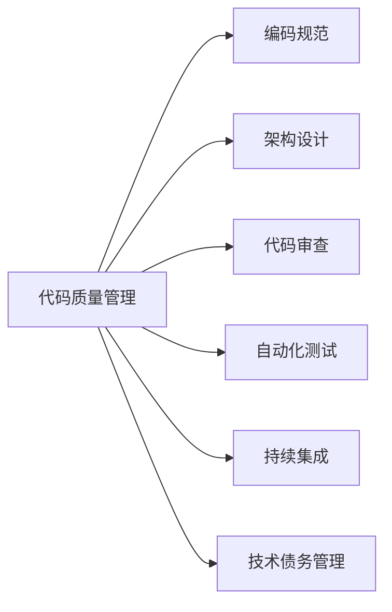

## 一、为何要进行代码质量管理

> "任何一个傻瓜都能写出计算机可以理解的代码。唯有写出人类容易理解的代码，才是优秀的程序员。" —— Martin Fowler

在软件开发领域，**代码质量**直接决定了项目的成败。据统计，软件维护成本占整个软件生命周期成本的 `60%-80%`，而其中 `60%` 的维护工作是理解代码。从实践经验上来看，代码质量管理主要达到以下目的：

### 1、核心价值
- **可维护性**：高质量的代码更易于维护和扩展。通过进行代码质量管理，你可以确保代码结构良好、易于理解，从而降低维护成本和项目风险。研究表明，良好的代码质量可以减少 `40%` 的维护时间。
- **可读性**：高质量的代码具有良好的可读性，这有助于开发团队更快地理解和修改代码。代码质量管理有助于确保代码的一致性和可读性，提高团队协作效率。代码的阅读时间与编写时间比例约为 `10:1`。
- **可靠性和稳定性**：通过进行代码质量管理，可以降低软件缺陷的数量，从而提高软件的可靠性和稳定性。这对于用户体验和满意度至关重要。高质量代码可以减少 `75%` 的生产环境故障。
- **性能**：代码质量管理有助于发现潜在的性能问题，从而提高软件的性能。良好的性能对于用户体验和应用程序的成功至关重要。
- **安全性**：代码质量管理可以帮助你发现和修复潜在的安全漏洞，从而提高软件的安全性。安全性对于保护用户数据和防止恶意攻击至关重要。`OWASP Top 10` 中的大部分漏洞都源于代码质量问题。

### 2、团队效能提升
- **开发效率**：通过进行代码质量管理，你可以提高开发团队的效率，减少因低质量代码而导致的浪费时间和精力。技术债务每年会增加 `15%-20%` 的开发成本。
- **持续改进**：代码质量管理有助于发现问题和改进点，从而促使开发团队不断改进软件质量。这有助于提高产品竞争力和满足客户需求。
- **团队协作和知识共享**：代码质量管理有助于建立团队协作和知识共享的文化，通过代码审查和团队讨论来共同解决问题和提高代码质量。
- **新人培养**：规范的代码库是最好的学习材料，新人可以通过阅读高质量代码快速成长，缩短上手时间 `50%` 以上。

### 3、不重视代码质量的后果

反过来推算，不进行代码质量管理，就难免陷入以下困境：
- **技术债务累积**：就像信用卡债务一样，技术债务会产生"利息"，拖延越久，修复成本越高
- **破窗效应**：一旦有人提交了低质量代码，其他人也会降低标准，最终导致整个代码库腐化
- **团队士气低落**：在糟糕的代码库中工作令人沮丧，优秀的开发者会选择离开
- **业务发展受阻**：新功能开发越来越慢，简单的需求也需要大量时间

如果进行了良好的代码质量管理，那么就能有效的避免代码中坏味道的发酵，可以让团队成员更加高效协作，让产品更加稳定可靠。

<!-- more -->

## 二、代码质量管理体系

代码质量管理是一个系统工程，需要从多个维度进行把控：



本文重点讨论**编码规范**这一基础而关键的环节。

## 三、应用架构规范

宏观的系统架构主要解决复杂性问题，那是一个庞大的话题。这里主要谈一下应用架构。每个公司的应用架构可能有所不同，常见的有传统三层、整洁架构、领域驱动设计等。

### 1、架构设计原则

不管什么样的架构设计，核心原则是基本一致的：
- **业务为核心**：架构应该反映业务领域，而不是技术框架
- **依赖倒置**：高层策略不应该依赖于低层细节
- **单一职责**：每个模块只负责一个功能领域
- **开闭原则**：对扩展开放，对修改关闭

### 2、分层架构示例

我以典型的ERP系统业务架构来举例，分层结构如下：


```
├── adapter/           # 适配层：处理外部请求
│   ├── web/          # Web控制器
│   ├── openapi/      # 开放API
│   └── mq/           # 消息队列处理
├── service/          # 业务服务层：编排业务流程
│   ├── api/          # 服务接口定义
│   └── impl/         # 服务实现
├── domain/           # 领域层：核心业务逻辑
│   ├── model/        # 领域模型
│   ├── service/      # 领域服务
│   └── repository/   # 仓储接口
└── infrastructure/   # 基础设施层
    ├── persistence/  # 持久化实现
    └── external/     # 外部服务调用
```

各层职责说明：
- **Adapter层**：处理HTTP请求、消息队列、定时任务等外部输入，将外部请求转换为内部调用
- **Service层**：编排业务流程，协调多个领域对象完成业务功能，处理事务
- **Domain层**：封装核心业务逻辑和业务规则，不依赖任何技术框架
- **Infrastructure层**：提供技术支撑，如数据库访问、缓存、消息发送等

### 3、层级调用规范

#### 3.1、基本原则
- **严格分层**：不能跨层调用，每层只能调用直接下层
- **依赖方向**：上层依赖下层，下层不能调用上一层
- **单向依赖**：避免循环依赖

#### 3.2、具体规范

1. **Controller层规范**
   - 一个页面对应一个Controller类
   - 一个Controller只依赖一个Service
   - Controller不直接调用Dao层
   
   ```java
   // ✅ 正确示例
   @RestController
   @RequestMapping("/user")
   public class UserController {
       private final UserService userService;
       
       @GetMapping("/{id}")
       public UserDTO getUser(@PathVariable Long id) {
           return userService.getUser(id);
       }
   }
   
   // ❌ 错误示例：Controller直接调用Dao
   @RestController
   public class BadController {
       private final UserDao userDao; // 错误：跨层调用
       private final OrderService orderService;
       private final UserService userService; // 错误：依赖多个Service
   }
   ```

2. **Service层规范**
   - 负责事务管理，使用 `@Transactional(rollbackFor = Exception.class)`
   - 可以调用多个Domain和Dao
   - 编排业务流程，不包含具体业务规则
   
   ```java
   @Service
   @Transactional(rollbackFor = Exception.class)
   public class OrderService {
       private final OrderDomain orderDomain;
       private final UserDomain userDomain;
       private final OrderDao orderDao;
       
       public void createOrder(CreateOrderCmd cmd) {
           // 编排业务流程
           userDomain.validateUserCredit(cmd.getUserId());
           Order order = orderDomain.createOrder(cmd);
           orderDao.insert(order);
       }
   }
   ```

3. **Domain层规范**
   - 封装复杂业务逻辑和业务规则
   - 不依赖具体技术实现
   - 提供可复用的业务能力
   
   ```java
   @Component
   public class OrderDomain {
       public Order createOrder(CreateOrderCmd cmd) {
           // 业务规则校验
           validateOrderAmount(cmd.getAmount());
           // 复杂业务逻辑
           BigDecimal finalPrice = calculatePrice(cmd);
           return Order.builder()
               .amount(finalPrice)
               .status(OrderStatus.CREATED)
               .build();
       }
   }
   ```

4. **Dao层规范**
   - 方法尽量为原子性操作
   - 只负责数据访问，不包含业务逻辑
   - 简单的查询逻辑可以放在Dao层

### 4、数据模型规范

正确的数据模型设计是保证代码清晰的关键。每层应该有自己的数据模型，避免跨层传递：

#### 4.1、数据模型分类

| 模型类型    | 后缀  | 所属层            | 用途说明   | 示例                 |
|---------|-----|----------------|--------|--------------------|
| Entity  | 无   | Infrastructure | 数据库表映射 | `User`, `Order`    |
| PO      | PO  | Infrastructure | 复杂查询结果 | `UserStatisticsPO` |
| Query   | Qry | Service        | 查询参数   | `UserPageQry`      |
| Command | Cmd | Service        | 写操作参数  | `CreateUserCmd`    |
| BO      | BO  | Service        | 业务对象   | `UserBO`           |
| DO      | DO  | Domain         | 领域对象   | `UserCreditDO`     |
| DTO     | DTO | Adapter        | 传输对象   | `UserDTO`          |
| VO      | VO  | Adapter        | 视图对象   | `UserVO`           |

#### 4.2、实践示例

```java
// Entity - 数据库实体
@Entity
@Table(name = "t_user")
public class User {
    @Id
    private Long id;
    private String username;
    private String email;
    private LocalDateTime createTime;
}

// Query - 查询参数
@Data
public class UserPageQry {
    @NotNull(message = "页码不能为空")
    private Integer pageNum;
    
    @NotNull(message = "每页条数不能为空")
    @Max(value = 100, message = "每页最多100条")
    private Integer pageSize;
    
    private String keyword;
}

// Command - 写入命令
@Data
public class CreateUserCmd {
    @NotBlank(message = "用户名不能为空")
    private String username;
    
    @Email(message = "邮箱格式不正确")
    private String email;
    
    @NotBlank(message = "密码不能为空")
    @Length(min = 6, max = 20, message = "密码长度6-20位")
    private String password;
}

// DTO - 传输对象
@Data
@ApiModel("用户信息")
public class UserDTO {
    @ApiModelProperty("用户ID")
    private Long id;
    
    @ApiModelProperty("用户名")
    private String username;
    
    @ApiModelProperty("邮箱")
    private String email;
    
    @ApiModelProperty("注册时间")
    private String createTime;
}
```

#### 4.3、数据转换最佳实践

```java
// 使用转换器模式
@Component
public class UserConverter {
    public UserDTO toDTO(User entity) {
        return UserDTO.builder()
            .id(entity.getId())
            .username(entity.getUsername())
            .email(entity.getEmail())
            .createTime(DateUtil.format(entity.getCreateTime()))
            .build();
    }
    
    public User toEntity(CreateUserCmd cmd) {
        return User.builder()
            .username(cmd.getUsername())
            .email(cmd.getEmail())
            .password(encryptPassword(cmd.getPassword()))
            .createTime(LocalDateTime.now())
            .build();
    }
}
```

#### 4.4、注意事项
- **禁止使用Map**：入参和返回值均不允许使用 `Map` 类型，必须定义明确的类
- **层间隔离**：不同层的数据模型不要混用，通过转换器进行转换
- **职责单一**：每个数据模型只服务于特定场景，不要试图用一个类满足所有需求

### 5、package与类设计规范
- Service接口都以Api结尾，放在api包下
- Service实现类都以Service结尾，放在service包下
- Controller都以Controller结尾，放在controller包下
- Controller以一组页面为一个package，有自己独立的包名。对于ERP来说，一级菜单对应一个package，比如用户管理就在controller.usermanager下；对于Adapter来说，一组页面对应一个package，比如游客数据就在controller.tourist下，会员中心就在controller.buyermember下
- Service的包名结构：同一个业务体系下的Service有一个独立的package，比如erpweb、appadapter、pcweb；在系统级别以下，package对应controller的包名来建立。比如api.erpweb.usermanager和service.erpweb.usermanager
- 前后端分离项目中的Controller的返回值是DTO；前后端不分离的项目中使用MVC模式，Controller和View可以直接使用BO
- 一个Qry对应一个Service中的方法；一个Cmd对应一个逻辑处理类（CmdExe）。【弹性：复杂情况下用到CmdExe，这样利于解构和可读性。一般情况下，Cmd的实现可以放在Service中】
- Api的入参必须是Qry或Cmd。【弹性：只有一个参数或逻辑简单的情况下，可以直接用原始类型入参，但也不允许超过3个参数】
- Api的每个方法有独立的Cmd（Qry)和BO返回值，不允许复用Cmd（Qry）和BO。【弹性：如果有复用的数据模型，必须严格控制，写好注释】
- 所有Controller、Service、Domain、Dao对应的数据模型都应该放到所属接口中（作为内部类），不要单独放到package中。【弹性：一些共用的数据模型允许放到common package中，但要严格控制，写好注释】

备注：严格控制的意思是必须经过架构师的同意，否则代码提交会被驳回

## 四、代码规范

### 1、命名规范

良好的命名是自文档化代码的第一步：

| 类型  | 规范                  | 示例                    | 反例                    |
|-----|---------------------|-----------------------|-----------------------|
| 包名  | 全小写，点分隔             | `com.example.service` | `com.Example.Service` |
| 类名  | 大驼峰(UpperCamelCase) | `UserService`         | `userservice`         |
| 方法名 | 小驼峰(lowerCamelCase) | `getUserById`         | `GetUserById`         |
| 变量名 | 小驼峰(lowerCamelCase) | `userName`            | `UserName`            |
| 常量名 | 全大写下划线分隔            | `MAX_SIZE`            | `maxSize`             |
| 枚举值 | 全大写下划线分隔            | `ACTIVE_STATUS`       | `ActiveStatus`        |

```java
// ✅ 正确的命名示例
package com.example.user.service;

public class UserService {
    private static final int MAX_RETRY_COUNT = 3;
    
    private String userName;
    
    public UserDTO getUserById(Long userId) {
        // 方法实现
    }
}

// 枚举命名示例
public enum OrderStatus {
    PENDING_PAYMENT,
    PAID,
    SHIPPED,
    COMPLETED,
    CANCELLED
}
```

### 2、基本类型规范

```java
// 数值类型必须使用明确的后缀
Long userId = 12345L;        // ✅ 正确：使用大写L
Long wrongId = 12345l;       // ❌ 错误：小写l容易与1混淆

Double price = 19.99D;       // ✅ 正确：使用大写D
Float rate = 0.85F;          // ✅ 正确：使用大写F

// 时间类型规范 - 使用Java 8时间API
LocalDateTime now = LocalDateTime.now();     // ✅ 正确
Date oldDate = new Date();                   // ❌ 错误：使用旧API
java.sql.Timestamp timestamp = null;         // ❌ 错误：禁用sql包时间类

// 推荐的时间处理方式
public class TimeExample {
    // 使用Java 8时间API
    private LocalDateTime createTime;
    private LocalDate birthDate;
    private Instant timestamp;
    
    // 时间格式化
    public String formatDateTime(LocalDateTime dateTime) {
        DateTimeFormatter formatter = DateTimeFormatter.ofPattern("yyyy-MM-dd HH:mm:ss");
        return dateTime.format(formatter);
    }
}
```

### 3、空值处理规范

使用注解明确表达空值意图，避免 `NullPointerException`：

```java
import javax.annotation.Nullable;
import javax.annotation.Nonnull;

public class NullSafetyExample {
    
    // 明确标注可能返回null
    @Nullable
    public User findUserById(Long id) {
        return userRepository.findById(id).orElse(null);
    }
    
    // 明确标注不会返回null
    @Nonnull
    public List<User> getAllUsers() {
        List<User> users = userRepository.findAll();
        return users != null ? users : Collections.emptyList();
    }
    
    // 参数空值检查
    public void updateUser(@Nonnull User user) {
        Objects.requireNonNull(user, "User cannot be null");
        // 业务逻辑
    }
    
    // Optional的使用
    public Optional<User> findUserOptional(Long id) {
        return userRepository.findById(id);
    }
}
```

### 4、集合处理规范

```java
public class CollectionExample {
    
    // ✅ 正确：返回空集合而不是null
    public List<User> getUsers() {
        List<User> users = queryUsers();
        return users != null ? users : Collections.emptyList();
    }
    
    // ✅ 正确：使用工具类简化集合操作
    public void processUsers(List<User> users) {
        // 使用CollectionUtils避免空指针
        if (CollectionUtils.isEmpty(users)) {
            return;
        }
        
        // 使用Stream API处理集合
        List<String> names = users.stream()
            .filter(Objects::nonNull)
            .map(User::getName)
            .filter(StringUtils::isNotBlank)
            .collect(Collectors.toList());
    }
    
    // ❌ 错误：返回null
    public List<User> getBadUsers() {
        return null; // 永远不要返回null集合
    }
}
```

### 5、异常处理规范

```java
public class ExceptionExample {
    
    // ✅ 正确的异常处理
    @Transactional(rollbackFor = Exception.class)
    public void createOrder(OrderDTO orderDTO) {
        try {
            // 业务逻辑
            validateOrder(orderDTO);
            saveOrder(orderDTO);
        } catch (BusinessException e) {
            // 业务异常，记录并抛出
            log.warn("Order creation failed: {}", e.getMessage());
            throw e;
        } catch (Exception e) {
            // 系统异常，记录详细信息并包装
            log.error("Unexpected error during order creation", e);
            throw new SystemException("创建订单失败", e);
        }
    }
    
    // 自定义业务异常
    public class BusinessException extends RuntimeException {
        private final String code;
        private final String message;
        
        public BusinessException(String code, String message) {
            super(message);
            this.code = code;
            this.message = message;
        }
    }
}
```

### 6、代码格式化工具配置

1. **Google Java Format**
   - IDEA插件：`google-java-format`
   - 配置每行最大长度：160字符
   - 自动格式化快捷键：`Ctrl+Alt+L` (Windows) / `Cmd+Opt+L` (Mac)

2. **阿里巴巴代码规范**
   - IDEA插件：`Alibaba Java Coding Guidelines`
   - 实时检查代码规范
   - 支持自定义规则开关

3. **SonarLint**
   - IDEA插件：`SonarLint`
   - 检测代码质量问题
   - 提供修复建议

备注：
- 严格控制部分，反馈到架构师后，架构师假如公示列表中，并对每项予以说明
- core基础包要进行版本管理和发行说明
- core基础包最好要分包，比如core-poi、core-image、core-pdf等

进阶阅读：
- [Effective Java](https://book.douban.com/subject/30412517/)
- [重构](https://book.douban.com/subject/30468597/)
- [Java开发手册](https://github.com/alibaba/p3c/blob/master/Java%E5%BC%80%E5%8F%91%E6%89%8B%E5%86%8C(%E9%BB%84%E5%B1%B1%E7%89%88).pdf)

## 五、规范

### 1、表设计规范

#### 1.1、命名规范

```sql
-- ✅ 正确的表设计示例
CREATE TABLE `t_user` (
    `id` BIGINT UNSIGNED NOT NULL AUTO_INCREMENT COMMENT '主键ID',
    `user_name` VARCHAR(50) NOT NULL COMMENT '用户名',
    `email` VARCHAR(100) NOT NULL COMMENT '邮箱',
    `phone` VARCHAR(20) DEFAULT NULL COMMENT '手机号',
    `is_active` TINYINT UNSIGNED NOT NULL DEFAULT 1 COMMENT '是否激活：1-是，0-否',
    `user_level` INT NOT NULL DEFAULT 1 COMMENT '用户等级',
    `balance` DECIMAL(10,2) NOT NULL DEFAULT 0.00 COMMENT '账户余额',
    `create_time` DATETIME NOT NULL DEFAULT CURRENT_TIMESTAMP COMMENT '创建时间',
    `update_time` DATETIME NOT NULL DEFAULT CURRENT_TIMESTAMP ON UPDATE CURRENT_TIMESTAMP COMMENT '更新时间',
    `is_deleted` TINYINT UNSIGNED NOT NULL DEFAULT 0 COMMENT '是否删除：1-是，0-否',
    PRIMARY KEY (`id`),
    UNIQUE KEY `uk_email` (`email`),
    UNIQUE KEY `uk_phone` (`phone`),
    KEY `idx_user_name` (`user_name`),
    KEY `idx_create_time` (`create_time`)
) ENGINE=InnoDB DEFAULT CHARSET=utf8mb4 COMMENT='用户表';

-- ❌ 错误示例
CREATE TABLE Users (  -- 错误：表名使用复数
    ID int,          -- 错误：字段名大写
    isActive bit,    -- 错误：布尔字段未使用is_xxx格式
    Price float      -- 错误：金额使用float
);
```

#### 1.2、字段类型选择

| 数据类型     | 使用场景   | 示例                      | 注意事项                  |
|----------|--------|-------------------------|-----------------------|
| BIGINT   | 主键ID   | `id`                    | 使用UNSIGNED，自增         |
| INT      | 数量、等级  | `user_level`            | 根据范围选择合适大小            |
| TINYINT  | 布尔值、状态 | `is_deleted`            | 使用UNSIGNED，0/1表示      |
| DECIMAL  | 金额、比率  | `price DECIMAL(10,2)`   | 禁用FLOAT/DOUBLE        |
| VARCHAR  | 变长字符串  | `user_name VARCHAR(50)` | 合理设置长度                |
| DATETIME | 时间戳    | `create_time`           | 使用DATETIME而非TIMESTAMP |
| TEXT     | 大文本    | `content`               | 单独建表存储                |

#### 1.3、必备字段规范

```sql
-- 每张表必须包含的字段
`id` BIGINT UNSIGNED NOT NULL AUTO_INCREMENT COMMENT '主键ID',
`create_time` DATETIME NOT NULL DEFAULT CURRENT_TIMESTAMP COMMENT '创建时间',
`update_time` DATETIME NOT NULL DEFAULT CURRENT_TIMESTAMP ON UPDATE CURRENT_TIMESTAMP COMMENT '更新时间'

-- 需要逻辑删除的表还需要
`is_deleted` TINYINT UNSIGNED NOT NULL DEFAULT 0 COMMENT '是否删除：1-是，0-否'
```

### 2、索引设计规范

#### 2.1、索引命名规范

```sql
-- 主键索引：pk_字段名
PRIMARY KEY (`id`)

-- 唯一索引：uk_字段名
UNIQUE KEY `uk_email` (`email`)

-- 普通索引：idx_字段名
KEY `idx_user_name` (`user_name`)

-- 联合索引：idx_字段1_字段2
KEY `idx_user_status` (`user_id`, `status`)
```

#### 2.2、索引设计原则

```sql
-- 1. 覆盖索引优化查询
-- 需求：查询用户姓名和邮箱
-- ✅ 好的设计：建立覆盖索引
ALTER TABLE t_user ADD INDEX idx_id_name_email (`id`, `user_name`, `email`);

-- 查询可以直接从索引获取数据，无需回表
SELECT user_name, email FROM t_user WHERE id = 1;

-- 2. 最左前缀原则
-- 联合索引 (a, b, c) 支持的查询：
-- ✅ WHERE a = 1
-- ✅ WHERE a = 1 AND b = 2
-- ✅ WHERE a = 1 AND b = 2 AND c = 3
-- ❌ WHERE b = 2 AND c = 3  -- 不走索引

-- 3. 避免索引失效
-- ❌ 错误：类型不匹配导致索引失效
SELECT * FROM t_user WHERE phone = 13812345678;  -- phone是VARCHAR，传入INT

-- ✅ 正确：类型匹配
SELECT * FROM t_user WHERE phone = '13812345678';

-- ❌ 错误：使用函数导致索引失效
SELECT * FROM t_user WHERE DATE(create_time) = '2024-01-01';

-- ✅ 正确：改用范围查询
SELECT * FROM t_user WHERE create_time >= '2024-01-01' AND create_time < '2024-01-02';
```

### 3、SQL编写规范

#### 3.1、查询优化

```sql
-- 1. 使用EXPLAIN分析查询计划
EXPLAIN SELECT * FROM t_user WHERE user_name = 'John';

-- type字段性能从好到坏：
-- const > eq_ref > ref > range > index > all

-- 2. 正确使用COUNT
-- ✅ 正确：统计行数
SELECT COUNT(*) FROM t_user;

-- ❌ 错误：使用列名或常量
SELECT COUNT(user_name) FROM t_user;  -- 不统计NULL值
SELECT COUNT(1) FROM t_user;          -- 没有优势

-- 3. 多表查询使用别名
-- ✅ 正确：使用表别名
SELECT 
    u.user_name,
    o.order_no,
    o.amount
FROM t_user u
INNER JOIN t_order o ON u.id = o.user_id
WHERE u.is_active = 1;

-- 4. 避免SELECT *
-- ✅ 正确：明确指定字段
SELECT id, user_name, email FROM t_user;

-- ❌ 错误：查询所有字段
SELECT * FROM t_user;
```

#### 3.2、写入优化

```sql
-- 1. 批量插入
-- ✅ 正确：一条SQL插入多行
INSERT INTO t_user (user_name, email) VALUES
    ('user1', 'user1@example.com'),
    ('user2', 'user2@example.com'),
    ('user3', 'user3@example.com');

-- ❌ 错误：循环单条插入
INSERT INTO t_user (user_name, email) VALUES ('user1', 'user1@example.com');
INSERT INTO t_user (user_name, email) VALUES ('user2', 'user2@example.com');

-- 2. 使用ON DUPLICATE KEY UPDATE
INSERT INTO t_user_stats (user_id, login_count) 
VALUES (1, 1)
ON DUPLICATE KEY UPDATE login_count = login_count + 1;

-- 3. 逻辑删除而非物理删除
-- ✅ 正确：逻辑删除
UPDATE t_user SET is_deleted = 1 WHERE id = 1;

-- ❌ 错误：物理删除
DELETE FROM t_user WHERE id = 1;
```

### 4、事务处理规范

```sql
-- 事务处理示例
START TRANSACTION;

-- 1. 锁定用户账户（使用悲观锁）
SELECT balance FROM t_user_account 
WHERE user_id = 1 
FOR UPDATE;

-- 2. 检查余额
-- 应用层判断余额是否充足

-- 3. 扣减余额
UPDATE t_user_account 
SET balance = balance - 100.00 
WHERE user_id = 1 AND balance >= 100.00;

-- 4. 记录交易日志
INSERT INTO t_transaction_log (user_id, amount, type) 
VALUES (1, -100.00, 'WITHDRAW');

COMMIT;
```

### 5、性能监控与优化

```sql
-- 1. 慢查询日志配置
SET GLOBAL slow_query_log = 'ON';
SET GLOBAL long_query_time = 2;

-- 2. 查看表索引使用情况
SHOW INDEX FROM t_user;

-- 3. 分析表统计信息
ANALYZE TABLE t_user;

-- 4. 查看锁等待
SELECT * FROM information_schema.INNODB_LOCKS;
```

扩展阅读：
- [MySQL设计规约](https://mp.weixin.qq.com/s/XC8e5iuQtfsrEOERffEZ-Q)

## 六、规范
- 使用合适的键名：为键选择具有描述性的名称，以便于理解和维护。控制键的长度，不超过256个字符
- 键名命名规范：建议使用冒号（:）作为命名空间的分隔符。例如，user:1:profile表示用户1的个人资料
- 键名不要包含特殊字符，只允许数字、字母、下划线、中划线、冒号
- 拒绝 bigkey(防止网卡流量、慢查询) string 类型控制在 10KB 以内，hash、list、set、zset 元素个数不要超过 5000
- 选择适合的数据类型。一般Java Bean，建议用string json存储；保存uv，建议用HyperLogLog；保存签到数据，建议用位图；解决推送重复的问题，可以用布隆过滤器；寻找附近的人，可以用GeoHash
- 控制 key 的生命周期，必须有过期时间，redis 不是垃圾桶。如果有特殊数据，需要长期存储，一定要放到单独的db中且经过架构师同意
- 避免使用“KEYS *”命令，使用“SCAN”命令替代，以避免性能问题

## 七、RESTful（前后端交互） 规范
- 生产环境必须使用 HTTPS
- 每一个 API 需对应一个路径，表示 API 具体的请求地址。路径表示资源，用名词，推荐用复数，不能用动词（请求方式已经表示了动作）
- URL 路径不能使用大写，单词如果需要分隔，统一使用下划线
- 路径禁止携带表示请求内容类型的后缀，比如".json"，".xml"，通过 accept 头表达即可
- URL 带的参数必须无敏感信息或符合安全要求；body 里带参数时必须设置 Content-Type
- 最常用的请求方式。GET：从服务器取出资源。POST：在服务器新建一个资源。PUT：在服务器更新资源。DELETE：从服务器删除资源。
- 服务端发生错误时，返回给前端的响应信息必须包含 HTTP 状态码，errorCode、errorMessage、用户提示信息四个部分
- 在前后端交互的 JSON 格式数据中，所有的 key 必须为小写字母开始的驼峰命名风格，符合英文表达习惯，且表意完整
- HTTP 请求通过 URL 传递参数时，不能超过 2048 字节
- 在翻页场景中，用户输入参数的小于 1，则前端返回第一页参数给后端；后端发现用户输入的参数大于总页数，直接返回最后一页
- 所有的Adapter，入参都要使用@Valid注解校验
- 所有的Api方法，返回空对象或空数组，不要返回null。便于前端前端判断
- 所有Controller用@RestController注解，这样意味着类所有的方法都默认用@ResponseBody注解。所有的method推荐使用RESTFul注解，如@GetMapping、@PostMapping，而不要用@RequestMapping
- HTTP状态码是所有开发者的基本功，善用状态码。比如200/401/403/404/500。前端要对状态码做处理，给与用户友好提示，比如500是服务器走丢了，请稍后再试！状态码也包含逻辑，比如401是未授权或过期，需要用户重新登录
- 开发适配层或开放API的原则是：只新增，不修改。对于旧版本的api访问，返回404，并在前端提示用户版本过低

## 八、规范
- 对于适配层或开放API的Controller，要配合Swagger 3，代码清晰，也容易和Yapi集成
- 对于两个不同的DTO类，@ApiModel注解的value千万不要一样，否则接口会出现混乱的情况
- @ApiModel注解的类，不光要有value，最好也有description。这样可以在yapi中显示备注

## 九、测试规范
- 新手写业务代码，老手写测试代码
- 单元测试必须具备Automatic(自动化)，Independent(独立性)，Repeatable(可重复)性
- 单元测试要保证测试粒度足够小。单元测试测试粒度足够小，有助于精确定位问题。单测粒度至多是类级别，一般是方法级别
- 单元测试要遵守BCDE原则，Border，边界值测试，包括循环边界、特殊取值、特殊时间点、数据顺序等；Correct，正确的输入，并得到预期的结果；Design，与设计文档相结合，来编写单元测试；Error，强制错误信息输入（如：非法数据、异常流程、非业务允许输入等），并得到预期的结果
- core工具包测试代码覆盖率要90%以上

## 十、其他语言
上面的规范只是一个基础，对于其他语言的开发来说，也应该建立自己的开发规范和统一格式化要求。  
以大前端举例，可能有如下规则：
- 优先使用TypeScript
- HTML标签名小写
- CSS使用统一的预处理器、命名方式以`-`作为分隔符
- 团队有统一的ESLint规则

## 十一、代码审查规范

代码审查是保证代码质量的重要环节，应该融入日常开发流程：

### 1、Review 检查清单

#### 1.1、功能性检查
- [ ] 代码是否实现了预期功能
- [ ] 边界条件是否处理
- [ ] 异常情况是否考虑
- [ ] 是否有单元测试覆盖

#### 1.2、代码质量检查
- [ ] 命名是否清晰、符合规范
- [ ] 是否有重复代码
- [ ] 复杂度是否过高（圈复杂度<10）
- [ ] 是否遵循SOLID原则

#### 1.3、性能检查
- [ ] 是否有明显的性能问题
- [ ] 数据库查询是否优化
- [ ] 是否有N+1查询问题
- [ ] 缓存使用是否合理

#### 1.4、安全检查
- [ ] 是否有SQL注入风险
- [ ] 是否有XSS攻击风险
- [ ] 敏感信息是否加密
- [ ] 权限控制是否到位

### 2、Review 工具集成

```yaml
# .gitlab-ci.yml.latest 示例
code_quality:
  stage: test
  script:
    # SonarQube 代码质量扫描
    - sonar-scanner -Dsonar.projectKey=$CI_PROJECT_NAME
    
    # SpotBugs 静态代码分析
    - mvn spotbugs:check
    
    # 代码覆盖率检查
    - mvn jacoco:report
    - python check_coverage.py --min-coverage=80
    
  artifacts:
    reports:
      coverage_report:
        coverage_format: cobertura
        path: target/site/jacoco/jacoco.xml
```

## 十二、CI/CD 集成规范

### 1、持续集成流水线

```yaml
# 完整的 CI/CD 流水线示例
stages:
  - compile
  - test
  - quality
  - build
  - deploy

# 编译阶段
compile:
  stage: compile
  script:
    - mvn clean compile
  cache:
    paths:
      - .m2/repository

# 单元测试
unit_test:
  stage: test
  script:
    - mvn test
  artifacts:
    reports:
      junit: target/surefire-reports/TEST-*.xml

# 代码质量检查
quality_gate:
  stage: quality
  script:
    # 代码规范检查
    - mvn checkstyle:check
    
    # 代码复杂度分析
    - mvn pmd:check
    
    # 依赖漏洞扫描
    - mvn dependency-check:check
    
  only:
    - merge_requests

# Docker镜像构建
build_image:
  stage: build
  script:
    - docker build -t $CI_REGISTRY_IMAGE:$CI_COMMIT_SHA .
    - docker push $CI_REGISTRY_IMAGE:$CI_COMMIT_SHA
  only:
    - main
```

### 2、质量门禁配置

```xml
<!-- pom.xml 质量检查插件配置 -->
<build>
  <plugins>
    <!-- Checkstyle 代码规范检查 -->
    <plugin>
      <groupId>org.apache.maven.plugins</groupId>
      <artifactId>maven-checkstyle-plugin</artifactId>
      <version>3.2.0</version>
      <configuration>
        <configLocation>checkstyle.xml</configLocation>
        <failOnViolation>true</failOnViolation>
        <maxAllowedViolations>0</maxAllowedViolations>
      </configuration>
      <executions>
        <execution>
          <phase>validate</phase>
          <goals>
            <goal>check</goal>
          </goals>
        </execution>
      </executions>
    </plugin>
    
    <!-- JaCoCo 代码覆盖率 -->
    <plugin>
      <groupId>org.jacoco</groupId>
      <artifactId>jacoco-maven-plugin</artifactId>
      <version>0.8.8</version>
      <configuration>
        <rules>
          <rule>
            <limits>
              <limit>
                <minimum>0.80</minimum>
              </limit>
            </limits>
          </rule>
        </rules>
      </configuration>
    </plugin>
  </plugins>
</build>
```

## 十三、代码质量度量指标

### 1、关键指标监控

| 指标     | 标准      | 说明        |
|--------|---------|-----------|
| 代码覆盖率  | >80%    | 单元测试覆盖率   |
| 圈复杂度   | <10     | 方法复杂度     |
| 重复率    | <5%     | 代码重复比例    |
| 技术债务比率 | <5%     | 技术债务/开发时间 |
| Bug密度  | <1/KLOC | 每千行代码Bug数 |
| 代码规范违规 | 0       | P1级别违规数   |

### 2、质量趋势分析

```javascript
// 质量报告生成脚本示例
const qualityMetrics = {
  coverage: 85.3,
  complexity: 8.2,
  duplication: 3.1,
  violations: 12,
  bugs: 3,
  vulnerabilities: 1,
  codeSmells: 45
};

function generateQualityReport(metrics) {
  const score = calculateQualityScore(metrics);
  const trend = analyzeTrend(metrics);
  
  return {
    score,
    trend,
    recommendations: getRecommendations(metrics)
  };
}
```

## 十四、代码精进之道

要记住，留给公司一个方便维护、整洁优雅的代码库，是我们技术人员最高技术使命，也是我们对公司做出的最大技术贡献。

### 1、编码原则

【**防止破窗**】首先我们要有一套规范，并尽量遵守规范，不要做"打破第一扇窗"的人；其次，发现"破窗"要及时修复，不要让问题进一步恶化。

【**三次原则**】第一次用到某功能时，写一个特定的解决方法；第二次又用到时，复制上一次的代码；第三次出现时，就要着手写通用解决方案了。

【**最小惊奇原则**】写代码不是写侦探小说，要的是简单易懂，而不是时不时搞点烧脑的骚操作。

### 2、实践建议

【**日志规范**】能用 `debug` 就不要用 `info`，能用 `warn` 就不要用 `error`。滥用的 `error` 与狼来了无疑。

```java
// ✅ 正确的日志级别使用
log.debug("Processing user request: {}", userId);
log.info("User {} logged in successfully", username);
log.warn("API rate limit approaching for user: {}", userId);
log.error("Database connection failed", exception);
```

【**方法参数要少**】参数越少，越容易理解，也便于测试，各个参数的组合就如笛卡尔积。

```java
// ❌ 错误：参数过多
public void createUser(String name, String email, String phone, 
                      String address, Integer age, String gender) {}

// ✅ 正确：使用对象封装
public void createUser(CreateUserRequest request) {}
```

【**空行规范**】方法、逻辑分段，要加空行，提高代码可读性。车轮毂与车轴之间有空隙，车才能跑；书法绘画有留白。

【**请求读写分离**】增删改，会改变对象的状态，只需返回成功失败即可；查询是不会改变对象状态的，对系统没副作用。

## 十五、总结

### 1、规范落地的挑战与应对

代码规范的制定只是第一步，真正的挑战在于如何让规范落地并持续执行：

#### 1.1、不同层级开发者的成长路径

**初级开发者（0-2年）**
- 重点掌握基础规范，理解规范背后的原理
- 通过代码审查学习最佳实践
- 使用工具辅助（IDE插件、代码格式化工具）
- 建议阅读《Clean Code》、《Effective Java》

**中级开发者（2-5年）**
- 深入理解架构设计原则
- 能够独立进行代码审查
- 参与规范的制定和改进
- 关注性能优化和安全规范

**高级开发者（5年+）**
- 制定和维护团队规范
- 推动自动化质量保障体系
- 培养团队成员的质量意识
- 平衡规范的严格性和灵活性

#### 1.2、规范执行的关键要素

1. **工具支持**：自动化检查 > 人工审查
2. **渐进式改进**：先解决主要问题，逐步提高标准
3. **团队共识**：规范需要团队讨论和认同
4. **持续优化**：根据实践反馈调整规范

### 2、行动建议

1. **立即行动**
   - 安装并配置代码质量检查工具
   - 建立代码审查流程
   - 制定符合团队现状的基础规范

2. **短期目标（1-3个月）**
   - 代码覆盖率达到60%以上
   - 消除P1级别的规范违规
   - 建立自动化质量检查流程

3. **长期目标（6-12个月）**
   - 代码覆盖率达到80%以上
   - 技术债务控制在5%以内
   - 形成良好的质量文化

### 3、推荐资源

#### 3.1、必读书籍
- 《Clean Code》- Robert C. Martin
- 《Refactoring》- Martin Fowler  
- 《Effective Java》- Joshua Bloch
- 《代码精进之路》- 张建飞

#### 3.2、工具推荐
- **代码质量**：SonarQube、Checkstyle、PMD
- **代码审查**：Gerrit、GitLab MR、GitHub PR
- **持续集成**：Jenkins、GitLab CI、GitHub Actions
- **代码格式化**：Google Java Format、Prettier

#### 3.3、社区资源
- [阿里巴巴Java开发手册](https://github.com/alibaba/p3c)
- [Google Java Style Guide](https://google.github.io/styleguide/javaguide.html)
- [Spring Boot Best Practices](https://www.baeldung.com/spring-boot-best-practices)

### 4、写在最后

> "代码是写给人看的，顺便让机器执行。" —— Donald Knuth

代码质量管理不是一蹴而就的事情，需要团队持续投入和改进。记住以下几点：

1. **没有完美的规范**，只有适合团队的规范
2. **规范是为了提效**，而不是增加负担  
3. **质量是习惯**，而不是额外的工作
4. **越早重视越受益**，技术债务会产生复利

作为技术人员，留给公司一个方便维护、整洁优雅的代码库，是我们最高的技术使命，也是我们对公司做出的最大技术贡献。

**愿每一行代码都值得骄傲，祝你变得更强！**
