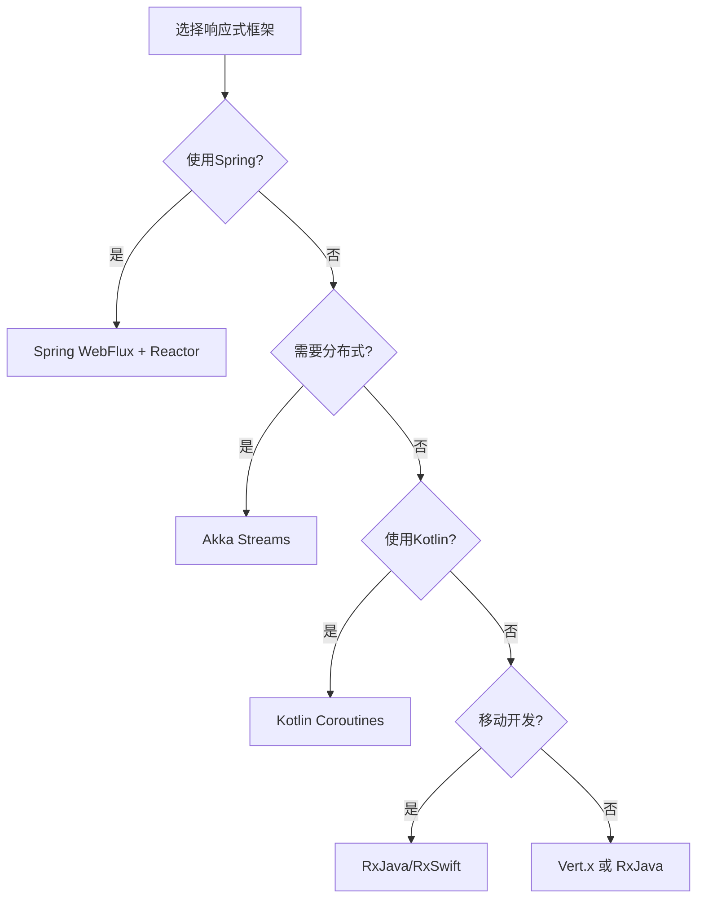
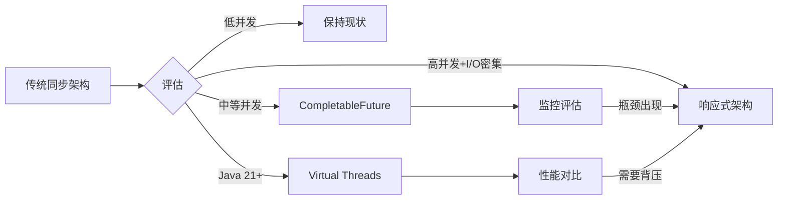

## 一、引言

响应式编程（Reactive Programming）是一种基于**数据流**和**变化传播**的编程范式。在这种编程模型中，程序通过建立一种自动的数据依赖关系，当某个数据发生变化时，所有依赖于它的计算和UI组件都会自动更新，无需手动干预。

随着现代应用对**实时性**、**高并发**和**用户体验**要求的不断提高，响应式编程已经从一个小众概念演变成主流技术栈的重要组成部分。无论是前端的 `React`、`Vue`，还是后端的 `Spring WebFlux`、`RxJava`，响应式编程都在改变着我们构建应用的方式。
<!-- more -->

### 1、响应式编程的核心概念

响应式编程的核心思想可以用一个简单的例子来说明：

```javascript
// 传统命令式编程
let a = 10;
let b = 20;
let c = a + b; // c = 30
a = 15; // c 仍然是 30，需要手动重新计算

// 响应式编程（概念示例）
let a = Observable(10);
let b = Observable(20);
let c = computed(() => a.value + b.value); // c 自动计算为 30
a.value = 15; // c 自动更新为 35，无需手动介入
```

响应式编程的发展历程：
- **2009年**：Erik Meijer 提出 `Reactive Extensions (Rx)` 概念
- **2013年**：Facebook 发布 `React`，将响应式思想带入前端主流
- **2014年**：`Reactive Streams` 规范发布，统一了 JVM 平台的响应式编程接口
- **2017年**：Spring 5 引入 `WebFlux`，标志着响应式编程在企业级应用的成熟

### 2、为什么响应式编程如此重要

#### 2.1 技术驱动因素

**硬件发展的新挑战**：
- CPU 主频增长放缓，多核处理器成为主流
- 传统的阻塞式 I/O 无法充分利用硬件资源
- 需要新的编程模型来实现真正的并发处理

**应用场景的新需求**：
- **实时数据流**：股票交易、物联网传感器、实时监控
- **高并发服务**：微服务架构下的服务间通信
- **用户体验**：即时响应、流畅交互、实时更新

#### 2.2 响应式编程的核心优势

1. **异步非阻塞**：通过事件循环和回调机制，避免线程阻塞，提高资源利用率
2. **背压控制**：自动调节数据生产和消费速度，防止内存溢出
3. **声明式编程**：关注"做什么"而非"怎么做"，代码更简洁易懂
4. **组合性强**：通过操作符链式调用，轻松实现复杂的数据处理逻辑

```java
// 传统方式：处理用户订单
public Order processOrder(Long userId) {
    User user = userService.getUser(userId); // 阻塞调用
    List<Product> products = productService.getProducts(user); // 阻塞调用
    Order order = orderService.createOrder(user, products); // 阻塞调用
    return order;
}

// 响应式方式：更高效的资源利用
public Mono<Order> processOrder(Long userId) {
    return userService.getUser(userId)
        .flatMap(user -> productService.getProducts(user)
            .collectList()
            .flatMap(products -> orderService.createOrder(user, products))
        ); // 非阻塞，可以同时处理更多请求
}
```

## 二、响应式编程基础

### 1、核心概念与原理

#### 1.1 响应式编程的四个核心要素

响应式编程建立在四个核心概念之上，这些概念构成了 `Reactive Streams` 规范的基础：

```java
// 1. Publisher（发布者）：数据的生产者
public interface Publisher<T> {
    void subscribe(Subscriber<? super T> subscriber);
}

// 2. Subscriber（订阅者）：数据的消费者
public interface Subscriber<T> {
    void onSubscribe(Subscription subscription);
    void onNext(T item);
    void onError(Throwable throwable);
    void onComplete();
}

// 3. Subscription（订阅）：连接发布者和订阅者的桥梁
public interface Subscription {
    void request(long n); // 背压控制
    void cancel();
}

// 4. Processor（处理器）：既是发布者又是订阅者
public interface Processor<T, R> extends Subscriber<T>, Publisher<R> {}
```

#### 1.2 数据流的特性

响应式编程中的数据流具有以下关键特性：

1. **推拉结合模式**（Push-Pull Model）
   - **推模式**：生产者主动推送数据给消费者
   - **拉模式**：消费者通过 `request(n)` 控制接收速度
   - 这种混合模式实现了高效的背压控制

2. **冷流与热流**（Cold vs Hot Streams）
   ```java
   // 冷流：每个订阅者独立接收完整数据序列
   Flux<Integer> coldStream = Flux.range(1, 5);
   coldStream.subscribe(x -> System.out.println("Sub1: " + x)); // 输出 1,2,3,4,5
   coldStream.subscribe(x -> System.out.println("Sub2: " + x)); // 也输出 1,2,3,4,5
   
   // 热流：所有订阅者共享同一数据源
   ConnectableFlux<Long> hotStream = Flux.interval(Duration.ofSeconds(1)).publish();
   hotStream.connect(); // 开始发射数据
   hotStream.subscribe(x -> System.out.println("Sub1: " + x)); // 从当前时刻开始接收
   Thread.sleep(2000);
   hotStream.subscribe(x -> System.out.println("Sub2: " + x)); // 错过前面的数据
   ```

3. **错误处理机制**
   ```java
   Flux.just(1, 2, 3, 0, 5)
       .map(i -> 10 / i)
       .onErrorResume(error -> {
           System.err.println("Error: " + error.getMessage());
           return Flux.just(-1); // 错误恢复
       })
       .subscribe(System.out::println);
   ```

### 2、响应式编程 vs 传统编程范式

#### 2.1 编程模型对比

| 特性 | 命令式编程 | 响应式编程 |
|------|-----------|-----------|
| **执行模型** | 同步阻塞 | 异步非阻塞 |
| **数据处理** | Pull（拉取） | Push-Pull（推拉结合） |
| **并发处理** | 线程池 + 锁 | 事件循环 + 消息传递 |
| **错误处理** | try-catch | onError 信号 |
| **资源利用** | 线程绑定 | 少量线程处理大量请求 |
| **代码风格** | 命令式 | 声明式/函数式 |

#### 2.2 实际案例对比

**场景：批量处理用户数据并发送邮件**

```java
// 传统方式：阻塞式处理
public void processUsersTraditional(List<Long> userIds) {
    for (Long userId : userIds) {
        try {
            User user = userRepository.findById(userId); // 阻塞 DB 调用
            if (user.isActive()) {
                EmailContent content = generateEmail(user); // CPU 密集操作
                emailService.send(content); // 阻塞 I/O 调用
            }
        } catch (Exception e) {
            logger.error("Failed to process user: " + userId, e);
        }
    }
}

// 响应式方式：非阻塞流式处理
public Mono<Void> processUsersReactive(List<Long> userIds) {
    return Flux.fromIterable(userIds)
        .parallel(4) // 并行处理
        .runOn(Schedulers.parallel())
        .flatMap(userId -> userRepository.findById(userId)
            .filter(User::isActive)
            .map(this::generateEmail)
            .flatMap(emailService::send)
            .onErrorResume(error -> {
                logger.error("Failed to process user: " + userId, error);
                return Mono.empty(); // 错误恢复，继续处理其他用户
            })
        )
        .sequential()
        .then();
}
```

#### 2.3 性能对比分析

基于 Spring 官方的基准测试，在高并发场景下（10000 并发连接）：

- **传统 Spring MVC**：需要 10000 个线程，内存占用约 10GB
- **Spring WebFlux**：仅需 CPU 核心数的线程（如 8 个），内存占用约 1GB
- **吞吐量提升**：相同硬件下，响应式可提升 3-5 倍吞吐量

## 三、响应式编程的应用领域

### 1、响应式前端开发

响应式设计是在不同设备和屏幕尺寸上提供一致用户体验的设计方法。通过使用响应式布局技术，可以使网站或应用程序自动适应各种屏幕大小和设备类型，从而提供最佳的用户体验。

响应式设计主要依赖于媒体查询、弹性布局和流式布局等技术。媒体查询允许我们根据不同的设备参数（如屏幕宽度）应用不同的样式和布局。弹性布局和流式布局则通过设置相对单位（如百分比）和自适应的容器宽度，使得页面元素能够自动调整大小和位置。

#### 1.1、前端框架和库介绍

响应式前端开发通常依赖于一些流行的前端框架和库，如React、Angular和Vue.js等。这些框架和库提供了一系列的工具和组件，用于构建响应式的用户界面和应用程序。

React是由Facebook开发的JavaScript库，它通过使用虚拟DOM和组件化的方法，实现了高性能和可维护的UI开发。React的组件可以自动地根据数据的变化进行更新，从而实现了响应式的界面。

Angular是由Google开发的JavaScript框架，它提供了一套完整的工具和库，用于构建大型的响应式应用程序。Angular的核心思想是依赖注入和数据绑定，使得UI组件能够与数据模型实时地同步。

Vue.js是一个轻量级的JavaScript框架，它采用了MVVM（模型-视图-ViewModel）的架构模式，通过双向数据绑定实现了响应式的数据流。Vue.js易于学习和使用，适合构建中小型的响应式应用程序。

这些前端框架和库的出现，极大地简化了响应式前端开发的工作。它们提供了丰富的功能和组件库，使得开发人员能够更加高效和容易地构建出响应式的用户界面和应用程序。同时，它们也提供了一些额外的特性，如状态管理、路由和动画等，以满足复杂的应用需求。

#### 1.2、Vue.js的响应式机制
Vue.js 通过其**响应式系统**实现了响应式编程的概念。Vue.js 的核心设计目标之一是让开发者能够轻松地构建动态的、数据驱动的用户界面。Vue 的响应式系统使得当数据发生变化时，视图能够自动更新，而开发者无需手动操作 DOM。

以下是 Vue.js 如何实现响应式编程的关键机制：

##### a、响应式数据

Vue.js 使用 `Object.defineProperty`（Vue 2）或 `Proxy`（Vue 3）来拦截对数据的访问和修改，从而实现数据的响应式。

- **Vue 2**：通过 `Object.defineProperty` 将对象的属性转换为 getter 和 setter。当访问数据时，Vue 会收集依赖；当修改数据时，Vue 会通知依赖更新。
- **Vue 3**：使用 `Proxy` 代理整个对象，能够更高效地拦截对象的操作（如读取、赋值、删除等），并支持对数组和嵌套对象的深度监听。

```javascript
// Vue 3 示例
const data = { count: 0 };
const reactiveData = new Proxy(data, {
  get(target, key) {
    console.log(`读取 ${key}`);
    return target[key];
  },
  set(target, key, value) {
    console.log(`更新 ${key} 为 ${value}`);
    target[key] = value;
    return true;
  },
});

reactiveData.count = 1; // 输出：更新 count 为 1
```

##### b、依赖追踪

Vue.js 通过**依赖追踪**机制来建立数据和视图之间的关系。

- 当组件渲染时，Vue 会访问模板中用到的响应式数据，触发 getter，从而将当前组件实例注册为数据的依赖。
- 当数据发生变化时，Vue 会通知所有依赖该数据的组件进行更新。

为了更直观地理解，以下是一个简化的伪代码实现：
```javascript
// 依赖收集器
class Dep {
   constructor() {
      this.subscribers = new Set(); // 存储依赖
   }
   depend() {
      if (activeWatcher) {
         this.subscribers.add(activeWatcher); // 添加当前依赖
      }
   }
   notify() {
      this.subscribers.forEach(watcher => watcher.update()); // 通知所有依赖更新
   }
}

// 观察者
class Watcher {
   constructor(updateFn) {
      this.updateFn = updateFn;
      this.run();
   }
   run() {
      activeWatcher = this; // 设置当前运行的 Watcher
      this.updateFn(); // 执行更新函数
      activeWatcher = null; // 重置
   }
   update() {
      this.run(); // 重新运行更新函数
   }
}

let activeWatcher = null; // 当前正在运行的 Watcher

// 响应式数据
function defineReactive(obj, key) {
   const dep = new Dep();
   let value = obj[key];

   Object.defineProperty(obj, key, {
      get() {
         if (activeWatcher) {
            dep.depend(); // 收集依赖
         }
         return value;
      },
      set(newVal) {
         if (newVal !== value) {
            value = newVal;
            dep.notify(); // 通知依赖更新
         }
      },
   });
}

// 示例
const data = { count: 0 };
defineReactive(data, 'count');

new Watcher(() => {
   console.log(`Count is: ${data.count}`); // 访问数据，触发依赖追踪
});

data.count = 1; // 输出：Count is: 1
```

##### c、组件更新

Vue.js 的组件是基于响应式数据构建的。当数据变化时，Vue 会自动重新渲染受影响的组件。

- Vue 使用虚拟 DOM 来高效地更新视图。当数据变化时，Vue 会生成新的虚拟 DOM，并与旧的虚拟 DOM 进行比较，找出需要更新的部分。
- 通过这种机制，Vue 实现了**声明式渲染**：开发者只需描述视图与数据的关系，Vue 会自动处理更新逻辑。

```html
<template>
  <div>
    <p>{{ message }}</p>
    <button @click="updateMessage">更新消息</button>
  </div>
</template>

<script>
export default {
  data() {
    return {
      message: 'Hello, Vue!',
    };
  },
  methods: {
    updateMessage() {
      this.message = '消息已更新！';
    },
  },
};
</script>
```

##### d、计算属性和侦听器

Vue.js 提供了**计算属性**和**侦听器**来进一步增强响应式编程的能力。

- **计算属性**：基于响应式数据动态计算值，并缓存结果，避免重复计算。
- **侦听器**：监听响应式数据的变化，并执行自定义逻辑。

```javascript
export default {
  data() {
    return {
      firstName: 'John',
      lastName: 'Doe',
    };
  },
  computed: {
    fullName() {
      return `${this.firstName} ${this.lastName}`;
    },
  },
  watch: {
    firstName(newVal, oldVal) {
      console.log(`firstName 从 ${oldVal} 变为 ${newVal}`);
    },
  },
};
```

##### e、响应式 API（Vue 3）

Vue 3 引入了更灵活的响应式 API，如 `ref`、`reactive`、`computed` 等，使开发者能够更细粒度地控制响应式逻辑。

```javascript
import { ref, computed, watch } from 'vue';

export default {
  setup() {
    const count = ref(0);
    const doubleCount = computed(() => count.value * 2);

    watch(count, (newVal, oldVal) => {
      console.log(`count 从 ${oldVal} 变为 ${newVal}`);
    });

    return {
      count,
      doubleCount,
    };
  },
};
```

### 2、响应式后端开发

#### 2.1、响应式编程的设计原则

在构建响应式系统时，应遵循以下核心设计原则：

##### **响应式宣言（Reactive Manifesto）的四大特性**

1. **响应性（Responsive）**：系统能够在合理时间内对请求做出响应
2. **弹性（Resilient）**：系统在出现故障时仍能保持响应性
3. **弹性伸缩（Elastic）**：系统能够根据负载动态调整资源
4. **消息驱动（Message Driven）**：组件之间通过异步消息进行通信

##### **实践中的设计模式**

```java
// 1. 发布-订阅模式：解耦生产者和消费者
@Component
public class EventPublisher {
    private final Sinks.Many<Event> sink = Sinks.many().multicast().onBackpressureBuffer();
    
    public void publish(Event event) {
        sink.tryEmitNext(event);
    }
    
    public Flux<Event> events() {
        return sink.asFlux();
    }
}

// 2. 断路器模式：处理下游服务故障
public Mono<Response> callServiceWithCircuitBreaker(Request request) {
    return webClient.post()
        .body(Mono.just(request), Request.class)
        .retrieve()
        .bodyToMono(Response.class)
        .timeout(Duration.ofSeconds(5))
        .retry(3)
        .onErrorResume(TimeoutException.class, e -> 
            Mono.just(Response.fallback()) // 降级处理
        );
}

// 3. 背压控制模式：防止消费者过载
Flux.range(1, 1000000)
    .onBackpressureBuffer(100, 
        dropped -> log.warn("Dropped: " + dropped),
        BufferOverflowStrategy.DROP_OLDEST)
    .publishOn(Schedulers.parallel())
    .subscribe(new BaseSubscriber<Integer>() {
        @Override
        protected void hookOnSubscribe(Subscription subscription) {
            request(10); // 初始请求10个元素
        }
        
        @Override
        protected void hookOnNext(Integer value) {
            // 处理数据
            processData(value);
            request(1); // 每处理完一个，再请求一个
        }
    });
```

#### 2.2、最佳实践与性能优化

##### **1. 选择合适的调度器（Scheduler）**

```java
// 不同场景使用不同的调度器
public class SchedulerBestPractices {
    
    // CPU密集型任务：使用parallel调度器
    public Flux<Integer> cpuIntensive() {
        return Flux.range(1, 100)
            .publishOn(Schedulers.parallel())
            .map(this::complexCalculation);
    }
    
    // I/O密集型任务：使用boundedElastic调度器
    public Flux<String> ioIntensive() {
        return Flux.range(1, 100)
            .publishOn(Schedulers.boundedElastic())
            .flatMap(this::fetchFromDatabase);
    }
    
    // 定时任务：使用single调度器
    public Flux<Long> scheduled() {
        return Flux.interval(Duration.ofSeconds(1))
            .subscribeOn(Schedulers.single());
    }
}
```

##### **2. 避免阻塞操作**

```java
// ❌ 错误示例：在响应式流中使用阻塞操作
public Mono<User> getUserWrong(String id) {
    return Mono.fromCallable(() -> {
        return blockingRepository.findById(id); // 阻塞调用
    });
}

// ✅ 正确示例：使用非阻塞API或适当的调度器
public Mono<User> getUserCorrect(String id) {
    return Mono.fromCallable(() -> blockingRepository.findById(id))
        .subscribeOn(Schedulers.boundedElastic()); // 在专门的线程池中执行
}
```

##### **3. 合理使用缓存和共享**

```java
// 使用cache()避免重复计算
Mono<ExpensiveData> cachedData = getExpensiveData()
    .cache(Duration.ofMinutes(5)); // 缓存5分钟

// 使用share()共享数据流
Flux<StockPrice> sharedPrices = getStockPrices()
    .share(); // 多个订阅者共享同一数据源

// 多个订阅者
sharedPrices.subscribe(price -> updateUI(price));
sharedPrices.subscribe(price -> saveToDatabase(price));
sharedPrices.subscribe(price -> sendNotification(price));
```

##### **4. 优雅的错误处理**

```java
public Mono<Result> robustOperation() {
    return primaryService.call()
        .timeout(Duration.ofSeconds(3))
        .retryWhen(Retry.backoff(3, Duration.ofSeconds(1))
            .filter(throwable -> throwable instanceof TimeoutException))
        .onErrorResume(PrimaryServiceException.class, e -> {
            log.warn("Primary service failed, falling back", e);
            return secondaryService.call();
        })
        .onErrorMap(Exception.class, e -> 
            new ServiceException("Operation failed", e))
        .doOnError(error -> metrics.recordError(error))
        .doFinally(signal -> metrics.recordLatency());
}

```

#### 2.3、响应式编程生态系统

##### **主流响应式框架对比**

| 框架 | 语言 | 特点 | 适用场景 |
|------|------|------|---------|
| **RxJava 3** | Java | 功能丰富，操作符最全面 | Android开发、复杂事件处理 |
| **Project Reactor** | Java | Spring生态深度集成 | Spring Boot微服务 |
| **Akka Streams** | Scala/Java | Actor模型，分布式支持 | 分布式系统、流处理 |
| **Kotlin Coroutines** | Kotlin | 语法简洁，学习曲线低 | Kotlin全栈开发 |
| **Vert.x** | Polyglot | 高性能，多语言支持 | 高并发API网关 |

##### **框架选择决策树**



##### **实战示例：构建响应式微服务**

```java
@RestController
@RequestMapping("/api/orders")
public class ReactiveOrderController {
    
    @Autowired
    private OrderService orderService;
    
    @Autowired
    private InventoryService inventoryService;
    
    @Autowired
    private PaymentService paymentService;
    
    // 响应式订单处理流程
    @PostMapping
    public Mono<OrderResponse> createOrder(@RequestBody OrderRequest request) {
        return Mono.just(request)
            // 验证请求
            .filter(this::validateRequest)
            .switchIfEmpty(Mono.error(new BadRequestException("Invalid request")))
            // 并行检查库存和用户信用
            .flatMap(req -> Mono.zip(
                inventoryService.checkStock(req.getItems()),
                paymentService.checkCredit(req.getUserId())
            ))
            // 创建订单
            .flatMap(tuple -> {
                StockInfo stock = tuple.getT1();
                CreditInfo credit = tuple.getT2();
                return orderService.createOrder(request, stock, credit);
            })
            // 异步发送通知
            .doOnSuccess(order -> {
                notificationService.sendOrderConfirmation(order).subscribe();
                analyticsService.trackOrder(order).subscribe();
            })
            // 转换为响应对象
            .map(OrderResponse::from)
            // 设置超时
            .timeout(Duration.ofSeconds(10))
            // 错误处理
            .onErrorMap(TimeoutException.class, 
                e -> new ServiceUnavailableException("Service timeout"))
            // 监控指标
            .doOnSubscribe(s -> metrics.incrementActiveRequests())
            .doFinally(signal -> metrics.decrementActiveRequests());
    }
    
    // 服务端推送（SSE）实时订单状态
    @GetMapping(value = "/{orderId}/status", produces = MediaType.TEXT_EVENT_STREAM_VALUE)
    public Flux<ServerSentEvent<OrderStatus>> streamOrderStatus(@PathVariable String orderId) {
        return orderService.getOrderStatusStream(orderId)
            .map(status -> ServerSentEvent.<OrderStatus>builder()
                .id(UUID.randomUUID().toString())
                .event("order-status")
                .data(status)
                .build())
            .doOnCancel(() -> log.info("Client disconnected from order status stream"));
    }
}

#### 2.3、Reactor中的响应式机制
Spring 中的 **Reactor** 库是 Spring 5 引入的响应式编程框架，它基于 **Reactive Streams** 规范，实现了响应式编程的核心概念。Reactor 提供了一种非阻塞、异步、事件驱动的编程模型，能够高效地处理高并发和流式数据。

参考：[Reactor 3指南](/pages/c97521/)

## 四、响应式编程的实战经验

### 1、真实案例分析

#### **案例1：Netflix 的响应式架构演进**

Netflix 作为全球最大的流媒体平台，其响应式架构支撑着每天数十亿次的API调用：

```java
// Netflix API Gateway 使用 RxJava 处理请求聚合
public Observable<MovieDetails> getMovieDetails(String movieId, String userId) {
    return Observable.zip(
        // 并行调用多个微服务
        movieService.getBasicInfo(movieId).subscribeOn(Schedulers.io()),
        ratingService.getRating(movieId).subscribeOn(Schedulers.io()),
        recommendationService.getSimilar(movieId, userId).subscribeOn(Schedulers.io()),
        userService.getWatchHistory(userId, movieId).subscribeOn(Schedulers.io()),
        // 聚合结果
        (info, rating, similar, history) -> 
            MovieDetails.builder()
                .basicInfo(info)
                .rating(rating)
                .similarMovies(similar)
                .userHistory(history)
                .build()
    )
    .timeout(2, TimeUnit.SECONDS)
    .onErrorReturn(MovieDetails.fallback()); // 降级处理
}
```

**成果**：
- 延迟降低 50%
- 服务器成本减少 75%
- 可支持的并发用户数提升 10 倍

#### **案例2：阿里巴巴的响应式实践**

阿里巴巴在双11大促期间，使用响应式编程处理峰值流量：

```java
// 订单处理链路的响应式改造
@Service
public class OrderProcessingService {
    
    // 使用 Reactor 处理订单流
    public Flux<OrderResult> processOrderStream(Flux<Order> orders) {
        return orders
            // 限流：每秒最多处理1000个订单
            .limitRate(1000)
            // 缓冲：应对突发流量
            .onBackpressureBuffer(10000)
            // 分组批处理
            .window(Duration.ofMillis(100))
            .flatMap(window -> window
                .collectList()
                .flatMap(this::batchProcess)
            )
            // 熔断保护
            .transform(CircuitBreaker.of("order-service", config))
            // 指标监控
            .doOnNext(result -> metrics.recordSuccess())
            .doOnError(error -> metrics.recordError(error));
    }
    
    private Mono<List<OrderResult>> batchProcess(List<Order> orders) {
        // 批量处理逻辑，减少数据库交互
        return inventoryService.batchDeduct(orders)
            .zipWith(paymentService.batchCharge(orders))
            .map(tuple -> processResults(orders, tuple.getT1(), tuple.getT2()));
    }
}
```

### 2、性能调优实践

#### **内存优化策略**

```java
// 1. 使用对象池减少GC压力
public class PooledBufferExample {
    private static final ObjectPool<ByteBuffer> BUFFER_POOL = 
        new GenericObjectPool<>(new ByteBufferFactory());
    
    public Flux<DataChunk> processLargeFile(Path file) {
        return DataBufferUtils.read(file, bufferFactory, 4096)
            .map(dataBuffer -> {
                ByteBuffer buffer = BUFFER_POOL.borrowObject();
                try {
                    // 处理数据
                    return processBuffer(dataBuffer, buffer);
                } finally {
                    BUFFER_POOL.returnObject(buffer);
                }
            });
    }
}

// 2. 避免内存泄漏
public Flux<Event> subscribeToEvents() {
    return eventSource.getEvents()
        .doOnCancel(() -> log.info("Subscription cancelled"))
        .doFinally(signal -> {
            // 确保资源释放
            if (signal == SignalType.CANCEL || signal == SignalType.ON_ERROR) {
                releaseResources();
            }
        })
        .share() // 共享订阅，避免重复创建资源
        .replay(10) // 缓存最近10个事件
        .autoConnect(0); // 自动连接
}
```

#### **线程模型优化**

```java
// 自定义调度器配置
@Configuration
public class SchedulerConfig {
    
    @Bean
    public Scheduler cpuBoundScheduler() {
        return Schedulers.newParallel("cpu-bound", 
            Runtime.getRuntime().availableProcessors(), true);
    }
    
    @Bean
    public Scheduler ioBoundScheduler() {
        // I/O密集型任务使用更多线程
        int threadCount = Runtime.getRuntime().availableProcessors() * 2;
        return Schedulers.newBoundedElastic(
            threadCount, 
            10000, 
            "io-bound",
            60, 
            true
        );
    }
    
    @Bean
    public Scheduler singleThreadScheduler() {
        // 顺序执行的任务
        return Schedulers.newSingle("single-thread", true);
    }
}
```

### 3、常见陷阱与解决方案

#### **陷阱1：阻塞操作导致线程饥饿**

```java
// ❌ 错误：在事件循环线程中执行阻塞操作
Flux.range(1, 100)
    .map(i -> {
        Thread.sleep(1000); // 阻塞操作！
        return i * 2;
    });

// ✅ 正确：使用异步操作或切换调度器
Flux.range(1, 100)
    .flatMap(i -> 
        Mono.delay(Duration.ofSeconds(1))
            .map(tick -> i * 2)
            .subscribeOn(Schedulers.boundedElastic())
    );
```

#### **陷阱2：无限缓冲导致内存溢出**

```java
// ❌ 错误：无限缓冲可能导致OOM
flux.onBackpressureBuffer(); // 危险！

// ✅ 正确：使用有界缓冲和溢出策略
flux.onBackpressureBuffer(1000, 
    dropped -> log.warn("Dropped item: " + dropped),
    BufferOverflowStrategy.DROP_OLDEST
);
```

#### **陷阱3：订阅泄漏**

```java
// ❌ 错误：忘记管理订阅
public void startMonitoring() {
    metricsService.getMetrics()
        .subscribe(metric -> updateDashboard(metric));
    // 订阅永远不会被取消！
}

// ✅ 正确：正确管理订阅生命周期
public class MonitoringService implements DisposableBean {
    private final CompositeDisposable disposables = new CompositeDisposable();
    
    public void startMonitoring() {
        Disposable subscription = metricsService.getMetrics()
            .subscribe(metric -> updateDashboard(metric));
        disposables.add(subscription);
    }
    
    @Override
    public void destroy() {
        disposables.dispose(); // 清理所有订阅
    }
}

## 五、响应式编程的局限与选择

### 1、响应式编程的固有挑战

#### **调试困难**

响应式编程的异步特性使得调试变得异常困难：

```java
// 传统调试方式在响应式编程中失效
Flux.range(1, 5)
    .map(i -> i * 2)
    .filter(i -> i > 5)
    .subscribe(System.out::println);
// 断点调试时，执行流程跳跃，难以追踪

// 解决方案：使用调试工具
Flux.range(1, 5)
    .checkpoint("after-range") // 添加检查点
    .map(i -> i * 2)
    .log("after-map") // 添加日志
    .filter(i -> i > 5)
    .checkpoint("after-filter", true) // 带堆栈跟踪
    .subscribe(System.out::println);
```

#### **错误处理复杂性**

```java
// 错误在响应式流中的传播路径复杂
userService.findUser(id)
    .flatMap(user -> orderService.getOrders(user))
    .flatMapMany(orders -> Flux.fromIterable(orders))
    .flatMap(order -> paymentService.processPayment(order))
    .onErrorContinue((error, item) -> {
        // 错误发生在哪个环节？是哪个订单？
        // 需要仔细设计错误处理策略
    });
```

#### **测试挑战**

```java
// 响应式代码的测试需要特殊工具
@Test
public void testReactiveFlow() {
    // 使用 StepVerifier 进行测试
    StepVerifier.create(
        service.processData()
            .take(3)
    )
    .expectNext("result1")
    .expectNext("result2")
    .expectNext("result3")
    .verifyComplete();
    
    // 测试超时和错误场景
    StepVerifier.create(
        service.timeoutOperation()
    )
    .expectError(TimeoutException.class)
    .verify(Duration.ofSeconds(5));
}
```

### 2、何时不适合使用响应式编程

#### **场景分析决策矩阵**

| 场景特征 | 适合响应式 | 不适合响应式 | 原因分析 |
|---------|-----------|-------------|---------|
| **并发量** | >1000 QPS | <100 QPS | 低并发下线程模型开销不明显 |
| **I/O 密集度** | 高（>70%） | 低（<30%） | CPU密集型任务无法受益于异步 |
| **延迟要求** | <100ms | >1s | 长延迟容忍度下同步模型更简单 |
| **团队经验** | 熟悉函数式 | 仅熟悉OOP | 学习成本影响开发效率 |
| **业务复杂度** | 流式处理 | CRUD操作 | 简单业务用响应式过度设计 |

#### **具体反例**

```java
// ❌ 不适合：简单的 CRUD 操作
@RestController
public class UserController {
    // 过度设计的响应式 CRUD
    @GetMapping("/users/{id}")
    public Mono<User> getUser(@PathVariable Long id) {
        return Mono.fromCallable(() -> userRepository.findById(id))
            .subscribeOn(Schedulers.boundedElastic())
            .map(Optional::get)
            .onErrorReturn(new User());
    }
    
    // 简单直接的传统方式更合适
    @GetMapping("/users/{id}")
    public User getUserSimple(@PathVariable Long id) {
        return userRepository.findById(id)
            .orElseThrow(() -> new UserNotFoundException(id));
    }
}

// ❌ 不适合：CPU 密集型计算
public Mono<BigInteger> calculatePrime(int n) {
    return Mono.fromCallable(() -> {
        // 大量 CPU 计算，异步无益
        return nthPrime(n);
    }).subscribeOn(Schedulers.parallel());
    // 不如直接使用并行流或 ForkJoinPool
}
```

### 3、技术选型建议

#### **替代方案对比**

```java
// 1. CompletableFuture（Java 8+）
// 适合：中等并发、简单异步场景
public CompletableFuture<Result> processAsync() {
    return CompletableFuture
        .supplyAsync(() -> fetchData())
        .thenCompose(data -> processData(data))
        .exceptionally(error -> handleError(error));
}

// 2. Kotlin Coroutines
// 适合：Kotlin 项目、需要简洁语法
suspend fun processCoroutine(): Result {
    return try {
        val data = fetchDataSuspend()
        processDataSuspend(data)
    } catch (e: Exception) {
        handleError(e)
    }
}

// 3. Virtual Threads (Java 21+)
// 适合：高并发 I/O、保持同步编程风格
public Result processVirtualThread() {
    try (var executor = Executors.newVirtualThreadPerTaskExecutor()) {
        return executor.submit(() -> {
            var data = fetchDataBlocking(); // 看起来是阻塞，实际不占用OS线程
            return processDataBlocking(data);
        }).get();
    }
}
```

#### **架构演进路径**



## 六、未来展望与总结

### 1、技术发展趋势

#### **Project Loom 的影响**

Java 21 引入的虚拟线程可能改变响应式编程的地位：

```java
// Virtual Threads 让同步代码也能处理高并发
public class VirtualThreadsVsReactive {
    // 传统响应式方式
    public Mono<String> reactiveApproach() {
        return webClient.get()
            .retrieve()
            .bodyToMono(String.class);
    }
    
    // Virtual Threads 方式
    public String virtualThreadApproach() {
        // 看起来是阻塞，但不会占用平台线程
        return httpClient.send(request, BodyHandlers.ofString())
            .body();
    }
}
```

#### **边缘计算与响应式**

响应式编程在边缘计算场景的新应用：

- **IoT 数据流处理**：处理传感器实时数据流
- **5G 网络切片**：动态资源分配和流量控制
- **边缘 AI 推理**：流式处理视频/音频数据

### 2、总结

响应式编程作为一种强大的编程范式，在处理**高并发**、**实时数据流**和**复杂异步场景**方面展现出了独特的优势。通过本文的深入探讨，我们可以得出以下关键结论：

#### **核心价值**
- ✅ **资源效率**：以少量线程处理大量并发，显著降低资源消耗
- ✅ **弹性伸缩**：天然支持背压控制，优雅处理流量峰值
- ✅ **组合性强**：声明式API便于构建复杂的数据处理管道

#### **适用边界**
- ⚠️ **学习成本**：需要转变思维模式，掌握新的调试技巧
- ⚠️ **复杂度增加**：简单场景下可能过度设计
- ⚠️ **生态依赖**：需要整个技术栈支持才能发挥最大价值

#### **选择建议**

响应式编程**不是银弹**，而是工具箱中的一个强大工具。在技术选型时应该：

1. **评估实际需求**：并发量、延迟要求、数据流特征
2. **考虑团队能力**：学习成本与收益的平衡
3. **渐进式采用**：从非关键路径开始试点
4. **持续监控优化**：建立性能基线，数据驱动决策

随着技术的不断演进，响应式编程将继续在**云原生**、**实时计算**和**边缘计算**等领域发挥重要作用。掌握响应式编程，不仅是掌握一种技术，更是理解现代软件架构演进方向的关键。

**祝你变得更强!**
