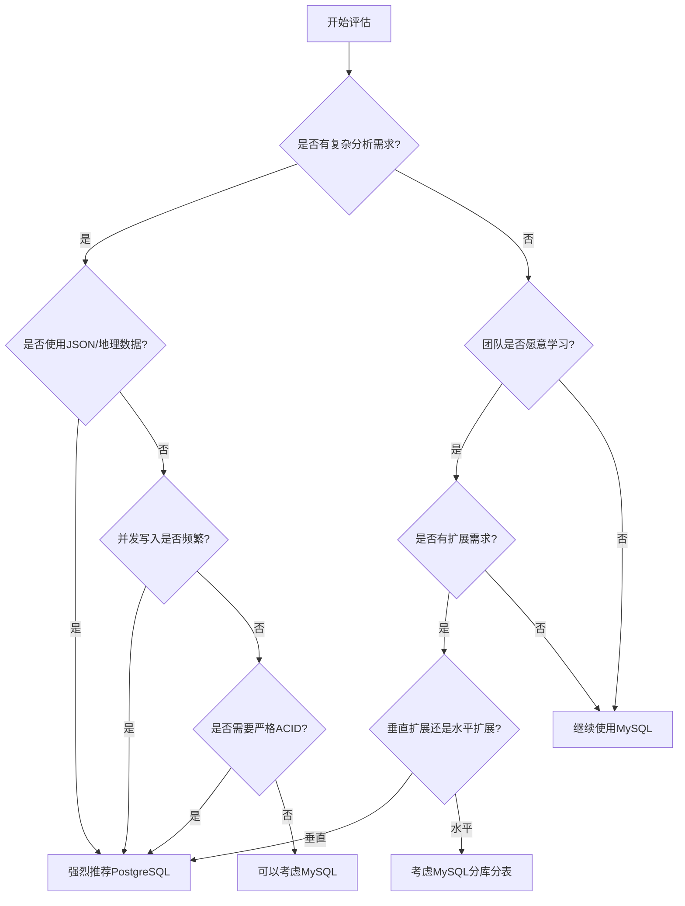

### 一、引言：数据库江湖的变迁

#### 1、数据库市场格局的演变：从MySQL独大到PostgreSQL崛起

近年来，数据库市场正在经历一场深刻的变革。根据[DB-Engines](https://db-engines.com/en/ranking)的最新排名数据，我们可以清晰地看到这种变化的轨迹。

**MySQL的辉煌与局限**

- **历史地位**：作为LAMP架构的重要组成部分，MySQL曾经是Web开发的首选数据库
- **市场占有率**：长期占据关系型数据库市场的头把交椅，特别在互联网公司中使用广泛
- **技术瓶颈**：随着业务复杂度提升，MySQL在复杂查询、数据类型支持、扩展性方面的不足日益凸显

**PostgreSQL的强势崛起**

- **排名跃升**：从2013年的第4名跃升至2024年的第2名，仅次于Oracle
- **增长势头**：DB-Engines积分从2013年的200+增长到2024年的500+，增长率超过150%
- **技术认可**：被越来越多的技术团队视为"最先进的开源数据库"

<!-- more -->
#### 2、PostgreSQL崛起的深层原因

**技术架构优势**  

PostgreSQL被誉为"数据库中的Linux"，这个比喻恰如其分地说明了它的几个核心特点：  

- **功能完整性**：支持SQL标准的95%以上，而MySQL仅支持约60%
- **扩展性设计**：插件化架构允许用户根据需求添加功能，从GIS到机器学习应有尽有
- **数据类型丰富**：原生支持JSON、数组、几何类型、自定义类型等，MySQL望尘莫及

**开发体验提升**

- **查询能力**：窗口函数、CTE、LATERAL JOIN等高级特性让复杂分析变得优雅
- **数据完整性**：更严格的约束检查和事务处理，减少了业务层的复杂度
- **运维友好**：丰富的系统视图和统计信息，问题诊断更加便捷

**生态系统繁荣**

- **云厂商支持**：AWS、Azure、阿里云等主流云厂商都将PostgreSQL作为重点产品
- **企业级应用**：Instagram、Uber、Netflix等大型公司的成功案例证明了其生产可用性
- **社区活跃度**：PostgreSQL社区的技术创新速度明显快于MySQL

#### 3、行业趋势的驱动力

**业务复杂度提升**

现代应用对数据库的要求已经远超简单的CRUD操作：
- 需要处理非结构化数据（JSON、地理信息）
- 需要复杂的分析查询和实时报表
- 需要更好的扩展性来应对数据量增长

**技术债务成本**

许多公司发现MySQL的局限性开始影响业务发展：
- 复杂查询性能不佳，需要在应用层实现大量逻辑
- 数据类型支持不足，导致设计妥协
- 分区、外键等特性的限制影响数据架构

**人才市场变化**

新一代开发者更倾向于选择功能更全面的工具：
- PostgreSQL的学习曲线虽然稍陡，但功能回报更高
- 掌握PostgreSQL的开发者在就业市场更具竞争力
- 技术社区的讨论重心正在向PostgreSQL倾斜

#### 4、本文的目标：深入理解PostgreSQL的技术优势

本文将从以下几个维度深入分析PostgreSQL相对于MySQL的技术优势：

**核心技术对比**
- MVCC实现机制的差异和性能影响
- 查询优化器的技术架构对比
- 并发控制和锁机制的设计理念

**功能特性实战**
- PostgreSQL独有的高级数据类型及其应用场景
- 强大的扩展生态系统和插件机制
- 声明式分区和HTAP能力的实际价值

**性能与扩展性**
- 不同工作负载下的性能表现对比
- 水平扩展和高可用解决方案
- 生产环境的调优和监控实践

**迁移与决策指南**
- 从MySQL到PostgreSQL的迁移策略
- 技术选型的评估矩阵和决策要点
- 团队能力建设和知识迁移建议

通过本文的深入分析，你将全面理解为什么PostgreSQL被称为"新王"，以及在什么情况下应该选择它作为你的数据库解决方案。


### 二、新王的实力：PostgreSQL核心优势深度解析

#### 1、技术架构对比：设计哲学的根本差异

##### 1.1、MVCC实现机制：两种截然不同的路径

PostgreSQL和MySQL InnoDB在MVCC（多版本并发控制）的实现上采用了不同的策略，这直接影响了它们的性能特征：

**PostgreSQL的MVCC实现**
```sql
-- PostgreSQL的行版本策略
-- 每个UPDATE/DELETE都会创建新的行版本，旧版本保留在表中
CREATE TABLE test_mvcc (
    id INTEGER,
    name TEXT,
    version INTEGER DEFAULT 1
);

-- 插入初始数据
INSERT INTO test_mvcc (id, name) VALUES (1, '张三');

-- 更新操作会创建新行版本
UPDATE test_mvcc SET name = '李四' WHERE id = 1;

-- 查看行版本信息（使用系统列）
SELECT
    ctid,           -- 物理位置
    xmin,           -- 创建该版本的事务ID
    xmax,           -- 删除该版本的事务ID
    id,
    name
FROM test_mvcc;
```

**MySQL InnoDB的MVCC实现**
```sql
-- MySQL通过undo log维护历史版本
-- 只在原地更新，历史版本存储在undo log中
CREATE TABLE test_mvcc (
    id INT PRIMARY KEY,
    name VARCHAR(50),
    version INT DEFAULT 1
) ENGINE=InnoDB;

-- 相同的操作，但底层机制不同
INSERT INTO test_mvcc (id, name) VALUES (1, '张三');
UPDATE test_mvcc SET name = '李四' WHERE id = 1;
```

**技术优劣对比**

| 特性对比 | PostgreSQL | MySQL InnoDB | 影响分析 |
|----------|------------|--------------|----------|
| **存储开销** | 高（每个版本都存储） | 低（undo log按需） | PG需要更多存储空间 |
| **读性能** | 优（直接读取目标版本） | 良（需要回滚构造） | 依赖具体工作负载 |
| **写性能** | 良（需要vacuum清理） | 优（原地更新） | 高频小事务MySQL更优 |
| **长事务影响** | 中等（影响vacuum） | 严重（undo log膨胀） | PG对长事务更友好 |
| **并发度** | 高（版本隔离好） | 中等（锁竞争较多） | PG并发性能更优 |

**进程模型 vs 线程模型：稳定性与性能的权衡**

```bash
# PostgreSQL进程模型查看
ps aux | grep postgres
# 典型输出：
# postgres: postmaster process
# postgres: checkpointer process
# postgres: background writer process
# postgres: WAL writer process
# postgres: autovacuum launcher process
# postgres: user database connection process

# MySQL线程模型查看（在MySQL内部）
SHOW PROCESSLIST;
```

**架构差异分析**

**PostgreSQL进程模型优势**
- **故障隔离**：单个连接崩溃不会影响其他连接
- **内存隔离**：每个进程有独立的内存空间，避免内存泄露扩散
- **调试便利**：可以单独调试某个进程，问题定位更容易
- **平台兼容**：在不同操作系统上行为一致

**PostgreSQL进程模型劣势**
- **连接成本**：创建进程比创建线程成本高
- **内存开销**：每个连接需要独立的内存空间
- **连接数限制**：受操作系统进程数限制

**生产环境最佳实践**
```sql
-- PostgreSQL连接池配置建议
-- 使用PgBouncer进行连接池管理
-- pgbouncer.ini配置示例

[databases]
mydb = host=localhost port=5432 dbname=mydb

[pgbouncer]
pool_mode = transaction
max_client_conn = 1000
default_pool_size = 20
max_db_connections = 100
```

##### 1.2、WAL机制详解：日志先行的性能艺术

PostgreSQL的WAL（Write-Ahead Logging）机制在设计上比MySQL的redo log更加灵活和强大：

```sql
-- WAL配置和监控
-- 查看当前WAL配置
SELECT name, setting, unit, short_desc
FROM pg_settings
WHERE name IN (
    'wal_level',
    'wal_buffers',
    'checkpoint_timeout',
    'checkpoint_completion_target',
    'max_wal_size'
);

-- 监控WAL写入状态
SELECT
    pg_current_wal_lsn() as current_lsn,
    pg_walfile_name(pg_current_wal_lsn()) as current_wal_file,
    pg_wal_lsn_diff(pg_current_wal_lsn(), '0/0') / 1024 / 1024 as total_wal_mb;

-- WAL统计信息
SELECT * FROM pg_stat_wal;
```

**WAL vs Redo Log对比**

| 特性 | PostgreSQL WAL | MySQL Redo Log | 技术优势 |
|------|----------------|----------------|----------|
| **格式设计** | 逻辑+物理混合 | 纯物理格式 | WAL支持逻辑复制 |
| **压缩能力** | 支持压缩 | 不支持 | 节省存储和网络 |
| **并行写入** | 支持 | 有限支持 | 复杂写入场景PG更优 |
| **复制灵活性** | 物理+逻辑复制 | 主要是物理复制 | WAL支持更多场景 |
| **恢复粒度** | 时间点恢复 | 时间点恢复 | 功能相当 |

##### 1.3、内存管理：共享内存的哲学差异

```sql
-- PostgreSQL内存配置查看
SELECT
    name,
    setting,
    unit,
    context,
    short_desc
FROM pg_settings
WHERE name IN (
    'shared_buffers',
    'work_mem',
    'maintenance_work_mem',
    'effective_cache_size',
    'temp_buffers'
)
ORDER BY name;

-- 内存使用统计
SELECT
    datname,
    numbackends,
    xact_commit,
    xact_rollback,
    blks_read,
    blks_hit,
    round(blks_hit * 100.0 / (blks_hit + blks_read), 2) as cache_hit_ratio
FROM pg_stat_database
WHERE datname NOT IN ('template0', 'template1', 'postgres');
```

**内存架构对比**

**PostgreSQL内存模型**
- **shared_buffers**：所有进程共享的缓冲池
- **work_mem**：每个操作可用的工作内存
- **maintenance_work_mem**：维护操作（VACUUM、索引创建）专用
- **effective_cache_size**：操作系统缓存大小的估计值

**推荐配置策略**
```sql
-- 生产环境推荐配置（32GB内存服务器）
-- postgresql.conf

# 共享缓冲区 = 内存的25%
shared_buffers = 8GB

# 工作内存，根据并发连接数调整
work_mem = 256MB

# 维护工作内存
maintenance_work_mem = 2GB

# 操作系统缓存估计 = 内存的75%
effective_cache_size = 24GB

# WAL缓冲区
wal_buffers = 64MB

# 检查点配置
checkpoint_completion_target = 0.7
checkpoint_timeout = 10min
max_wal_size = 4GB
```

#### 2、SQL标准兼容性深度对比：功能完整性的显著差异

PostgreSQL在SQL标准兼容性方面远超MySQL，支持更多高级特性，在复杂查询和分析场景中表现卓越。

**核心差异对比表**

| SQL标准特性 | PostgreSQL | MySQL 8.0 | 技术优势       | 业务价值 |
|-------------|------------|-----------|------------|----------|
| **窗口函数** | 完整支持 | 基础支持 | 20+种窗口函数   | 复杂数据分析一步到位 |
| **CTE递归查询** | 完整支持 | 支持 | 更强大的递归能力   | 层次数据处理更优雅 |
| **LATERAL JOIN** | 完整支持 | 无LATERAL语法 | 动态关联查询     | 需用窗口函数/子查询替代 |
| **GROUPING SETS** | 完整支持 | 不支持 | 多维聚合分析     | OLAP报表一步生成 |
| **FILTER子句** | 完整支持 | 不支持 | 条件聚合优化     | 简化复杂统计逻辑 |
| **UPSERT语法** | `ON CONFLICT` | `ON DUPLICATE KEY` | 更灵活的冲突处理   | 数据同步更可靠 |
| **数组类型** | 原生支持 | JSON模拟 | 简化多值存储与查询  | 复杂数据结构 |
| **自定义类型** | 完整支持 | 不支持 | 强化数据模型语义表达 | 业务建模 |

##### 2.1、窗口函数：超越MySQL的分析能力

窗口函数让复杂的数据分析变得简单，PostgreSQL在这方面比MySQL强大得多。

**核心差异**：PostgreSQL支持20+种窗口函数，MySQL只支持基础的几种；PostgreSQL语法更灵活，表达能力更强。

**典型场景：销售排名分析**

```sql
-- PostgreSQL：功能完整
SELECT
    salesperson,
    sales_amount,
    -- 排名分析
    ROW_NUMBER() OVER (ORDER BY sales_amount DESC) as 序号,
    RANK() OVER (ORDER BY sales_amount DESC) as 排名,
    PERCENT_RANK() OVER (ORDER BY sales_amount) as 百分位排名,  -- MySQL不支持

    -- 移动平均（最近3天）
    AVG(sales_amount) OVER (
        ORDER BY sale_date
        ROWS BETWEEN 2 PRECEDING AND CURRENT ROW
    ) as 三日均值,

    -- 趋势分析
    LAG(sales_amount) OVER (ORDER BY sale_date) as 昨日销售,
    sales_amount - LAG(sales_amount) OVER (ORDER BY sale_date) as 环比增长
FROM daily_sales;
```

```sql
-- MySQL 8.0：功能受限
SELECT
    salesperson,
    sales_amount,
    ROW_NUMBER() OVER (ORDER BY sales_amount DESC) as 序号,
    RANK() OVER (ORDER BY sales_amount DESC) as 排名,
    -- 不支持 PERCENT_RANK 等高级函数
    -- 移动窗口语法受限，表达能力弱
    AVG(sales_amount) OVER (ORDER BY sale_date ROWS 2 PRECEDING) as 移动均值
FROM daily_sales;
```

**业务价值**：PostgreSQL可以一条SQL完成复杂的排名、趋势、分布分析，MySQL往往需要多条查询或应用层计算。

##### 2.2、CTE递归查询：层次数据的优雅处理

递归CTE是处理树形结构数据的利器，如组织架构、分类树、评论回复等。PostgreSQL的递归能力比MySQL更强大。

**核心优势**：PostgreSQL支持更复杂的递归逻辑，可以在递归过程中进行复杂计算和路径追踪。

**典型场景：组织架构查询**

```sql
-- PostgreSQL：一步到位的递归查询
WITH RECURSIVE org_tree AS (
    -- 第一步：找到根节点（CEO）
    SELECT emp_id, emp_name, manager_id, 1 as level, emp_name as path
    FROM employees
    WHERE manager_id IS NULL

    UNION ALL

    -- 第二步：递归找下属
    SELECT e.emp_id, e.emp_name, e.manager_id,
           ot.level + 1,
           ot.path || ' -> ' || e.emp_name
    FROM employees e
    JOIN org_tree ot ON e.manager_id = ot.emp_id
)
SELECT level, REPEAT('  ', level-1) || emp_name as 层级显示, path as 完整路径
FROM org_tree ORDER BY path;
```

结果展示：
```
层级显示              完整路径
张总                  张总
  李经理              张总 -> 李经理
    王主管            张总 -> 李经理 -> 王主管
      小明            张总 -> 李经理 -> 王主管 -> 小明
```

```sql
-- MySQL 8.0+也支持递归CTE，但在性能优化和复杂场景下与PostgreSQL有差异
WITH RECURSIVE mysql_org_tree AS (
    SELECT emp_id, emp_name, manager_id, 1 as level
    FROM employees
    WHERE manager_id IS NULL

    UNION ALL

    SELECT e.emp_id, e.emp_name, e.manager_id, mot.level + 1
    FROM employees e
    JOIN mysql_org_tree mot ON e.manager_id = mot.emp_id
)
SELECT * FROM mysql_org_tree;
-- MySQL支持但在路径追踪和复杂计算上不如PostgreSQL灵活
```

**业务价值**：PostgreSQL在递归CTE的路径追踪、性能优化和复杂逻辑处理上更优秀，MySQL 8.0+虽支持基础递归但限制较多。

##### 2.3、LATERAL JOIN：动态关联的强大武器

`LATERAL JOIN`让子查询可以引用左侧表的字段，实现"依赖关联"。PostgreSQL原生支持，MySQL无LATERAL语法，需要通过窗口函数或相关子查询实现类似功能。

**核忈价值**：解决"为每个XX找到对应的最新/最多/最少的YY"这类问题，PostgreSQL一条SQL搞定。

**典型场景：为每个客户找到最近的3笔订单**

```sql
-- PostgreSQL：一步到位
SELECT
    c.customer_name,
    recent.order_date,
    recent.amount
FROM customers c
LEFT JOIN LATERAL (
    SELECT order_date, amount
    FROM orders
    WHERE customer_id = c.customer_id  -- 关键：引用左侧表字段
    ORDER BY order_date DESC
    LIMIT 3
) recent ON true;
```

结果展示：
```
customer_name | order_date | amount
张三          | 2024-03-15 | 299.99
张三          | 2024-03-10 | 199.99
张三          | 2024-03-05 | 99.99
李四          | 2024-03-12 | 399.99
...
```

```sql
-- MySQL：需要用窗口函数或子查询实现，语法相对复杂
WITH ranked_orders AS (
    SELECT
        customer_id,
        order_date,
        amount,
        ROW_NUMBER() OVER (PARTITION BY customer_id ORDER BY order_date DESC) as rn
    FROM orders
)
SELECT
    c.customer_name,
    ro.order_date,
    ro.amount
FROM customers c
LEFT JOIN ranked_orders ro ON c.customer_id = ro.customer_id AND ro.rn <= 3;
```

**业务价值**：在客户分析、产品推荐、趋势分析等场景中，`LATERAL JOIN`能够简化复杂查询，提升性能。

##### 2.4、GROUPING SETS：多维分析的利器

`GROUPING SETS`是OLAP分析的核心功能，可以在一次查询中按多种维度组合进行聚合。PostgreSQL完整支持，MySQL完全不支持。

**核心价值**：一条SQL生成多维度报表，相当于同时执行多个`GROUP BY`查询。

**典型场景：销售报表多维度分析**

```sql
-- PostgreSQL：一次查询生成所有维度的报表
SELECT
    region,
    category,
    SUM(amount) as total_sales,
    COUNT(*) as order_count
FROM sales_data
GROUP BY GROUPING SETS (
    (region, category),    -- 地区+类别细分
    (region),              -- 地区汇总
    (category),            -- 类别汇总
    ()                     -- 全国总计
);
```

结果展示（一次查询得到）：
```
region | category  | total_sales | order_count
华北    | 数码       | 150000      | 300
华南    | 数码       | 120000      | 250
华北    | NULL      | 280000      | 600      -- 华北地区汇总
华南    | NULL      | 220000      | 480      -- 华南地区汇总
NULL   | 数码       | 270000      | 550      -- 数码类别汇总
NULL   | NULL      | 500000      | 1080     -- 全国总计
```

```sql
-- MySQL：需要多个查询和UNION ALL
SELECT region, NULL as category, SUM(amount), COUNT(*) FROM sales_data GROUP BY region
UNION ALL
SELECT NULL, category, SUM(amount), COUNT(*) FROM sales_data GROUP BY category
UNION ALL
SELECT region, category, SUM(amount), COUNT(*) FROM sales_data GROUP BY region, category
UNION ALL
SELECT NULL, NULL, SUM(amount), COUNT(*) FROM sales_data;
-- 4次扫表，性能差，代码复杂
```

###### a、ROLLUP：层次汇总的便捷工具

`ROLLUP`是`GROUPING SETS`的简化版本，自动生成层次化的汇总报表。

```sql
-- 地区 -> 城市 -> 产品的层次汇总
SELECT
    region,
    city,
    product,
    SUM(sales_amount) as total_sales
FROM regional_sales
GROUP BY ROLLUP (region, city, product);
```

等价于以下GROUPING SETS：
```sql
GROUP BY GROUPING SETS (
    (region, city, product),  -- 最细粒度
    (region, city),           -- 城市汇总
    (region),                 -- 地区汇总
    ()                        -- 总计
)
```

结果展示：
```
region | city | product | total_sales
华北    | 北京  | 手机     | 50000      -- 最细粒度
华北    | 北京  | 电脑     | 30000
华北    | 上海  | 手机     | 40000
华北    | 北京  | NULL    | 80000      -- 北京城市汇总
华北    | 上海  | NULL    | 40000      -- 上海城市汇总
华北    | NULL | NULL    | 120000     -- 华北地区汇总
NULL   | NULL | NULL    | 250000     -- 全国总计
```

###### b、CUBE：所有维度组合的全面分析

`CUBE`生成所有可能的维度组合，适合全面的多维分析。

```sql
-- 地区、渠道、产品类型的全维度分析
SELECT
    region,
    channel,
    product_type,
    SUM(revenue) as total_revenue,
    COUNT(*) as order_count
FROM multi_dimension_sales
GROUP BY CUBE (region, channel, product_type);
```

等价于以下GROUPING SETS：
```sql
GROUP BY GROUPING SETS (
    (region, channel, product_type),  -- 三维详细
    (region, channel),                -- 地区+渠道
    (region, product_type),           -- 地区+产品
    (channel, product_type),          -- 渠道+产品
    (region),                         -- 仅地区
    (channel),                        -- 仅渠道
    (product_type),                   -- 仅产品
    ()                                -- 总计
)
```

**三种方式的使用场景对比**

| 方式 | 适用场景 | 生成的分组数 | 典型应用 |
|------|----------|-------------|----------|
| `GROUPING SETS` | 需要特定维度组合 | 自定义 | 定制化报表 |
| `ROLLUP` | 层次化数据汇总 | n+1 (n为维度数) | 组织架构、地理层次 |
| `CUBE` | 全维度交叉分析 | 2^n | OLAP多维分析 |

###### c、高级应用：混合使用

```sql
-- 复杂的商业智能报表
SELECT
    CASE WHEN GROUPING(region) = 1 THEN '全国' ELSE region END as 地区,
    CASE WHEN GROUPING(quarter) = 1 THEN '全年' ELSE quarter END as 季度,
    CASE WHEN GROUPING(product_line) = 1 THEN '全品类' ELSE product_line END as 产品线,

    SUM(revenue) as 收入,
    COUNT(*) as 订单数,
    ROUND(AVG(revenue), 2) as 平均订单价值,

    -- 标识汇总级别
    CASE
        WHEN GROUPING(region, quarter, product_line) = 0 THEN '明细数据'
        WHEN GROUPING(region, quarter, product_line) = 1 THEN '产品线汇总'
        WHEN GROUPING(region, quarter, product_line) = 3 THEN '季度汇总'
        WHEN GROUPING(region, quarter, product_line) = 4 THEN '地区汇总'
        WHEN GROUPING(region, quarter, product_line) = 7 THEN '总计'
        ELSE '其他汇总'
    END as 汇总级别

FROM business_data
WHERE order_date >= '2024-01-01'
GROUP BY ROLLUP (region, quarter, product_line)
ORDER BY
    GROUPING(region, quarter, product_line),
    region, quarter, product_line;
```

**业务价值**：在BI报表、数据分析场景中，这些OLAP功能能够：
- **提升效率**：一条SQL生成多维度报表，避免多次查询
- **保证一致性**：同一次计算确保所有汇总数据的一致性
- **简化开发**：减少复杂的UNION ALL和子查询嵌套
- **提升性能**：数据库层面优化，比应用层聚合更高效

##### 2.5、FILTER子句：条件聚合的简洁表达

`FILTER`子句让条件聚合变得简洁优雅，避免了复杂的`CASE WHEN`嵌套。PostgreSQL支持，MySQL不支持。

**核心优势**：可读性更好，性能更优，代码更简洁。

**典型场景：用户行为分析**

```sql
-- PostgreSQL：简洁优雅
SELECT
    user_type,
    COUNT(*) as 总用户数,
    COUNT(*) FILTER (WHERE age >= 18) as 成年用户,
    COUNT(*) FILTER (WHERE gender = 'F') as 女性用户,
    COUNT(*) FILTER (WHERE last_login >= CURRENT_DATE - INTERVAL '30 days') as 活跃用户,
    SUM(order_amount) FILTER (WHERE order_status = 'completed') as 完成订单金额
FROM user_analytics
GROUP BY user_type;
```

结果展示：
```
user_type | 总用户数 | 成年用户 | 女性用户 | 活跃用户 | 完成订单金额
普通用户   | 1000     | 850     | 520     | 680     | 125000.00
VIP用户  | 200      | 200     | 95      | 180     | 89000.00
```

```sql
-- MySQL：冗长难读
SELECT
    user_type,
    COUNT(*) as 总用户数,
    SUM(CASE WHEN age >= 18 THEN 1 ELSE 0 END) as 成年用户,
    SUM(CASE WHEN gender = 'F' THEN 1 ELSE 0 END) as 女性用户,
    SUM(CASE WHEN last_login >= DATE_SUB(CURDATE(), INTERVAL 30 DAY) THEN 1 ELSE 0 END) as 活跃用户,
    SUM(CASE WHEN order_status = 'completed' THEN order_amount ELSE 0 END) as 完成订单金额
FROM user_analytics
GROUP BY user_type;
```

**业务价值**：在数据统计、用户画像、A/B测试分析等场景中，`FILTER`子句能够大大提升代码的可读性。

##### 2.6、UPSERT：冲突处理的优雅解决方案

UPSERT（INSERT + UPDATE）在数据同步、缓存更新等场景中非常常用。PostgreSQL的`ON CONFLICT`比MySQL的`ON DUPLICATE KEY`更强大。

**核心优势**：PostgreSQL支持条件更新、多字段约束、忽略冲突等高级功能。

**典型场景：用户登录统计更新**

```sql
-- PostgreSQL：强大的冲突处理
INSERT INTO user_stats (user_id, login_count, last_login)
VALUES (12345, 1, NOW())
ON CONFLICT (user_id)
DO UPDATE SET
    login_count = user_stats.login_count + 1,
    last_login = EXCLUDED.last_login,
    updated_at = NOW()
WHERE
    EXCLUDED.last_login > user_stats.last_login;  -- 只有更新的登录时间才更新

-- 忽略重复访问（防刷）
INSERT INTO daily_visitors (user_id, visit_date)
VALUES (12345, CURRENT_DATE)
ON CONFLICT (user_id, visit_date) DO NOTHING;  -- 同一天重复访问不记录
```

```sql
-- MySQL：功能受限
INSERT INTO user_stats (user_id, login_count, last_login)
VALUES (12345, 1, NOW())
ON DUPLICATE KEY UPDATE
    login_count = login_count + 1,
    last_login = VALUES(last_login);
-- 无法实现条件更新，无法忽略冲突
```

**功能对比**：
- PostgreSQL支持条件更新（WHERE子句）
- PostgreSQL支持多字段组合约束冲突处理
- PostgreSQL支持`DO NOTHING`忽略冲突
- MySQL功能相对简单，只支持基础的重复键更新

**业务价值**：在数据同步、缓存更新、计数器维护等场景中，PostgreSQL的灵活性让业务逻辑更加精确。

#### 3、查询优化器技术对比：智能化程度的显著差距

**PostgreSQL的基于成本优化器详解**

PostgreSQL的查询优化器采用了更先进的基于成本的优化策略（CBO），在复杂查询的处理上明显优于MySQL：

```sql
-- 查看查询优化器配置
SELECT name, setting, unit, short_desc
FROM pg_settings
WHERE name IN (
    'enable_seqscan',
    'enable_indexscan',
    'enable_bitmapscan',
    'enable_hashjoin',
    'enable_mergejoin',
    'enable_nestloop',
    'random_page_cost',
    'seq_page_cost',
    'cpu_tuple_cost',
    'cpu_index_tuple_cost'
);

-- 成本估算参数调优
SET random_page_cost = 1.1;  -- SSD环境降低随机访问成本
SET effective_cache_size = '24GB';  -- 指导优化器估算缓存命中率
```

**统计信息收集和使用机制**
```sql
-- PostgreSQL的统计信息系统
-- 查看表的统计信息
SELECT
    schemaname,
    tablename,
    attname,
    n_distinct,          -- 不同值数量估算
    correlation,         -- 物理存储与逻辑顺序的相关性
    most_common_vals,    -- 最常见值
    most_common_freqs,   -- 最常见值的频率
    histogram_bounds     -- 直方图边界
FROM pg_stats
WHERE tablename = 'orders'
  AND schemaname = 'public';

-- 手动更新统计信息
ANALYZE orders;

-- 查看自动统计信息更新设置
SELECT name, setting FROM pg_settings
WHERE name LIKE '%autovacuum%' OR name LIKE '%stats%';
```

**并行查询处理能力对比**
```sql
-- PostgreSQL并行查询配置
SET max_parallel_workers_per_gather = 4;
SET max_parallel_workers = 8;
SET min_parallel_table_scan_size = '8MB';
SET min_parallel_index_scan_size = '512kB';
SET parallel_tuple_cost = 0.1;
SET parallel_setup_cost = 1000.0;

-- 复杂的并行分析查询
EXPLAIN (ANALYZE, BUFFERS, FORMAT JSON)
SELECT
    o.customer_id,
    c.customer_name,
    c.region,
    COUNT(*) as order_count,
    SUM(o.amount) as total_amount,
    AVG(o.amount) as avg_amount,
    MAX(o.order_date) as last_order_date,
    -- 复杂的窗口函数计算
    RANK() OVER (PARTITION BY c.region ORDER BY SUM(o.amount) DESC) as region_rank,
    SUM(SUM(o.amount)) OVER (PARTITION BY c.region) as region_total
FROM orders o
JOIN customers c ON o.customer_id = c.customer_id
JOIN order_items oi ON o.order_id = oi.order_id
JOIN products p ON oi.product_id = p.product_id
WHERE o.order_date >= '2023-01-01'
  AND p.category IN ('电子产品', '家居用品', '服装鞋包')
GROUP BY o.customer_id, c.customer_name, c.region
HAVING SUM(o.amount) > 10000
ORDER BY total_amount DESC;
```

**执行计划分析：EXPLAIN vs EXPLAIN ANALYZE深度使用**

```sql
-- 基础执行计划查看
EXPLAIN (ANALYZE, BUFFERS, TIMING, FORMAT TEXT)
SELECT
    p.product_name,
    SUM(oi.quantity * oi.unit_price) as total_revenue,
    COUNT(DISTINCT o.customer_id) as unique_customers,
    AVG(oi.quantity * oi.unit_price) as avg_order_value
FROM products p
JOIN order_items oi ON p.product_id = oi.product_id
JOIN orders o ON oi.order_id = o.order_id
WHERE o.order_date BETWEEN '2024-01-01' AND '2024-12-31'
  AND p.category = '数码产品'
GROUP BY p.product_id, p.product_name
HAVING SUM(oi.quantity * oi.unit_price) > 50000
ORDER BY total_revenue DESC
LIMIT 10;

-- JSON格式的详细执行计划
EXPLAIN (ANALYZE, BUFFERS, TIMING, FORMAT JSON)
WITH monthly_sales AS (
    SELECT
        DATE_TRUNC('month', order_date) as month,
        customer_id,
        SUM(amount) as monthly_total
    FROM orders
    WHERE order_date >= '2024-01-01'
    GROUP BY DATE_TRUNC('month', order_date), customer_id
),
customer_trends AS (
    SELECT
        customer_id,
        month,
        monthly_total,
        LAG(monthly_total) OVER (PARTITION BY customer_id ORDER BY month) as prev_month,
        LEAD(monthly_total) OVER (PARTITION BY customer_id ORDER BY month) as next_month
    FROM monthly_sales
)
SELECT
    ct.customer_id,
    c.customer_name,
    COUNT(*) as active_months,
    SUM(ct.monthly_total) as total_spent,
    AVG(ct.monthly_total) as avg_monthly_spend,
    -- 增长趋势分析
    COUNT(CASE WHEN ct.monthly_total > ct.prev_month THEN 1 END) as growth_months,
    COUNT(CASE WHEN ct.monthly_total < ct.prev_month THEN 1 END) as decline_months
FROM customer_trends ct
JOIN customers c ON ct.customer_id = c.customer_id
GROUP BY ct.customer_id, c.customer_name
HAVING COUNT(*) >= 6  -- 至少6个月活跃
ORDER BY total_spent DESC;
```

**性能调优的关键指标分析**
```sql
-- 查询性能监控
SELECT
    query,
    calls,
    total_exec_time,
    mean_exec_time,
    stddev_exec_time,
    min_exec_time,
    max_exec_time,
    rows,
    100.0 * shared_blks_hit / nullif(shared_blks_hit + shared_blks_read, 0) as hit_percent
FROM pg_stat_statements
ORDER BY total_exec_time DESC
LIMIT 10;

-- 索引使用情况分析
SELECT
    t.schemaname,
    t.tablename,
    indexname,
    idx_tup_read,    -- 索引读取的元组数
    idx_tup_fetch,   -- 通过索引获取的表行数
    idx_scan,        -- 索引扫描次数
    CASE WHEN idx_scan > 0
         THEN round(idx_tup_read::numeric / idx_scan, 2)
         ELSE 0
    END as avg_tuples_per_scan
FROM pg_stat_user_indexes i
JOIN pg_stat_user_tables t ON i.relid = t.relid
WHERE t.schemaname = 'public'
ORDER BY idx_scan DESC;
```

#### 2、索引使用最佳实践大全

##### 2.1、索引选择决策树

为了帮助开发者快速选择正确的索引类型，下面提供一个系统性的决策指南：

**查询类型与索引选择矩阵**

| 查询模式 | 数据特征 | 第一选择 | 替代方案 | 典型SQL |
|----------|----------|----------|----------|---------|
| **等值查询** | 高基数字段 | B-tree | Hash（仅等值） | `WHERE id = 123` |
| **范围查询** | 有序数据 | B-tree | BRIN（大表） | `WHERE age BETWEEN 18 AND 65` |
| **前缀匹配** | 字符串前缀 | B-tree | - | `WHERE name LIKE 'John%'` |
| **模糊匹配** | 任意子串 | GIN + pg_trgm | - | `WHERE name LIKE '%john%'` |
| **全文搜索** | 文本内容 | GIN + tsvector | - | 全文搜索 |
| **数组操作** | 数组包含/重叠 | GIN | GiST | `WHERE tags @> ARRAY['sql']` |
| **JSON查询** | JSONB数据 | GIN | - | `WHERE data @> '{"type": "user"}'` |
| **空间查询** | 几何数据 | GiST | SP-GiST | PostGIS空间查询 |
| **低选择性** | 枚举值字段 | 部分索引 | Bloom | `WHERE status = 'active'` |
| **时序数据** | 按时间排序 | BRIN | B-tree | 时间序列数据 |

##### 2.2、综合选择策略案例

下面通过一个电商系统的完整案例，展示如何为不同业务场景设计最优的索引策略：

```sql
-- 电商商品表的综合索引设计
CREATE TABLE e_commerce_products (
    -- 主键字段
    product_id BIGSERIAL PRIMARY KEY,

    -- 基础信息字段
    name TEXT NOT NULL,
    brand TEXT,
    category_id INTEGER,
    subcategory_id INTEGER,
    sku TEXT UNIQUE,

    -- 价格与库存
    price DECIMAL(10,2),
    cost DECIMAL(10,2),
    stock_quantity INTEGER,
    min_stock_threshold INTEGER,

    -- 状态与属性
    status TEXT,  -- 'active', 'inactive', 'discontinued'
    is_featured BOOLEAN DEFAULT FALSE,
    weight DECIMAL(8,3),
    dimensions JSONB,

    -- 标签与分类
    tags TEXT[],
    keywords TEXT[],
    attributes JSONB,

    -- 评分与销量
    avg_rating DECIMAL(3,2),
    review_count INTEGER,
    sales_count INTEGER,

    -- 时间字段
    created_at TIMESTAMPTZ DEFAULT NOW(),
    updated_at TIMESTAMPTZ DEFAULT NOW(),
    launch_date DATE,

    -- 地理信息（本地化商品）
    available_regions TEXT[]
);
```

**为不同查询场景设计的索引**

```sql
-- 1. 商品搜索索引（支持全文搜索）
-- 场景：用户输入关键词搜索商品
CREATE INDEX idx_products_search_name
    ON e_commerce_products
    USING GIN(to_tsvector('english', name));

CREATE INDEX idx_products_search_combined
    ON e_commerce_products
    USING GIN(to_tsvector('english', name || ' ' || COALESCE(brand, '')));

-- 2. 电商筛选索引（分类+状态+价格）
-- 场景：分类页面的筛选功能
CREATE INDEX idx_products_category_filter
    ON e_commerce_products (category_id, status, price)
    WHERE status = 'active';

-- 3. 价格范围查询索引
-- 场景：价格区间筛选
CREATE INDEX idx_products_price_range
    ON e_commerce_products (price)
    WHERE status = 'active' AND price > 0;

-- 4. 标签系统索引（GIN数组）
-- 场景：按标签过滤商品
CREATE INDEX idx_products_tags
    ON e_commerce_products
    USING GIN(tags);

-- 5. 属性系统索引（JSONB）
-- 场景：按商品属性过滤
CREATE INDEX idx_products_attributes
    ON e_commerce_products
    USING GIN(attributes);

-- 6. 热门商品排序索引
-- 场景：热销商品列表
CREATE INDEX idx_products_hot_items
    ON e_commerce_products (sales_count DESC, avg_rating DESC)
    WHERE status = 'active' AND sales_count > 0;

-- 7. 库存警报索引
-- 场景：低库存商品管理
CREATE INDEX idx_products_low_stock
    ON e_commerce_products (stock_quantity)
    WHERE status = 'active' AND stock_quantity <= min_stock_threshold;

-- 8. 时间分区索引（BRIN适合大表）
-- 场景：时间范围查询，大量历史数据
CREATE INDEX idx_products_created_brin
    ON e_commerce_products
    USING BRIN(created_at, updated_at);

-- 9. 地理位置索引（本地化）
-- 场景：地域性商品过滤
CREATE INDEX idx_products_regions
    ON e_commerce_products
    USING GIN(available_regions);

-- 10. 复合索引（品牌+分类）
-- 场景：品牌页面的分类查询
CREATE INDEX idx_products_brand_category
    ON e_commerce_products (brand, category_id, status)
    WHERE status = 'active';
```

##### 2.3、索引维护与监控最佳实践

```sql
-- 索引使用情况分析
SELECT
    schemaname,
    tablename,
    indexname,
    idx_scan as 使用次数,
    idx_tup_read as 读取元组数,
    idx_tup_fetch as 获取表行数,
    CASE
        WHEN idx_scan = 0 THEN '⚠️ 未使用'
        WHEN idx_scan < 100 THEN '🟡 低频使用'
        WHEN idx_scan < 1000 THEN '🟢 中频使用'
        ELSE '🔴 高频使用'
    END as 使用频率,
    pg_size_pretty(pg_relation_size(indexrelid)) as 索引大小
FROM pg_stat_user_indexes
ORDER BY idx_scan DESC;

-- 索引性能分析
SELECT
    schemaname,
    tablename,
    indexname,
    idx_scan,
    CASE
        WHEN idx_scan > 0
        THEN ROUND(idx_tup_read::numeric / idx_scan, 2)
        ELSE 0
    END as 平均扫描行数,
    CASE
        WHEN idx_scan > 0 AND idx_tup_read > idx_scan * 100
        THEN '🟡 需优化'
        WHEN idx_scan > 0 AND idx_tup_read > idx_scan * 50
        THEN '🟢 尚可'
        ELSE '✅ 良好'
    END as 性能评估
FROM pg_stat_user_indexes
WHERE idx_scan > 0
ORDER BY 平均扫描行数 DESC;
```

通过以上深入对比，我们可以清晰地看到PostgreSQL在技术架构、SQL标准兼容性和查询优化器方面的显著优势。这些技术优势不仅体现在功能的丰富性上，更重要的是为复杂业务场景提供了更优雅、更高效的解决方案。

### 三、PostgreSQL独特数据类型与高级特性实战

#### 1、JSONB：比MySQL JSON更强大的文档存储

##### 1.1、核心技术优势分析

PostgreSQL的JSONB类型在功能和性能上都远超MySQL的JSON类型，提供了真正的文档数据库能力：

**JSONB vs MySQL JSON核心差异**

| 特性对比 | PostgreSQL JSONB | MySQL JSON | 技术优势 |
|----------|------------------|-------------|----------|
| **存储格式** | 二进制优化格式 | 二进制编码，支持快速访问 | JSONB在复杂查询上更优 |
| **索引支持** | GIN、GiST、B-tree | 虚拟列索引 | 索引类型更丰富 |
| **操作符支持** | 20+种专用操作符 | 基础函数 | 查询表达力更强 |
| **嵌套查询** | 原生支持 | 有限支持 | 复杂查询更便捷 |
| **更新性能** | 优化的部分更新 | 整体替换 | 大文档更新更快 |
| **并发性能** | MVCC友好 | 锁竞争较多 | 高并发场景更优 |

**关键技术优势解析**

- **二进制存储优化**：JSONB采用优化的二进制格式存储，避免了重复解析JSON字符串的开销
- **索引生态丰富**：支持GIN索引的包含查询、GiST索引的空间查询、表达式索引等多种索引策略
- **操作符表达力强**：提供`@>`包含、`?`键存在、`#>`路径提取等20+种专用操作符
- **部分更新机制**：支持精确的字段级更新，避免整个文档重写

##### 1.2、适用场景与业务价值

**核心适用场景**

| 业务场景 | JSONB优势 | 具体价值 |
|----------|-----------|----------|
| **用户画像与标签** | 灵活的属性存储 | 无需频繁修改表结构 |
| **配置管理** | 层次化配置存储 | 支持复杂的嵌套配置 |
| **日志与事件存储** | 高效的结构化查询 | 既有NoSQL的灵活性，又有SQL的查询能力 |
| **API响应缓存** | 原生JSON操作 | 直接存储和查询API响应数据 |
| **多租户数据隔离** | 租户特定字段存储 | 避免多租户表结构差异问题 |

##### 1.3、实战应用演示

**表结构设计**

```sql
-- 创建包含JSONB的事件日志表
CREATE TABLE event_logs (
    id BIGSERIAL PRIMARY KEY,
    event_type TEXT NOT NULL,
    event_data JSONB NOT NULL,
    user_id INTEGER,
    session_id TEXT,
    ip_address INET,
    created_at TIMESTAMPTZ DEFAULT NOW()
);
```

**索引策略设计**

不同的业务场景需要不同的索引策略，JSONB提供了丰富的索引选择：

```sql
-- 1. GIN索引：适合包含查询和键存在查询
CREATE INDEX idx_event_logs_data_gin ON event_logs USING GIN(event_data);

-- 2. 表达式索引：针对特定JSON路径优化
CREATE INDEX idx_event_logs_user_id ON event_logs USING BTREE((event_data->>'user_id'));

-- 3. 部分索引：只为特定条件的数据创建索引
CREATE INDEX idx_event_logs_errors ON event_logs USING GIN(event_data)
WHERE event_type = 'error';

-- 4. 复合表达式索引
CREATE INDEX idx_event_logs_user_session ON event_logs
USING BTREE(user_id, (event_data->>'session_id'))
WHERE event_data ? 'session_id';
```

**数据插入示例**

以下演示如何插入复杂的嵌套JSON数据：

```sql
-- 插入复杂的事件数据
INSERT INTO event_logs (event_type, event_data, user_id, session_id, ip_address) VALUES
('user_login', '{
    "type": "login",
    "user": {
        "id": 12345,
        "name": "张三",
        "email": "zhangsan@example.com",
        "roles": ["user", "premium"],
        "preferences": {
            "theme": "dark",
            "language": "zh-CN",
            "notifications": {
                "email": true,
                "push": false
            }
        }
    },
    "device": {
        "type": "mobile",
        "os": "iOS",
        "version": "17.1",
        "app_version": "2.1.0"
    },
    "location": {
        "country": "CN",
        "city": "北京",
        "coordinates": [116.4074, 39.9042]
    },
    "metadata": {
        "login_method": "oauth",
        "provider": "wechat",
        "is_first_login": false,
        "session_duration": 3600
    }
}', 12345, 'sess_abc123', '192.168.1.100'),

('purchase', '{
    "type": "purchase",
    "order": {
        "id": "ORD_20240315_001",
        "amount": 299.99,
        "currency": "CNY",
        "items": [
            {
                "product_id": "PROD_001",
                "name": "MacBook Pro",
                "quantity": 1,
                "price": 299.99,
                "categories": ["electronics", "computers"]
            }
        ]
    },
    "payment": {
        "method": "alipay",
        "status": "completed",
        "transaction_id": "TXN_789456"
    },
    "shipping": {
        "address": {
            "province": "北京",
            "city": "北京",
            "district": "朝阳区",
            "street": "建国门外大街1号",
            "postal_code": "100020"
        },
        "method": "express",
        "estimated_delivery": "2024-03-18"
    }
}', 12345, 'sess_abc123', '192.168.1.100');
```

##### 1.4、JSONB查询操作符详解

PostgreSQL提供了丰富的JSONB专用操作符，让复杂的JSON查询变得简单直观：

**基础查询操作符**

##### a、包含与键存在查询

包含查询是JSONB最强大的特性之一，让复杂的JSON数据查询变得简单直观：

```sql
-- 1. 包含查询 (@>)：检查JSON是否包含指定的键值对
-- 场景：查找所有高级用户的登录事件
SELECT
    id,
    event_data #>> '{user,name}' as user_name,
    created_at
FROM event_logs
WHERE event_data @> '{"type": "login", "user": {"roles": ["premium"]}}';

-- 2. 被包含查询 (<@)：检查JSON是否被另一个JSON包含
-- 场景：检查事件是否为简单的登录事件
SELECT id, event_type FROM event_logs
WHERE '{"type": "login"}' <@ event_data;
```

##### b、键存在性检查

键存在查询帮助我们快速筛选包含特定字段的记录：

```sql
-- 3. 键存在查询 (?)：检查顶级键是否存在
-- 场景：查找所有包含设备信息的事件
SELECT
    id,
    event_type,
    event_data #>> '{device,type}' as device_type
FROM event_logs
WHERE event_data ? 'device';

-- 4. 任意键存在查询 (?|)：检查是否存在任意一个指定键
-- 场景：查找用户事件、订单事件或系统事件
SELECT
    id,
    event_type,
    CASE
        WHEN event_data ? 'user' THEN '用户事件'
        WHEN event_data ? 'order' THEN '订单事件'
        WHEN event_data ? 'system' THEN '系统事件'
    END as event_category
FROM event_logs
WHERE event_data ?| array['user', 'order', 'system'];

-- 5. 所有键存在查询 (?&)：检查是否存在所有指定键
-- 场景：查找包含完整用户和类型信息的事件
SELECT id, event_type FROM event_logs
WHERE event_data ?& array['type', 'user'];
```

**路径提取操作符**

```sql
-- 6. 路径提取 (#>)：按路径提取JSON值
SELECT
    id,
    event_data #> '{user,name}' as user_name,
    event_data #> '{device,type}' as device_type,
    event_data #> '{location,coordinates}' as coordinates
FROM event_logs
WHERE event_type = 'user_login';

-- 7. 路径提取为文本 (#>>)：提取并转换为文本
SELECT
    id,
    event_data #>> '{user,email}' as email,
    (event_data #>> '{order,amount}')::numeric as amount,
    event_data #>> '{payment,status}' as payment_status
FROM event_logs;
```

##### 1.5、复杂的JSONB聚合分析

在实际业务中，经常需要对JSONB数据进行统计分析，PostgreSQL提供了强大的聚合能力：

```sql
SELECT
    event_type,
    COUNT(*) as event_count,
    -- 统计不同设备类型的分布
    COUNT(CASE WHEN event_data #>> '{device,type}' = 'mobile' THEN 1 END) as mobile_count,
    COUNT(CASE WHEN event_data #>> '{device,type}' = 'desktop' THEN 1 END) as desktop_count,

    -- 计算平均订单金额（仅购买事件）
    AVG(CASE WHEN event_type = 'purchase'
             THEN (event_data #>> '{order,amount}')::numeric
             ELSE NULL END) as avg_order_amount,

    -- 统计支付方式分布
    COUNT(CASE WHEN event_data #>> '{payment,method}' = 'alipay' THEN 1 END) as alipay_count,
    COUNT(CASE WHEN event_data #>> '{payment,method}' = 'wechat' THEN 1 END) as wechat_count,

    -- 提取最常见的城市
    MODE() WITHIN GROUP (ORDER BY event_data #>> '{location,city}') as most_common_city,

    -- 统计首次登录用户
    COUNT(CASE WHEN event_data #>> '{metadata,is_first_login}' = 'true' THEN 1 END) as first_login_count
FROM event_logs
WHERE created_at >= NOW() - INTERVAL '7 days'
GROUP BY event_type
ORDER BY event_count DESC;
```

##### 1.6、高效的JSONB更新操作

PostgreSQL的JSONB支持精确的部分更新，避免了整个文档重写的开销：

**常用更新操作**

```sql
-- 1. 修改嵌套字段
UPDATE event_logs
SET event_data = jsonb_set(
    event_data,
    '{user,preferences,theme}',
    '"light"'
)
WHERE event_data #>> '{user,id}' = '12345';

-- 2. 删除字段
UPDATE event_logs
SET event_data = event_data #- '{metadata,session_duration}'
WHERE event_type = 'user_login';

-- 3. 合并JSON对象
UPDATE event_logs
SET event_data = event_data || '{"updated_at": "2024-03-15T10:30:00Z", "version": 2}'
WHERE id = 1;

-- 4. 数组操作：添加元素
UPDATE event_logs
SET event_data = jsonb_set(
    event_data,
    '{user,roles}',
    (event_data #> '{user,roles}') || '["admin"]'
)
WHERE event_data #>> '{user,email}' = 'zhangsan@example.com';
```

##### 1.7、JSONB复杂分析：用户行为深度洞察

下面通过一个完整的用户行为分析案例，展示JSONB在复杂业务场景中的强大能力。

**第一步：数据提取与清洗**

```sql
-- 第一步：从JSONB中提取关键业务字段
WITH user_behavior AS (
    SELECT
        user_id,
        event_data #>> '{user,name}' as user_name,
        event_type,
        -- 设备信息提取
        event_data #>> '{device,type}' as device_type,
        event_data #>> '{device,os}' as device_os,
        -- 地理位置信息
        event_data #>> '{location,city}' as city,
        event_data #>> '{location,country}' as country,
        -- 订单相关信息
        (event_data #>> '{order,amount}')::numeric as order_amount,
        event_data #> '{order,items}' as order_items,
        -- 时间信息
        created_at,
        DATE(created_at) as event_date
    FROM event_logs
    WHERE user_id IS NOT NULL
      AND created_at >= NOW() - INTERVAL '30 days'
      AND event_data IS NOT NULL
)
-- 查看提取结果
SELECT * FROM user_behavior LIMIT 5;
```

**第二步：用户行为统计聚合**

```sql
-- 第二步：按用户聚合行为数据
WITH user_stats AS (
    SELECT
        user_id,
        user_name,

        -- 基础行为统计
        COUNT(*) as total_events,
        COUNT(CASE WHEN event_type = 'user_login' THEN 1 END) as login_count,
        COUNT(CASE WHEN event_type = 'purchase' THEN 1 END) as purchase_count,
        COUNT(CASE WHEN event_type = 'page_view' THEN 1 END) as page_view_count,

        -- 设备使用分析
        COUNT(CASE WHEN device_type = 'mobile' THEN 1 END) as mobile_usage,
        COUNT(CASE WHEN device_type = 'desktop' THEN 1 END) as desktop_usage,
        COUNT(CASE WHEN device_type = 'tablet' THEN 1 END) as tablet_usage,

        -- 消费行为分析
        COALESCE(SUM(order_amount), 0) as total_spent,
        COALESCE(AVG(order_amount), 0) as avg_order_value,
        COALESCE(MAX(order_amount), 0) as max_order_value,

        -- 活跃度指标
        COUNT(DISTINCT event_date) as active_days,
        MAX(created_at) as last_activity,
        MIN(created_at) as first_activity,

        -- 地理分布分析
        STRING_AGG(DISTINCT city, ', ') FILTER (WHERE city IS NOT NULL) as visited_cities,
        COUNT(DISTINCT city) FILTER (WHERE city IS NOT NULL) as unique_cities,
        COUNT(DISTINCT country) FILTER (WHERE country IS NOT NULL) as unique_countries

    FROM user_behavior
    GROUP BY user_id, user_name
)
-- 查看聚合结果
SELECT * FROM user_stats ORDER BY total_spent DESC LIMIT 10;
```

**第三步：用户分类与标签生成**

```sql
-- 第三步：基于统计数据进行用户分类
SELECT
    user_id,
    user_name,
    total_events,
    login_count,
    purchase_count,
    ROUND(total_spent::numeric, 2) as total_spent,
    ROUND(avg_order_value::numeric, 2) as avg_order_value,
    active_days,

    -- 用户价值分类
    CASE
        WHEN total_spent > 5000 THEN '超级VIP'
        WHEN total_spent > 1000 THEN '高价值用户'
        WHEN purchase_count > 5 THEN '活跃买家'
        WHEN login_count > 20 THEN '高活跃用户'
        WHEN login_count > 5 THEN '一般活跃用户'
        ELSE '沉睡用户'
    END as user_value_tier,

    -- 设备使用偏好
    CASE
        WHEN mobile_usage > desktop_usage * 2 THEN '移动优先用户'
        WHEN desktop_usage > mobile_usage * 2 THEN '桌面优先用户'
        WHEN tablet_usage > 0 THEN '多设备用户'
        ELSE '单一设备用户'
    END as device_preference,

    -- 地理活跃度标签
    CASE
        WHEN unique_countries > 1 THEN '国际用户'
        WHEN unique_cities > 5 THEN '高流动性用户'
        WHEN unique_cities > 2 THEN '中等流动性用户'
        ELSE '固定位置用户'
    END as mobility_pattern,

    -- 用户生命周期阶段
    CASE
        WHEN DATE_PART('day', NOW() - last_activity) <= 7 THEN '活跃期'
        WHEN DATE_PART('day', NOW() - last_activity) <= 30 THEN '衰减期'
        WHEN DATE_PART('day', NOW() - last_activity) <= 90 THEN '休眠期'
        ELSE '流失期'
    END as lifecycle_stage,

    visited_cities,
    ROUND(DATE_PART('day', NOW() - last_activity)) as days_since_last_activity

FROM user_stats
WHERE total_events >= 3  -- 过滤掉活动太少的用户
ORDER BY total_spent DESC, active_days DESC;
```

**业务价值总结**

这个分析展示了JSONB在用户行为分析中的强大能力：
- **灵活性**：无需预定义schema就能存储复杂的事件数据
- **查询性能**：通过GIN索引支持高效的JSON查询
- **分析能力**：结合PostgreSQL的窗口函数和聚合功能进行深度分析
- **扩展性**：新的事件字段可以直接添加，无需修改表结构

#### 2、数组类型：MySQL无法比拟的原生支持

##### 2.1、核心技术优势

PostgreSQL的数组类型是真正的原生数据类型，提供了MySQL完全不具备的强大功能：

**PostgreSQL vs MySQL 数组支持对比**

| 特性对比 | PostgreSQL数组 | MySQL处理方式 | 技术优势 |
|----------|----------------|---------------|----------|
| **原生支持** | 真正的数组类型 | JSON模拟或字符串拼接 | 性能和存储效率更优 |
| **索引支持** | GIN索引原生支持 | 需要额外字段或函数索引 | 查询性能显著提升 |
| **操作符丰富** | @>, <@, &&, \|\| 等专用操作符 | 复杂的JSON函数 | 查询语法更简洁 |
| **类型安全** | 编译时类型检查 | 运行时字符串处理 | 减少运行时错误 |
| **多维数组** | 原生支持 | 不支持 | 处理复杂数据结构 |
| **聚合函数** | array_agg等专用函数 | GROUP_CONCAT模拟 | 功能更完整 |

**适用业务场景**

- **标签系统**：商品标签、文章分类、用户兴趣标签
- **权限管理**：角色列表、权限集合、资源访问控制
- **多选属性**：商品规格、用户选项、配置项
- **数据分析**：时间序列数据、评分数组、统计指标

##### 2.2、表结构设计与索引策略

```sql
-- 创建包含数组字段的内容管理表
CREATE TABLE articles (
    id BIGSERIAL PRIMARY KEY,
    title TEXT NOT NULL,
    content TEXT,
    author_id INTEGER,

    -- 数组字段定义
    tags TEXT[],                    -- 标签数组
    categories INTEGER[],           -- 分类ID数组
    keywords TEXT[],               -- 关键词数组
    scores INTEGER[],              -- 评分数组
    view_counts INTEGER[],         -- 按日浏览量数组

    -- 多维数组
    monthly_stats INTEGER[][],     -- 二维数组：[月份][指标类型]

    -- 元数据
    metadata JSONB,

    created_at TIMESTAMPTZ DEFAULT NOW(),
    updated_at TIMESTAMPTZ DEFAULT NOW()
);
```

**专门的数组索引策略**

PostgreSQL为数组提供了专门的索引支持，大幅提升查询性能：

```sql

-- 为数组字段创建专门的GIN索引
CREATE INDEX idx_articles_tags ON articles USING GIN(tags);
CREATE INDEX idx_articles_categories ON articles USING GIN(categories);
CREATE INDEX idx_articles_keywords ON articles USING GIN(keywords);

-- 注意：GIN复合索引需要btree_gin扩展才能支持integer类型
-- 实际中建议使用分离的索引更实用
CREATE INDEX idx_articles_author ON articles (author_id);
CREATE INDEX idx_articles_tags ON articles USING GIN(tags);

-- 如需GIN复合索引，需先安装扩展：
-- CREATE EXTENSION IF NOT EXISTS btree_gin;
-- CREATE INDEX idx_articles_author_tags ON articles USING GIN(author_id gin_btree_ops, tags);

-- 插入包含数组数据的文章
INSERT INTO articles (title, content, author_id, tags, categories, keywords, scores, view_counts, monthly_stats, metadata) VALUES
('PostgreSQL完全指南', '深入介绍PostgreSQL的各种特性...', 1,
 ARRAY['数据库', 'PostgreSQL', '教程', '开源'],
 ARRAY[1, 3, 5],
 ARRAY['PostgreSQL', 'database', 'tutorial', 'SQL'],
 ARRAY[5, 4, 5, 4, 5],
 ARRAY[100, 150, 200, 180, 220],
 ARRAY[[1000, 50, 5], [1200, 60, 8], [1500, 80, 12]], -- [浏览量, 点赞数, 评论数]
 '{"difficulty": "intermediate", "read_time": 25, "featured": true}'),

('MySQL vs PostgreSQL对比', '详细对比两个数据库的优劣...', 2,
 ARRAY['数据库', 'MySQL', 'PostgreSQL', '对比分析'],
 ARRAY[1, 2, 5],
 ARRAY['MySQL', 'PostgreSQL', 'database', 'comparison'],
 ARRAY[4, 5, 4, 5, 4],
 ARRAY[80, 120, 160, 140, 190],
 ARRAY[[800, 40, 3], [950, 45, 6], [1100, 55, 9]],
 '{"difficulty": "advanced", "read_time": 30, "featured": false}');
```

##### 2.3、数组查询操作详解

PostgreSQL为数组提供了丰富的查询操作符，让数组查询变得简单高效：

**基础查询操作符**

```sql
-- 1. 包含查询 (@>)：检查数组是否包含指定元素
SELECT title, tags FROM articles
WHERE tags @> ARRAY['PostgreSQL'];

-- 2. 被包含查询 (<@)：检查数组是否被另一个数组包含
SELECT title, tags FROM articles
WHERE ARRAY['数据库', 'PostgreSQL'] <@ tags;

-- 3. 重叠查询 (&&)：检查两个数组是否有重叠元素
SELECT title, tags FROM articles
WHERE tags && ARRAY['MySQL', 'NoSQL', '数据库'];

-- 4. 等值查询 (=)：数组完全相等
SELECT title FROM articles
WHERE categories = ARRAY[1, 3, 5];

-- 5. ANY操作：检查是否包含任一指定元素
SELECT title, tags FROM articles
WHERE 'PostgreSQL' = ANY(tags);

-- 6. ALL操作：与所有元素比较
SELECT title, scores FROM articles
WHERE 4 <= ALL(scores);  -- 所有评分都>=4
```

##### 2.4、数组聚合分析
```sql
-- 统计标签使用频率
SELECT
    tag,
    COUNT(*) as usage_count,
    ROUND(COUNT(*) * 100.0 / SUM(COUNT(*)) OVER (), 2) as usage_percentage
FROM (
    SELECT UNNEST(tags) as tag FROM articles
) tag_usage
GROUP BY tag
HAVING COUNT(*) >= 2
ORDER BY usage_count DESC;

-- 分析每个作者的标签偏好
SELECT
    author_id,
    STRING_AGG(DISTINCT tag, ', ' ORDER BY tag) as unique_tags,
    COUNT(DISTINCT tag) as tag_diversity,
    ROUND(AVG(array_length(tags, 1)), 1) as avg_tags_per_article
FROM (
    SELECT author_id, UNNEST(tags) as tag, tags FROM articles
) author_tags
GROUP BY author_id
ORDER BY tag_diversity DESC;
```

##### 2.5、数组的高级操作函数

PostgreSQL提供了丰富的数组处理函数，支持各种复杂的数组操作：

```sql
-- 数组的高级操作函数
SELECT
    title,
    tags,

    -- 数组长度
    array_length(tags, 1) as tag_count,

    -- 数组拼接
    tags || ARRAY['新增标签'] as extended_tags,

    -- 数组去重
    array(SELECT DISTINCT unnest(tags || keywords)) as all_unique_terms,

    -- 数组排序
    array(SELECT unnest(tags) ORDER BY unnest(tags)) as sorted_tags,

    -- 数组元素替换
    array_replace(tags, '数据库', 'Database') as replaced_tags,

    -- 数组元素移除
    array_remove(tags, 'PostgreSQL') as filtered_tags,

    -- 数组转字符串
    array_to_string(tags, ' | ') as tag_string,

    -- 数组切片
    tags[1:2] as first_two_tags,
    tags[array_length(tags, 1)] as last_tag
FROM articles;
```

```sql
-- 复杂的数组分析：内容推荐算法
WITH article_similarity AS (
    SELECT
        a1.id as article1_id,
        a1.title as article1_title,
        a2.id as article2_id,
        a2.title as article2_title,

        -- 计算标签相似度
        (SELECT COUNT(*)
         FROM (SELECT UNNEST(a1.tags) INTERSECT SELECT UNNEST(a2.tags)) t
        ) as common_tags,

        array_length(a1.tags, 1) as tags1_count,
        array_length(a2.tags, 1) as tags2_count,

        -- 计算分类重叠度
        (SELECT COUNT(*)
         FROM (SELECT UNNEST(a1.categories) INTERSECT SELECT UNNEST(a2.categories)) c
        ) as common_categories,

        -- 计算关键词重叠度
        (SELECT COUNT(*)
         FROM (SELECT UNNEST(a1.keywords) INTERSECT SELECT UNNEST(a2.keywords)) k
        ) as common_keywords

    FROM articles a1
    CROSS JOIN articles a2
    WHERE a1.id < a2.id  -- 避免重复比较
),
similarity_scores AS (
    SELECT
        article1_id,
        article1_title,
        article2_id,
        article2_title,
        common_tags,
        common_categories,
        common_keywords,

        -- 计算综合相似度分数
        (
            COALESCE(common_tags::float / GREATEST(tags1_count, tags2_count), 0) * 0.5 +
            COALESCE(common_categories::float / 3, 0) * 0.3 +
            COALESCE(common_keywords::float / 4, 0) * 0.2
        ) as similarity_score
    FROM article_similarity
)
SELECT
    article1_id,
    article1_title,
    article2_id,
    article2_title,
    ROUND(similarity_score, 3) as similarity_score,
    common_tags,
    common_categories,
    common_keywords,
    CASE
        WHEN similarity_score > 0.7 THEN '高度相似'
        WHEN similarity_score > 0.4 THEN '中度相似'
        WHEN similarity_score > 0.2 THEN '低度相似'
        ELSE '不相似'
    END as similarity_level
FROM similarity_scores
WHERE similarity_score > 0.2
ORDER BY similarity_score DESC;

-- 数组在权限管理中的应用
CREATE TABLE user_permissions (
    user_id INTEGER PRIMARY KEY,
    username TEXT NOT NULL,
    roles TEXT[],                  -- 用户角色数组
    permissions TEXT[],            -- 具体权限数组
    resource_access INTEGER[],     -- 可访问资源ID数组
    ip_whitelist INET[],          -- IP白名单数组
    allowed_hours INTEGER[],       -- 允许访问的小时数组
    created_at TIMESTAMPTZ DEFAULT NOW()
);

-- 创建权限相关索引
CREATE INDEX idx_user_permissions_roles ON user_permissions USING GIN(roles);
CREATE INDEX idx_user_permissions_perms ON user_permissions USING GIN(permissions);

-- 插入权限数据
INSERT INTO user_permissions (user_id, username, roles, permissions, resource_access, ip_whitelist, allowed_hours) VALUES
(1, 'admin',
 ARRAY['admin', 'super_user'],
 ARRAY['read', 'write', 'delete', 'manage_users', 'system_config'],
 ARRAY[1,2,3,4,5,6,7,8,9,10],
 ARRAY['192.168.1.0/24', '10.0.0.0/8']::INET[],
 ARRAY[0,1,2,3,4,5,6,7,8,9,10,11,12,13,14,15,16,17,18,19,20,21,22,23]),

(2, 'editor',
 ARRAY['editor', 'content_manager'],
 ARRAY['read', 'write', 'publish'],
 ARRAY[1,2,3,4,5],
 ARRAY['192.168.1.100', '192.168.1.101']::INET[],
 ARRAY[9,10,11,12,13,14,15,16,17,18]);

-- 权限检查查询
-- 检查用户是否有特定权限
SELECT username, roles, permissions
FROM user_permissions
WHERE user_id = 1
  AND permissions @> ARRAY['write', 'delete'];

-- 检查用户是否可以访问特定资源
SELECT username
FROM user_permissions
WHERE resource_access @> ARRAY[3, 4];

-- 检查当前时间是否在允许访问时间内
SELECT username, allowed_hours
FROM user_permissions
WHERE EXTRACT(HOUR FROM NOW()) = ANY(allowed_hours);

-- 批量权限分析
SELECT
    roles[1] as primary_role,
    COUNT(*) as user_count,
    array_agg(DISTINCT username) as users,
    -- 统计每个角色的平均权限数
    ROUND(AVG(array_length(permissions, 1)), 1) as avg_permissions,
    -- 找出最常见的权限组合
    array_agg(DISTINCT permissions) as permission_combinations
FROM user_permissions
GROUP BY roles[1]
ORDER BY user_count DESC;
```

#### 3、范围类型：时间和数值范围的优雅处理

##### 3.1、核心技术优势

PostgreSQL的范围类型是处理区间数据的专业解决方案，提供了MySQL完全不具备的强大功能：

**PostgreSQL范围类型 vs MySQL处理方式**

| 功能特性 | PostgreSQL范围类型 | MySQL处理方式 | 技术优势 |
|----------|-------------------|---------------|----------|
| **数据类型支持** | TSRANGE, NUMRANGE, INT4RANGE等 | 两个字段存储开始结束值 | 语义更明确，操作更简洁 |
| **索引支持** | GiST索引原生支持 | 需要复合索引 | 范围查询性能显著优化 |
| **操作符丰富** | 重叠(&&)、包含(@>)、相邻(-\|-)等 | 复杂的WHERE条件 | 查询表达力更强 |
| **边界处理** | 灵活的开闭区间控制 | 手动处理边界逻辑 | 减少边界错误 |
| **约束支持** | 排他约束防重叠 | 应用层逻辑控制 | 数据一致性更强 |
| **聚合运算** | 范围联合、交集、差集 | 复杂的子查询 | 复杂范围运算简化 |

**适用业务场景**

**范围类型适用场景对照表**

| 业务场景 | 范围类型 | 具体应用 | 技术优势 |
|----------|----------|----------|---------|
| **时间段管理** | TSRANGE | 酒店预订、会议室申请 | 自动防重叠预订 |
| **价格区间** | NUMRANGE | 促销定价、VIP折扣 | 分层定价策略 |
| **库存管理** | INT4RANGE | 安全库存警戒 | 动态警报阈值 |
| **地理范围** | NumRange | 配送区域划分 | 高效空间查询 |
| **版本控制** | TSRANGE | 功能发布窗口 | 灵活版本管理 |

##### 3.2、实战应用：酒店预订系统

以酒店预订系统为例，展示范围类型的强大功能：

**系统设计架构**

```sql
-- 酒店房间基础表
CREATE TABLE hotel_rooms (
    room_id SERIAL PRIMARY KEY,
    room_number TEXT NOT NULL,
    room_type TEXT NOT NULL,
    capacity INTEGER NOT NULL,
    base_price DECIMAL(8,2)
);

-- 预订表：核心范围类型应用
CREATE TABLE reservations (
    reservation_id BIGSERIAL PRIMARY KEY,
    room_id INTEGER REFERENCES hotel_rooms(room_id),
    guest_name TEXT NOT NULL,
    guest_phone TEXT,
    guest_email TEXT,

    -- 范围类型字段
    stay_period TSRANGE NOT NULL,          -- 入住时间范围
    price_range NUMRANGE,                  -- 价格范围
    guest_count_range INT4RANGE,           -- 入住人数范围

    -- 业务字段
    status TEXT DEFAULT 'confirmed',
    total_amount DECIMAL(10,2),
    created_at TIMESTAMPTZ DEFAULT NOW(),

    -- 排他约束：防止同一房间时间重叠预订
    EXCLUDE USING GIST (
        room_id WITH =,
        stay_period WITH &&
    ) WHERE (status = 'confirmed')
);
```

**专门的范围索引策略**

```sql
-- 为范围字段创建专门的GIST索引
CREATE INDEX idx_reservations_stay_period ON reservations USING GIST(stay_period);
CREATE INDEX idx_reservations_price_range ON reservations USING GIST(price_range);
```

##### 3.3、范围查询操作详解

PostgreSQL为范围类型提供了丰富的操作符，让复杂的范围查询变得简单直观：

**核心查询操作符**

```sql

-- 插入酒店房间数据
INSERT INTO hotel_rooms (room_number, room_type, capacity, base_price) VALUES
('101', '标准单人间', 1, 299.00),
('102', '标准双人间', 2, 399.00),
('201', '豪华套房', 4, 899.00),
('301', '总统套房', 6, 1999.00);

-- 插入预订数据（展示范围类型的语法）
INSERT INTO reservations (room_id, guest_name, guest_phone, stay_period, price_range, guest_count_range, total_amount) VALUES
-- 使用不同的范围表示法
(1, '张三', '13800138000',
 '[2024-03-15 14:00, 2024-03-17 12:00)',  -- 包含起始时间，不包含结束时间
 '[280, 320)',                             -- 价格区间
 '[1, 1]',                                 -- 确切入住1人
 598.00),

(2, '李四', '13900139000',
 '[2024-03-16 15:00, 2024-03-20 11:00)',  -- 4天3夜
 '(350, 450]',                             -- 不包含350，包含450
 '[1, 2]',                                 -- 1-2人
 1197.00),

(3, '王五', '13700137000',
 '[2024-03-18 16:00, 2024-03-22 10:00)',  -- 豪华套房4天
 '[800, 1000)',
 '[2, 4]',                                 -- 2-4人
 3596.00);

-- 1. 包含查询 (@>)：检查范围是否包含特定值或子范围
-- 查找在特定时间点有预订的房间
SELECT r.reservation_id, r.guest_name, hr.room_number, r.stay_period
FROM reservations r
JOIN hotel_rooms hr ON r.room_id = hr.room_id
WHERE r.stay_period @> '2024-03-17 10:00:00'::timestamp;

-- 查找价格在特定区间内的预订
SELECT guest_name, price_range, total_amount
FROM reservations
WHERE price_range @> 300::numeric;

-- 2. 重叠查询 (&&)：检查两个范围是否有重叠
-- 查找与指定时间段有冲突的预订
SELECT
    r.reservation_id,
    r.guest_name,
    hr.room_number,
    r.stay_period,
    '需要调整时间' as conflict_status
FROM reservations r
JOIN hotel_rooms hr ON r.room_id = hr.room_id
WHERE r.stay_period && '[2024-03-16, 2024-03-19)'::tsrange;

-- 3. 相邻查询 (-|-)：检查范围是否相邻
SELECT
    r1.guest_name as guest1,
    r2.guest_name as guest2,
    r1.stay_period as period1,
    r2.stay_period as period2
FROM reservations r1, reservations r2
WHERE r1.room_id = r2.room_id
  AND r1.reservation_id < r2.reservation_id
  AND r1.stay_period -|- r2.stay_period;

-- 4. 严格左侧 (<<) 和严格右侧 (>>) 查询
-- 查找在指定时间之前结束的预订
SELECT guest_name, stay_period
FROM reservations
WHERE stay_period << '[2024-03-18, 2024-03-20)'::tsrange;
```

##### 3.4、范围集合运算

PostgreSQL支持对范围进行数学运算，让复杂的范围计算变得简单：

```sql

-- 范围的集合运算

-- 范围联合 (+)：合并重叠的范围
SELECT
    guest_name,
    stay_period,
    stay_period + '[2024-03-20, 2024-03-22)'::tsrange as extended_period
FROM reservations
WHERE reservation_id = 2;

-- 范围交集 (*)：获取重叠部分
SELECT
    r1.guest_name,
    r2.guest_name,
    r1.stay_period * r2.stay_period as overlap_period
FROM reservations r1, reservations r2
WHERE r1.reservation_id < r2.reservation_id
  AND r1.stay_period && r2.stay_period;

-- 范围差集 (-)：从一个范围中减去另一个范围
SELECT
    stay_period,
    stay_period - '[2024-03-16 18:00, 2024-03-17 09:00)'::tsrange as non_overlap_periods
FROM reservations
WHERE reservation_id = 1;

-- 复杂的酒店管理分析

-- 房间入住率分析
WITH date_series AS (
    SELECT generate_series(
        '2024-03-01'::date,
        '2024-03-31'::date,
        '1 day'::interval
    )::date as check_date
),
daily_occupancy AS (
    SELECT
        ds.check_date,
        hr.room_id,
        hr.room_number,
        hr.room_type,
        CASE
            WHEN EXISTS (
                SELECT 1 FROM reservations r
                WHERE r.room_id = hr.room_id
                  AND r.stay_period @> ds.check_date::timestamp
                  AND r.status = 'confirmed'
            ) THEN 1
            ELSE 0
        END as is_occupied
    FROM date_series ds
    CROSS JOIN hotel_rooms hr
)
SELECT
    room_number,
    room_type,
    COUNT(*) as total_days,
    SUM(is_occupied) as occupied_days,
    ROUND(SUM(is_occupied) * 100.0 / COUNT(*), 2) as occupancy_rate,
    COUNT(*) - SUM(is_occupied) as available_days
FROM daily_occupancy
GROUP BY room_id, room_number, room_type
ORDER BY occupancy_rate DESC;

-- 时间段可用性查询（酒店前台最常用的查询）
WITH requested_period AS (
    SELECT '[2024-03-20 15:00, 2024-03-23 11:00)'::tsrange as search_period
),
available_rooms AS (
    SELECT
        hr.room_id,
        hr.room_number,
        hr.room_type,
        hr.capacity,
        hr.base_price,
        -- 检查是否与现有预订冲突
        NOT EXISTS (
            SELECT 1 FROM reservations r
            WHERE r.room_id = hr.room_id
              AND r.status = 'confirmed'
              AND r.stay_period && (SELECT search_period FROM requested_period)
        ) as is_available,

        -- 计算该时间段的推荐价格
        CASE
            WHEN EXTRACT(DOW FROM lower((SELECT search_period FROM requested_period))) IN (5, 6)
            THEN hr.base_price * 1.2  -- 周末加价20%
            ELSE hr.base_price
        END as recommended_price,

        -- 计算总价
        EXTRACT(EPOCH FROM upper((SELECT search_period FROM requested_period)) -
                          lower((SELECT search_period FROM requested_period))) / 86400 as nights
    FROM hotel_rooms hr
)
SELECT
    room_number,
    room_type,
    capacity,
    CASE WHEN is_available THEN '可预订' ELSE '已被预订' END as availability_status,
    ROUND(recommended_price, 2) as nightly_rate,
    ROUND(nights, 1) as nights_count,
    ROUND(recommended_price * nights, 2) as total_price,

    -- 房型推荐等级
    CASE
        WHEN capacity >= 4 AND is_available THEN '推荐（适合家庭）'
        WHEN capacity = 2 AND is_available THEN '推荐（适合情侣）'
        WHEN capacity = 1 AND is_available THEN '推荐（商务出行）'
        WHEN NOT is_available THEN '不可用'
    END as recommendation
FROM available_rooms
ORDER BY is_available DESC, capacity DESC, recommended_price ASC;

-- 预订冲突检测和智能调度
CREATE OR REPLACE FUNCTION suggest_alternative_periods(
    p_room_id INTEGER,
    p_desired_period TSRANGE,
    p_flexibility_days INTEGER DEFAULT 3
) RETURNS TABLE(
    suggested_period TSRANGE,
    days_difference INTEGER,
    availability_score NUMERIC
) AS $$
BEGIN
    RETURN QUERY
    WITH flexibility_range AS (
        SELECT
            lower(p_desired_period) - (p_flexibility_days || ' days')::interval as min_start,
            upper(p_desired_period) + (p_flexibility_days || ' days')::interval as max_end,
            upper(p_desired_period) - lower(p_desired_period) as duration
    ),
    potential_periods AS (
        SELECT
            tsrange(
                generate_series(
                    (SELECT min_start FROM flexibility_range)::timestamp,
                    (SELECT max_end FROM flexibility_range) - (SELECT duration FROM flexibility_range),
                    '1 day'::interval
                ),
                generate_series(
                    (SELECT min_start FROM flexibility_range)::timestamp,
                    (SELECT max_end FROM flexibility_range) - (SELECT duration FROM flexibility_range),
                    '1 day'::interval
                ) + (SELECT duration FROM flexibility_range)
            ) as period
    ),
    available_periods AS (
        SELECT
            pp.period,
            ABS(EXTRACT(EPOCH FROM lower(pp.period) - lower(p_desired_period))) / 86400 as days_diff,
            NOT EXISTS (
                SELECT 1 FROM reservations r
                WHERE r.room_id = p_room_id
                  AND r.status = 'confirmed'
                  AND r.stay_period && pp.period
            ) as is_available
        FROM potential_periods pp
    )
    SELECT
        ap.period,
        ap.days_diff::INTEGER,
        CASE
            WHEN ap.days_diff = 0 THEN 100
            WHEN ap.days_diff <= 1 THEN 90
            WHEN ap.days_diff <= 2 THEN 80
            ELSE 70 - (ap.days_diff * 5)
        END as availability_score
    FROM available_periods ap
    WHERE ap.is_available
    ORDER BY ap.days_diff ASC, availability_score DESC
    LIMIT 5;
END;
$$ LANGUAGE plpgsql;

-- 使用智能调度函数
SELECT * FROM suggest_alternative_periods(
    2,                                           -- 房间ID
    '[2024-03-16 15:00, 2024-03-20 11:00)',    -- 期望入住时间
    3                                            -- 灵活性天数
);
```

#### 4、几何类型：空间数据的原生支持

##### 4.1、核心技术优势

PostgreSQL提供了业界最强大的开源空间数据处理能力，结合PostGIS扩展，成为了功能最完整的开源空间数据库：

**PostgreSQL vs MySQL 空间数据支持对比**

| 功能特性 | PostgreSQL + PostGIS | MySQL空间扩展 | 技术优势 |
|----------|---------------------|--------------|----------|
| **几何类型** | POINT, LINESTRING, POLYGON等完整支持 | 基础几何类型 | 类型更丰富，精度更高 |
| **空间索引** | GiST, SP-GiST, BRIN等多种索引 | R-tree索引 | 索引策略更多样化 |
| **空间函数** | 500+专业空间函数 | 100+基础函数 | 功能覆盖面更广 |
| **坐标系支持** | 支持4000+坐标参考系统 | 有限坐标系支持 | 全球化应用更友好 |
| **3D支持** | 完整的3D几何支持 | 基础3D支持 | 专业GIS应用必需 |
| **标准兼容** | 完整的OGC/ISO标准 | 部分标准支持 | 行业标准兼容性 |

**适用业务场景**

- **位置服务**：地图应用、导航系统、位置推荐
- **物流配送**：路径规划、配送区域管理、仓储布局
- **地理信息系统**：城市规划、环境监测、资源管理
- **房地产**：区域分析、周边设施查询、价格预测
- **零售连锁**：店铺选址、服务半径、竞争分析

##### 4.2、基础几何类型应用

PostgreSQL原生支持多种几何类型，无需额外扩展就能处理基本的空间数据：

**表结构设计**

```sql
-- 创建位置服务表（使用原生几何类型）
CREATE TABLE locations (
    location_id SERIAL PRIMARY KEY,
    name TEXT NOT NULL,

    -- 基础几何类型
    position POINT,                    -- 点：经纬度坐标
    coverage_area CIRCLE,             -- 圆形：服务覆盖区域
    service_boundary POLYGON,         -- 多边形：服务边界
    delivery_route PATH,              -- 路径：配送路线
    service_zone BOX,                 -- 矩形：服务区域

    -- 业务属性
    location_type TEXT,
    address TEXT,
    phone TEXT,
    operating_hours JSONB,

    created_at TIMESTAMPTZ DEFAULT NOW()
);

-- 创建空间索引
CREATE INDEX idx_locations_position ON locations USING GIST(position);
CREATE INDEX idx_locations_coverage ON locations USING GIST(coverage_area);
CREATE INDEX idx_locations_boundary ON locations USING GIST(service_boundary);
```

**数据插入示例**

```sql
-- 插入位置数据
INSERT INTO locations (
    name, position, coverage_area, service_boundary, delivery_route, service_zone,
    location_type, address, operating_hours
) VALUES
-- 北京总部
('北京总部',
 POINT(116.4074, 39.9042),
 CIRCLE(POINT(116.4074, 39.9042), 0.1),
 POLYGON(PATH'((116.40, 39.90), (116.41, 39.90), (116.41, 39.91), (116.40, 39.91))'),
 PATH'((116.40, 39.90), (116.405, 39.905), (116.41, 39.91))',
 BOX(POINT(116.40, 39.90), POINT(116.41, 39.91)),
 '总部',
 '北京市朝阳区建国门外大街1号',
 '{"weekdays": "09:00-18:00", "weekend": "10:00-16:00"}'),

-- 上海分部
('上海分部',
 POINT(121.4737, 31.2304),
 CIRCLE(POINT(121.4737, 31.2304), 0.05),
 POLYGON(PATH'((121.47, 31.23), (121.48, 31.23), (121.48, 31.24), (121.47, 31.24))'),
 PATH'((121.47, 31.23), (121.475, 31.235), (121.48, 31.24))',
 BOX(POINT(121.47, 31.23), POINT(121.48, 31.24)),
 '分部',
 '上海市黄浦区南京东路100号',
 '{"weekdays": "09:00-18:00", "weekend": "10:00-16:00"}');
```

##### 4.3、空间查询操作

PostgreSQL提供了丰富的空间操作符和函数：

**基础空间查询**

```sql
-- 1. 距离计算
SELECT
    l1.name as location1,
    l2.name as location2,
    -- 计算两点间距离（使用距离操作符）
    l1.position <-> l2.position as distance_degrees
FROM locations l1, locations l2
WHERE l1.location_id < l2.location_id;

-- 2. 邻近查询：查找指定点附近的位置
SELECT
    name,
    address,
    position <-> POINT(116.41, 39.905) as distance,
    coverage_area @> POINT(116.41, 39.905) as within_coverage
FROM locations
WHERE position <-> POINT(116.41, 39.905) < 0.1  -- 距离小于0.1度
ORDER BY distance;

-- 3. 包含查询：查找包含指定点的服务区域
SELECT
    name,
    location_type,
    service_boundary @> POINT(116.405, 39.905) as point_in_boundary,
    coverage_area @> POINT(116.405, 39.905) as point_in_coverage
FROM locations
WHERE service_boundary @> POINT(116.405, 39.905)
   OR coverage_area @> POINT(116.405, 39.905);
```

##### 4.4、PostGIS扩展的强大功能

对于专业的GIS应用，PostGIS扩展提供了世界级的空间数据处理能力：

**PostGIS扩展安装与配置**

```sql
-- 启用PostGIS扩展
CREATE EXTENSION IF NOT EXISTS postgis;

-- 创建使用PostGIS的高级空间表
CREATE TABLE delivery_locations (
    location_id SERIAL PRIMARY KEY,
    name TEXT NOT NULL,

    -- PostGIS几何类型（WGS84坐标系）
    precise_location GEOMETRY(POINT, 4326),
    service_area GEOMETRY(POLYGON, 4326),

    -- 业务属性
    location_type TEXT,
    capacity INTEGER,
    created_at TIMESTAMPTZ DEFAULT NOW()
);

-- 创建PostGIS空间索引
CREATE INDEX idx_delivery_locations_geom ON delivery_locations USING GIST(precise_location);
CREATE INDEX idx_delivery_locations_area ON delivery_locations USING GIST(service_area);
```

**高级空间分析**

```sql
-- 插入PostGIS数据
INSERT INTO delivery_locations (name, precise_location, service_area, location_type, capacity) VALUES
('朝阳仓库',
 ST_GeomFromText('POINT(116.4500 39.9200)', 4326),
 ST_Buffer(ST_GeomFromText('POINT(116.4500 39.9200)', 4326)::geography, 5000)::geometry,
 '仓库', 1000),

('海淀仓库',
 ST_GeomFromText('POINT(116.3000 39.9800)', 4326),
 ST_Buffer(ST_GeomFromText('POINT(116.3000 39.9800)', 4326)::geography, 8000)::geometry,
 '仓库', 1500);

-- 复杂空间分析查询
SELECT
    dl.name,
    dl.location_type,
    -- 精确距离计算（米）
    ST_Distance_Sphere(dl.precise_location, ST_GeomFromText('POINT(116.4200 39.9100)', 4326)) as distance_meters,

    -- 服务区域面积（平方米）
    ST_Area(dl.service_area::geography) as service_area_sqm,

    -- 几何中心
    ST_AsText(ST_Centroid(dl.service_area)) as area_center,

    -- 边界长度
    ST_Perimeter(dl.service_area::geography) as perimeter_meters
FROM delivery_locations dl
ORDER BY distance_meters;

-- 缓冲区分析：查找5公里范围内的所有位置
SELECT
    name,
    location_type,
    ST_Distance_Sphere(precise_location, ST_GeomFromText('POINT(116.4074 39.9042)', 4326)) as distance_m
FROM delivery_locations
WHERE ST_DWithin(
    precise_location::geography,
    ST_GeomFromText('POINT(116.4074 39.9042)', 4326)::geography,
    5000  -- 5公里
)
ORDER BY distance_m;
```

### 四、PostgreSQL强大的扩展生态系统
PostgreSQL的扩展系统是其最大的技术优势之一。与MySQL相比，PostgreSQL提供了丰富的内置扩展，覆盖从性能监控到高级数据处理的各个方面。

#### 1、核心内置扩展

##### 1.1、pg_stat_statements：SQL性能分析利器

**功能概述**
`pg_stat_statements`是PostgreSQL最重要的性能诊断扩展，提供详细的SQL执行统计信息，是DBA和开发者进行性能优化的核心工具。

```sql
-- 启用pg_stat_statements扩展（需要在postgresql.conf中配置）
-- shared_preload_libraries = 'pg_stat_statements'
-- pg_stat_statements.max = 10000
-- pg_stat_statements.track = all
CREATE EXTENSION IF NOT EXISTS pg_stat_statements;

-- 1. 查看最耗时的查询（慢查询TOP10）
SELECT
    query,
    calls,
    total_exec_time,
    mean_exec_time,
    max_exec_time,
    min_exec_time,
    stddev_exec_time,
    rows,
    100.0 * shared_blks_hit / nullif(shared_blks_hit + shared_blks_read, 0) AS hit_percent
FROM pg_stat_statements
ORDER BY total_exec_time DESC
LIMIT 10;

-- 2. 查看最频繁执行的查询（高频查询分析）
SELECT
    query,
    calls,
    total_exec_time / calls as avg_time_ms,
    rows / calls as avg_rows,
    100.0 * calls / SUM(calls) OVER() as call_percent
FROM pg_stat_statements
WHERE calls > 100  -- 过滤掉偶发查询
ORDER BY calls DESC
LIMIT 10;

-- 3. I/O密集型查询识别
SELECT
    query,
    calls,
    shared_blks_read + shared_blks_written as total_io,
    shared_blks_read,
    shared_blks_written,
    shared_blks_hit,
    100.0 * shared_blks_hit / nullif(shared_blks_hit + shared_blks_read, 0) AS hit_percent
FROM pg_stat_statements
WHERE shared_blks_read + shared_blks_written > 1000
ORDER BY total_io DESC
LIMIT 10;

-- 4. 内存使用分析
SELECT
    query,
    calls,
    local_blks_hit + local_blks_read + local_blks_written as local_blocks,
    temp_blks_read + temp_blks_written as temp_blocks,
    CASE
        WHEN temp_blks_read + temp_blks_written > 0 THEN '使用临时文件'
        ELSE '内存操作'
    END as memory_usage_type
FROM pg_stat_statements
WHERE local_blks_hit + local_blks_read + local_blks_written > 0
ORDER BY local_blocks DESC
LIMIT 10;

-- 5. 性能改善建议查询
WITH query_analysis AS (
    SELECT
        query,
        calls,
        mean_exec_time,
        100.0 * shared_blks_hit / nullif(shared_blks_hit + shared_blks_read, 0) AS hit_percent,
        CASE
            WHEN mean_exec_time > 1000 THEN 'SLOW'
            WHEN calls > 10000 THEN 'HIGH_FREQ'
            WHEN 100.0 * shared_blks_hit / nullif(shared_blks_hit + shared_blks_read, 0) < 90 THEN 'CACHE_MISS'
            ELSE 'NORMAL'
        END as performance_issue
    FROM pg_stat_statements
    WHERE calls > 10
)
SELECT
    performance_issue,
    COUNT(*) as query_count,
    AVG(mean_exec_time) as avg_exec_time,
    AVG(hit_percent) as avg_hit_percent
FROM query_analysis
GROUP BY performance_issue
ORDER BY query_count DESC;

-- 重置统计信息（生产环境慎用）
SELECT pg_stat_statements_reset();
```

**与MySQL Performance Schema对比**

| 功能对比 | pg_stat_statements | MySQL Performance Schema |
|----------|-------------------|--------------------------|
| **启用方式** | 单个扩展 | 多个表配置 |
| **性能开销** | 极低（<2%） | 中等（5-10%） |
| **SQL标准化** | 自动 | 需要额外配置 |
| **历史数据** | 累积统计 | 需要定期收集 |
| **内存管理** | 自动清理 | 手动管理 |

##### 1.2、pgcrypto：企业级数据加密和安全

**功能概述**
`pgcrypto`提供完整的加密解决方案，包括密码哈希、对称/非对称加密、数字签名等功能，是构建安全应用的重要基础。

```sql
-- 启用pgcrypto扩展
CREATE EXTENSION IF NOT EXISTS pgcrypto;

-- 1. 密码安全存储（Bcrypt哈希）
CREATE TABLE secure_users (
    id SERIAL PRIMARY KEY,
    username TEXT UNIQUE NOT NULL,
    email TEXT UNIQUE NOT NULL,
    password_hash TEXT NOT NULL,
    salt TEXT,
    created_at TIMESTAMP DEFAULT NOW(),
    last_login TIMESTAMP,
    failed_attempts INTEGER DEFAULT 0,
    locked_until TIMESTAMP
);

-- 用户注册：安全密码哈希
INSERT INTO secure_users (username, email, password_hash, salt) VALUES
('alice', 'alice@example.com', crypt('mySecurePassword123', gen_salt('bf', 12)), gen_salt('md5'));

-- 密码验证函数
CREATE OR REPLACE FUNCTION verify_user_password(p_username TEXT, p_password TEXT)
RETURNS TABLE(user_id INTEGER, is_valid BOOLEAN, should_lock BOOLEAN) AS $$
DECLARE
    user_record RECORD;
    is_password_valid BOOLEAN;
BEGIN
    -- 查找用户
    SELECT id, password_hash, failed_attempts, locked_until
    INTO user_record
    FROM secure_users
    WHERE username = p_username;

    -- 用户不存在
    IF NOT FOUND THEN
        RETURN QUERY SELECT NULL::INTEGER, FALSE, FALSE;
        RETURN;
    END IF;

    -- 检查账户是否被锁定
    IF user_record.locked_until IS NOT NULL AND user_record.locked_until > NOW() THEN
        RETURN QUERY SELECT user_record.id, FALSE, TRUE;
        RETURN;
    END IF;

    -- 验证密码
    is_password_valid := (user_record.password_hash = crypt(p_password, user_record.password_hash));

    IF is_password_valid THEN
        -- 密码正确：重置失败次数，更新登录时间
        UPDATE secure_users
        SET failed_attempts = 0,
            last_login = NOW(),
            locked_until = NULL
        WHERE id = user_record.id;

        RETURN QUERY SELECT user_record.id, TRUE, FALSE;
    ELSE
        -- 密码错误：增加失败次数
        UPDATE secure_users
        SET failed_attempts = failed_attempts + 1,
            locked_until = CASE
                WHEN failed_attempts + 1 >= 5 THEN NOW() + INTERVAL '30 minutes'
                ELSE NULL
            END
        WHERE id = user_record.id;

        RETURN QUERY SELECT user_record.id, FALSE, (user_record.failed_attempts + 1 >= 5);
    END IF;
END;
$$ LANGUAGE plpgsql;

-- 使用密码验证
SELECT * FROM verify_user_password('alice', 'mySecurePassword123');

-- 2. 敏感数据加密存储
CREATE TABLE customer_data (
    id SERIAL PRIMARY KEY,
    customer_name TEXT,
    email TEXT,
    phone_encrypted BYTEA,  -- 加密的手机号
    address_encrypted BYTEA,  -- 加密的地址
    credit_card_encrypted BYTEA,  -- 加密的信用卡号
    encryption_key_id INTEGER,  -- 密钥版本管理
    created_at TIMESTAMP DEFAULT NOW()
);

-- 插入加密数据
INSERT INTO customer_data (
    customer_name,
    email,
    phone_encrypted,
    address_encrypted,
    credit_card_encrypted,
    encryption_key_id
) VALUES (
    '张三',
    'zhangsan@example.com',
    pgp_sym_encrypt('13800138000', current_setting('app.encryption_key')),
    pgp_sym_encrypt('北京市朝阳区xxx街道', current_setting('app.encryption_key')),
    pgp_sym_encrypt('4111-1111-1111-1111', current_setting('app.encryption_key')),
    1
);

-- 设置应用加密密钥（实际应用中应该从环境变量读取）
SET app.encryption_key = 'your-secret-encryption-key-here';

-- 查询并解密数据
SELECT
    id,
    customer_name,
    email,
    pgp_sym_decrypt(phone_encrypted, current_setting('app.encryption_key')) as phone,
    pgp_sym_decrypt(address_encrypted, current_setting('app.encryption_key')) as address,
    -- 信用卡号脱敏显示
    CONCAT(
        LEFT(pgp_sym_decrypt(credit_card_encrypted, current_setting('app.encryption_key')), 4),
        '-****-****-',
        RIGHT(pgp_sym_decrypt(credit_card_encrypted, current_setting('app.encryption_key')), 4)
    ) as credit_card_masked
FROM customer_data
WHERE id = 1;

-- 3. 高级加密功能
-- 生成各种随机值
SELECT
    gen_random_uuid() as random_uuid,
    gen_salt('bf', 12) as bcrypt_salt,
    gen_salt('md5') as md5_salt,
    encode(gen_random_bytes(32), 'hex') as random_token,
    encode(gen_random_bytes(16), 'base64') as session_key;

-- 数字签名和验证
WITH signature_demo AS (
    SELECT
        'important_document_content' as document,
        'secret_signing_key' as private_key
)
SELECT
    document,
    digest(document, 'sha256') as document_hash,
    encode(
        hmac(document, private_key, 'sha256'),
        'hex'
    ) as digital_signature
FROM signature_demo;

-- 4. 密钥轮换策略
CREATE TABLE encryption_keys (
    key_id SERIAL PRIMARY KEY,
    key_value TEXT NOT NULL,
    algorithm TEXT NOT NULL DEFAULT 'AES256',
    created_at TIMESTAMP DEFAULT NOW(),
    expires_at TIMESTAMP,
    is_active BOOLEAN DEFAULT TRUE,
    description TEXT
);

-- 密钥轮换函数
CREATE OR REPLACE FUNCTION rotate_encryption_key()
RETURNS TABLE(old_key_id INTEGER, new_key_id INTEGER) AS $$
DECLARE
    current_key_id INTEGER;
    new_key_id INTEGER;
BEGIN
    -- 获取当前活跃密钥
    SELECT key_id INTO current_key_id
    FROM encryption_keys
    WHERE is_active = TRUE
    ORDER BY created_at DESC
    LIMIT 1;

    -- 创建新密钥
    INSERT INTO encryption_keys (key_value, description)
    VALUES (encode(gen_random_bytes(32), 'hex'), '自动轮换生成')
    RETURNING key_id INTO new_key_id;

    -- 停用旧密钥
    UPDATE encryption_keys
    SET is_active = FALSE,
        expires_at = NOW() + INTERVAL '30 days'
    WHERE key_id = current_key_id;

    RETURN QUERY SELECT current_key_id, new_key_id;
END;
$$ LANGUAGE plpgsql;
```

##### 1.3、pg_buffercache：缓冲区分析利器

```sql
-- 启用缓冲区分析扩展
CREATE EXTENSION IF NOT EXISTS pg_buffercache;

-- 1. 缓冲区使用统计
SELECT
    c.relname,
    pg_size_pretty(count(*) * 8192) as buffered_size,
    count(*) as buffer_pages,
    round(100.0 * count(*) / (SELECT setting FROM pg_settings WHERE name='shared_buffers')::integer, 2) as buffer_percent
FROM pg_buffercache b
JOIN pg_class c ON b.relfilenode = pg_relation_filenode(c.oid)
WHERE b.relfilenode IS NOT NULL
GROUP BY c.relname
ORDER BY count(*) DESC
LIMIT 20;

-- 2. 缓冲区命中率分析
SELECT
    schemaname,
    tablename,
    heap_blks_read,
    heap_blks_hit,
    round(
        100.0 * heap_blks_hit / NULLIF(heap_blks_hit + heap_blks_read, 0), 2
    ) as hit_ratio
FROM pg_statio_user_tables
WHERE heap_blks_read + heap_blks_hit > 1000
ORDER BY hit_ratio ASC;
```

##### 1.4、uuid-ossp：UUID生成器

```sql
-- 启用UUID扩展
CREATE EXTENSION IF NOT EXISTS "uuid-ossp";

-- 各种UUID生成方式
SELECT
    uuid_generate_v1() as uuid_v1,    -- 基于时间和MAC地址
    uuid_generate_v1mc() as uuid_v1mc, -- 基于时间和随机MAC
    uuid_generate_v4() as uuid_v4,    -- 完全随机
    gen_random_uuid() as random_uuid; -- PostgreSQL 13+内置

-- 分布式系统友好的主键设计
CREATE TABLE distributed_orders (
    order_id UUID PRIMARY KEY DEFAULT uuid_generate_v4(),
    customer_id UUID NOT NULL,
    order_number TEXT GENERATED ALWAYS AS ('ORD-' || EXTRACT(YEAR FROM created_at) || '-' || LPAD(EXTRACT(DOY FROM created_at)::text, 3, '0') || '-' || RIGHT(order_id::text, 8)) STORED,
    amount DECIMAL(10,2),
    created_at TIMESTAMP DEFAULT NOW()
);
```

##### 1.5、hstore：键值对数据类型

```sql
-- 启用hstore扩展
CREATE EXTENSION IF NOT EXISTS hstore;

-- 灵活的属性存储
CREATE TABLE products_with_attributes (
    id SERIAL PRIMARY KEY,
    name TEXT,
    category TEXT,
    attributes HSTORE  -- 灵活的键值对属性
);

-- 插入带属性的产品
INSERT INTO products_with_attributes (name, category, attributes) VALUES
('iPhone 15', '手机', 'color=>蓝色, storage=>128GB, screen_size=>6.1英寸, 5G=>true'),
('MacBook Pro', '笔记本', 'color=>深空灰, memory=>16GB, storage=>512GB, screen_size=>14英寸, processor=>M3');

-- 查询特定属性
SELECT name, attributes->'color' as color, attributes->'storage' as storage
FROM products_with_attributes
WHERE attributes ? 'color';  -- 检查是否存在某个键

-- 属性搜索和过滤
SELECT name, attributes
FROM products_with_attributes
WHERE attributes @> 'color=>蓝色';  -- 包含特定键值对

-- 动态属性统计
SELECT
    (each(attributes)).key as attribute_name,
    (each(attributes)).value as attribute_value,
    count(*) as count
FROM products_with_attributes
GROUP BY attribute_name, attribute_value
ORDER BY attribute_name, count DESC;
```

**与MySQL JSON对比**

| 功能特性 | PostgreSQL内置扩展 | MySQL JSON |
|----------|-------------------|-------------|
| **性能监控** | pg_stat_statements | Performance Schema |
| **模糊搜索** | pg_trgm + GIN索引 | FULLTEXT索引 |
| **加密功能** | pgcrypto完整方案 | 基础AES函数 |
| **UUID支持** | uuid-ossp原生 | 需要函数模拟 |
| **键值存储** | hstore类型 | JSON部分支持 |
| **扩展能力** | 插件化架构 | 相对有限 |

#### 2、地理信息系统扩展

参考 空间数据的原生支持 一节。

#### 3、时序数据扩展

##### 3.1、TimescaleDB：时序数据的专业处理
```sql
-- TimescaleDB需要单独安装
-- 创建时序表
CREATE TABLE sensor_data (
    time TIMESTAMPTZ NOT NULL,
    sensor_id INTEGER NOT NULL,
    temperature DOUBLE PRECISION,
    humidity DOUBLE PRECISION,
    location TEXT
);

-- 转换为时序表（hypertable）
SELECT create_hypertable('sensor_data', 'time');

-- 创建时序索引
CREATE INDEX idx_sensor_data_sensor_time ON sensor_data (sensor_id, time DESC);

-- 时序数据的高效查询
-- 时间窗口聚合
SELECT
    time_bucket('1 hour', time) AS hour,
    sensor_id,
    AVG(temperature) as avg_temp,
    MAX(temperature) as max_temp,
    MIN(temperature) as min_temp,
    COUNT(*) as readings_count
FROM sensor_data
WHERE time >= NOW() - INTERVAL '7 days'
GROUP BY hour, sensor_id
ORDER BY hour DESC, sensor_id;

-- 连续聚合视图（实时物化视图）
CREATE MATERIALIZED VIEW sensor_hourly_stats
WITH (timescaledb.continuous) AS
SELECT
    time_bucket('1 hour', time) AS hour,
    sensor_id,
    AVG(temperature) as avg_temp,
    MAX(temperature) as max_temp,
    MIN(temperature) as min_temp,
    COUNT(*) as readings_count
FROM sensor_data
GROUP BY hour, sensor_id;

-- 数据保留策略
SELECT add_retention_policy('sensor_data', INTERVAL '90 days');
```

##### 3.2、时序数据分析函数
```sql
-- 移动平均和趋势分析
SELECT
    time,
    sensor_id,
    temperature,
    AVG(temperature) OVER (
        PARTITION BY sensor_id
        ORDER BY time
        ROWS BETWEEN 5 PRECEDING AND CURRENT ROW
    ) as moving_avg_6,
    temperature - LAG(temperature, 1) OVER (
        PARTITION BY sensor_id
        ORDER BY time
    ) as temp_change,
    CASE
        WHEN temperature > AVG(temperature) OVER (
            PARTITION BY sensor_id
            ORDER BY time
            ROWS BETWEEN 23 PRECEDING AND CURRENT ROW
        ) + 2 * STDDEV(temperature) OVER (
            PARTITION BY sensor_id
            ORDER BY time
            ROWS BETWEEN 23 PRECEDING AND CURRENT ROW
        ) THEN 'ANOMALY_HIGH'
        WHEN temperature < AVG(temperature) OVER (
            PARTITION BY sensor_id
            ORDER BY time
            ROWS BETWEEN 23 PRECEDING AND CURRENT ROW
        ) - 2 * STDDEV(temperature) OVER (
            PARTITION BY sensor_id
            ORDER BY time
            ROWS BETWEEN 23 PRECEDING AND CURRENT ROW
        ) THEN 'ANOMALY_LOW'
        ELSE 'NORMAL'
    END as anomaly_status
FROM sensor_data
WHERE sensor_id = 1
  AND time >= NOW() - INTERVAL '1 day'
ORDER BY time;
```

#### 4、向量与AI扩展

##### 4.1、pgvector：向量相似度搜索
```sql
-- 启用pgvector扩展
CREATE EXTENSION IF NOT EXISTS vector;

-- 创建向量表
CREATE TABLE embeddings (
    id SERIAL PRIMARY KEY,
    content TEXT,
    embedding vector(1536)  -- OpenAI embedding维度
);

-- 创建向量索引
CREATE INDEX idx_embeddings_vector ON embeddings USING ivfflat (embedding vector_cosine_ops);

-- 插入向量数据
INSERT INTO embeddings (content, embedding) VALUES
('机器学习是人工智能的一个分支', '[0.1, 0.2, 0.3, ...]'),
('数据库是存储数据的系统', '[0.4, 0.5, 0.6, ...]');

-- 向量相似度搜索
SELECT
    content,
    1 - (embedding <=> '[0.1, 0.2, 0.3, ...]') AS cosine_similarity
FROM embeddings
ORDER BY embedding <=> '[0.1, 0.2, 0.3, ...]'
LIMIT 10;

-- 不同距离度量
SELECT
    content,
    embedding <-> '[0.1, 0.2, 0.3, ...]' AS l2_distance,
    embedding <=> '[0.1, 0.2, 0.3, ...]' AS cosine_distance,
    embedding <#> '[0.1, 0.2, 0.3, ...]' AS inner_product
FROM embeddings
ORDER BY cosine_distance
LIMIT 5;
```

#### 5、分区与性能扩展

##### 5.1、pg_partman：自动化分区管理
```sql
-- pg_partman需要单独安装
CREATE EXTENSION IF NOT EXISTS pg_partman;

-- 创建主表
CREATE TABLE sales_data (
    id SERIAL,
    sale_date DATE NOT NULL,
    amount DECIMAL(10,2),
    customer_id INTEGER
) PARTITION BY RANGE (sale_date);

-- 使用pg_partman创建分区
SELECT partman.create_parent(
    p_parent_table => 'public.sales_data',
    p_control => 'sale_date',
    p_type => 'range',
    p_interval => 'monthly',
    p_premake => 6
);

-- 自动维护分区
SELECT partman.run_maintenance_proc();
```

##### 5.2、并行查询和分区裁剪
```sql
-- 设置并行度
SET max_parallel_workers_per_gather = 4;
SET parallel_tuple_cost = 0.1;
SET parallel_setup_cost = 1000.0;

-- 并行查询示例
EXPLAIN (ANALYZE, BUFFERS)
SELECT
    customer_id,
    SUM(amount) as total_amount,
    COUNT(*) as order_count
FROM sales_data
WHERE sale_date >= '2024-01-01'
  AND sale_date < '2024-12-31'
GROUP BY customer_id
HAVING SUM(amount) > 10000;
```

#### 6、外部数据访问扩展

##### 6.1、postgres_fdw：访问远程PostgreSQL
```sql
-- 创建外部数据包装器
CREATE EXTENSION IF NOT EXISTS postgres_fdw;

-- 创建外部服务器
CREATE SERVER remote_server
FOREIGN DATA WRAPPER postgres_fdw
OPTIONS (host 'remote-host', port '5432', dbname 'remote_db');

-- 创建用户映射
CREATE USER MAPPING FOR current_user
SERVER remote_server
OPTIONS (user 'remote_user', password 'remote_password');

-- 创建外部表
CREATE FOREIGN TABLE remote_users (
    id INTEGER,
    name TEXT,
    email TEXT
) SERVER remote_server
OPTIONS (schema_name 'public', table_name 'users');

-- 查询外部表
SELECT * FROM remote_users WHERE id > 100;

-- 连接本地表和远程表
SELECT
    l.order_id,
    r.name as customer_name,
    l.amount
FROM local_orders l
JOIN remote_users r ON l.customer_id = r.id;
```

##### 6.2、file_fdw：访问文件数据
```sql
-- 创建文件外部数据包装器
CREATE EXTENSION IF NOT EXISTS file_fdw;

-- 创建外部表映射CSV文件
CREATE FOREIGN TABLE csv_import (
    id INTEGER,
    name TEXT,
    email TEXT,
    created_at TIMESTAMP
) SERVER file_server
OPTIONS (filename '/path/to/data.csv', format 'csv', header 'true');

-- 直接查询CSV文件
SELECT * FROM csv_import WHERE created_at >= '2024-01-01';
```

#### 7、全文搜索：比MySQL更强大的搜索能力

##### 7.1、PostgreSQL内置全文搜索的优势与局限性

**PostgreSQL tsvector/tsquery的核心优势**

PostgreSQL原生的全文搜索相比MySQL提供了更强大的功能：

```sql
-- 1. 灵活的查询语法和权重支持
CREATE TABLE articles (
    id SERIAL PRIMARY KEY,
    title TEXT,
    content TEXT,
    author TEXT,
    tags TEXT[],
    search_vector TSVECTOR,
    created_at TIMESTAMPTZ DEFAULT NOW()
);

-- 支持多种权重级别的搜索向量
CREATE OR REPLACE FUNCTION update_search_vector() RETURNS TRIGGER AS $$
BEGIN
    NEW.search_vector :=
        setweight(to_tsvector('english', COALESCE(NEW.title, '')), 'A') ||     -- 最高权重
        setweight(to_tsvector('english', COALESCE(NEW.content, '')), 'B') ||   -- 次高权重
        setweight(to_tsvector('english', COALESCE(NEW.author, '')), 'C') ||    -- 中等权重
        setweight(to_tsvector('english', array_to_string(COALESCE(NEW.tags, '{}'), ' ')), 'D'); -- 最低权重
    RETURN NEW;
END;
$$ LANGUAGE plpgsql;

-- 创建GIN索引支持高效搜索
CREATE INDEX idx_articles_search ON articles USING GIN(search_vector);

-- 支持复杂的布尔查询
SELECT id, title, ts_rank(search_vector, query) as rank
FROM articles, to_tsquery('english', 'PostgreSQL & (搜索 | 数据库) & !MySQL') query
WHERE search_vector @@ query
ORDER BY rank DESC;
```

**但PostgreSQL内置全文搜索也有明显局限性**：

* CJK/多语言弱：中文/日文/韩文需要额外分词器（如 zhparser/pg_jieba/PGroonga），多词典合并也要自己配。
* 不能做任意子串：偏“按词”匹配，%中缀% 不擅长；1–2 个字符/汉字检索体验差。
* 不自带模糊/容错：没有编辑距离/拼写纠错，需再拼 pg_trgm。
* 排序表达力有限：ts_rank/ts_rank_cd 可用但不如搜索引擎级 BM25/学习排序灵活。
* 维护成本：要维护 tsvector 生成（触发器/生成列）、字典/停用词、索引与统计信息。

##### 7.2、pg_trgm的强大与不足

**pg_trgm的独特价值**

pg_trgm通过三元组（trigram）算法实现模糊搜索，这是MySQL完全不具备的能力：

```sql
-- 启用pg_trgm扩展
CREATE EXTENSION IF NOT EXISTS pg_trgm;

-- 创建trigram索引
CREATE INDEX idx_articles_title_trgm ON articles USING GIN(title gin_trgm_ops);
CREATE INDEX idx_articles_content_trgm ON articles USING GIN(content gin_trgm_ops);

-- 拼写容错搜索
SELECT
    title,
    similarity(title, 'PostgrSQL') as sim_score  -- 故意拼错
FROM articles
WHERE similarity(title, 'PostgrSQL') > 0.3
ORDER BY sim_score DESC;

-- 智能搜索建议
SELECT DISTINCT
    word,
    similarity(word, '数据库') as sim
FROM (
    SELECT unnest(string_to_array(title || ' ' || content, ' ')) as word
    FROM articles
) words
WHERE similarity(word, '数据库') > 0.4
ORDER BY sim DESC LIMIT 10;
```

**pg_trgm的明显劣势**：

* 短串硬伤：查询只有 1–2 个字符基本用不上索引（或召回很差）。
* 无语义/短语：只看 n-gram 重叠，相似度排序容易“假相似”，无法表达邻近/短语关系。
* 索引体积与写入开销：长文本建 trigram 索引容易膨胀；低阈值查询开销大。
* 易噪声：%词% 放得太宽容易把无关文本也拉进来，需要小心阈值与限流。

##### 7.3、ParadeDB pg_search的进步与限制

**ParadeDB的企业级特性**

ParadeDB将现代搜索引擎能力集成到PostgreSQL中：

```sql
-- 安装ParadeDB扩展
CREATE EXTENSION IF NOT EXISTS pg_search;

-- 创建BM25索引（更先进的相关性算法）
CREATE INDEX idx_articles_bm25 ON articles
USING bm25 (id, title, content, author)
WITH (key_field='id');

-- 使用类似Elasticsearch的查询语法
SELECT
    id,
    title,
    author,
    paradedb.score(id) as bm25_score
FROM articles
WHERE title @@@ 'PostgreSQL & 搜索'
   OR content @@@ 'PostgreSQL & 搜索'
ORDER BY bm25_score DESC;

-- 分面搜索支持
SELECT
    author,
    COUNT(*) as article_count,
    AVG(paradedb.score(id)) as avg_score
FROM articles
WHERE content @@@ 'PostgreSQL'
GROUP BY author
ORDER BY avg_score DESC;
```

**ParadeDB pg_search的不足之处**：

1. **功能覆盖有限**：相比Elasticsearch，缺少高级特性如权重调节、富DSL查询、同义词、词形还原等
2. **生态不成熟**：作为新项目，文档、社区支持、最佳实践都还不够完善
3. **搜索建议缺失**：没有自动补全、搜索建议、拼写纠错等用户体验功能
4. **管道处理限制**：缺少复杂的文本处理管道，如自定义分析器、过滤器等

##### 7.4、ZomboDB的强大能力与联合查询挑战

**ZomboDB的企业级优势**

ZomboDB将PostgreSQL与Elasticsearch完美桥接，提供了最强大的搜索能力：

```sql
-- 安装ZomboDB扩展
CREATE EXTENSION IF NOT EXISTS zombodb;

-- 创建ZomboDB索引
CREATE INDEX idx_articles_zdb ON articles
USING zombodb ((articles.*))
WITH (url='http://localhost:9200/', index_name='articles_index');

-- 使用完整的Elasticsearch DSL查询
SELECT
    a.id,
    a.title,
    a.author,
    u.name as user_name,
    zdb.score(a.ctid) as score
FROM articles a
JOIN users u ON a.author_id = u.id
WHERE a ==> '{
    "bool": {
        "must": [
            {"match": {"content": "PostgreSQL"}},
            {"range": {"created_at": {"gte": "2024-01-01"}}}
        ],
        "should": [
            {"match": {"title": {"query": "搜索", "boost": 2.0}}}
        ]
    }
}'
ORDER BY score DESC;
```

**ZomboDB联合查询的解决方案**

ZomboDB最大的挑战是如何优雅地处理搜索结果与其他表的JOIN查询。传统的JOIN方式性能很差，需要采用以下优化策略：

**方案1：使用CTE优化联合查询**

```sql
-- 先通过搜索获取相关ID，再进行JOIN
WITH search_results AS (
    SELECT
        id,
        zdb.score(ctid) as score
    FROM articles
    WHERE articles ==> 'content:PostgreSQL AND category:技术'
    ORDER BY score DESC
    LIMIT 100
)
SELECT
    a.id,
    a.title,
    a.content,
    c.category_name,
    u.username,
    sr.score
FROM search_results sr
JOIN articles a ON sr.id = a.id
JOIN categories c ON a.category_id = c.id
JOIN users u ON a.author_id = u.id
ORDER BY sr.score DESC;
```

**方案2：LATERAL JOIN实现动态搜索**

```sql
-- 对每个用户动态搜索其相关文章
SELECT
    u.id,
    u.username,
    sa.article_count,
    sa.avg_score,
    sa.top_articles
FROM users u
CROSS JOIN LATERAL (
    SELECT
        COUNT(*) as article_count,
        AVG(zdb.score(a.ctid)) as avg_score,
        array_agg(
            json_build_object('title', a.title, 'score', zdb.score(a.ctid))
            ORDER BY zdb.score(a.ctid) DESC
        )[1:5] as top_articles
    FROM articles a
    WHERE a ==> format('author_id:%s AND content:PostgreSQL', u.id)
) sa
WHERE sa.article_count > 0
ORDER BY sa.avg_score DESC;
```

**方案3：物化视图预计算热门搜索**

```sql
-- 创建搜索结果的物化视图
CREATE MATERIALIZED VIEW mv_popular_tech_articles AS
SELECT
    a.id,
    a.title,
    a.content,
    c.category_name,
    u.username,
    u.email,
    a.view_count,
    a.created_at,
    zdb.score(a.ctid) as search_score
FROM articles a
JOIN categories c ON a.category_id = c.id
JOIN users u ON a.author_id = u.id
WHERE a ==> 'category:技术 AND (content:PostgreSQL OR content:MySQL OR content:Redis)'
  AND a.view_count > 100
ORDER BY zdb.score(a.ctid) DESC;

-- 创建索引提升查询性能
CREATE INDEX idx_mv_popular_search_score ON mv_popular_tech_articles(search_score DESC);
CREATE INDEX idx_mv_popular_category ON mv_popular_tech_articles(category_name);

-- 定期刷新物化视图
REFRESH MATERIALIZED VIEW CONCURRENTLY mv_popular_tech_articles;

-- 高性能的联合查询
SELECT * FROM mv_popular_tech_articles
WHERE category_name = 'PostgreSQL'
ORDER BY search_score DESC
LIMIT 20;
```

##### 7.5、实战选择建议

**根据业务场景选择搜索方案**：

1. **简单应用**：使用PostgreSQL内置tsvector/tsquery，配合pg_trgm做模糊搜索
2. **中等复杂度**：采用ParadeDB pg_search，获得更好的相关性算法
3. **企业级应用**：选择ZomboDB，但需要合理设计联合查询策略
4. **极高性能要求**：考虑独立的Elasticsearch集群，通过数据同步机制保持一致性

每种方案都有其适用场景和局限性，关键是根据实际需求权衡功能、性能和维护复杂度。

#### 8、物化视图：MySQL视图的进化版

##### 8.1、物化视图 vs 普通视图的核心差异

**PostgreSQL物化视图的技术优势**

与MySQL的普通视图相比，PostgreSQL的物化视图提供了革命性的性能改进：

| 特性对比 | MySQL视图 | PostgreSQL普通视图 | PostgreSQL物化视图 | 技术优势 |
|----------|-----------|---------------------|---------------------|----------|
| **数据存储** | 虚拟表，不存储数据 | 虚拟表，不存储数据 | 物理存储查询结果 | 避免重复计算 |
| **查询性能** | 每次查询重新执行 | 每次查询重新执行 | 直接读取存储结果 | 性能提升几十倍 |
| **索引支持** | 不支持 | 不支持 | 完全支持索引 | 复杂查询性能更优 |
| **刷新机制** | 实时 | 实时 | 手动/定时刷新 | 可控制数据一致性 |
| **并发访问** | 受限于基表锁 | 受限于基表锁 | 独立的并发控制 | 更高并发性能 |
| **复杂聚合** | 性能较差 | 性能较差 | 预计算结果 | 分析查询性能极佳 |

##### 8.2、物化视图的实战应用场景

**场景1：复杂报表和数据分析**

```sql
-- 创建订单统计的物化视图
CREATE MATERIALIZED VIEW mv_order_statistics AS
SELECT
    DATE_TRUNC('month', o.order_date) as order_month,
    o.region,
    p.category_name,
    COUNT(DISTINCT o.order_id) as order_count,
    COUNT(DISTINCT o.customer_id) as customer_count,
    SUM(oi.quantity * oi.unit_price) as total_revenue,
    AVG(oi.quantity * oi.unit_price) as avg_order_value,
    PERCENTILE_CONT(0.5) WITHIN GROUP (ORDER BY oi.quantity * oi.unit_price) as median_order_value,
    -- 计算同比增长（需要窗口函数）
    LAG(SUM(oi.quantity * oi.unit_price), 12) OVER (
        PARTITION BY o.region, p.category_name
        ORDER BY DATE_TRUNC('month', o.order_date)
    ) as prev_year_revenue
FROM orders o
JOIN order_items oi ON o.order_id = oi.order_id
JOIN products p ON oi.product_id = p.product_id
WHERE o.status = 'completed'
  AND o.order_date >= '2022-01-01'
GROUP BY
    DATE_TRUNC('month', o.order_date),
    o.region,
    p.category_name;

-- 为物化视图创建索引提升查询性能
CREATE INDEX idx_mv_order_stats_month_region ON mv_order_statistics(order_month, region);
CREATE INDEX idx_mv_order_stats_revenue ON mv_order_statistics(total_revenue DESC);
CREATE INDEX idx_mv_order_stats_category ON mv_order_statistics(category_name);

-- 高性能查询物化视图
SELECT
    region,
    category_name,
    SUM(total_revenue) as yearly_revenue,
    AVG(avg_order_value) as avg_monthly_order_value,
    -- 计算同比增长率
    CASE
        WHEN prev_year_revenue > 0 THEN
            ROUND(((total_revenue - prev_year_revenue) * 100.0 / prev_year_revenue), 2)
        ELSE NULL
    END as yoy_growth_rate
FROM mv_order_statistics
WHERE order_month >= '2024-01-01'
  AND order_month < '2025-01-01'
GROUP BY region, category_name, total_revenue, prev_year_revenue
ORDER BY yearly_revenue DESC;
```

**场景2：实时仪表盘数据**

```sql
-- 创建实时业务指标仪表盘物化视图
CREATE MATERIALIZED VIEW mv_business_dashboard AS
SELECT
    'total_orders' as metric_name,
    COUNT(*) as metric_value,
    'orders' as unit,
    NOW() as last_updated
FROM orders
WHERE DATE(created_at) = CURRENT_DATE

UNION ALL

SELECT
    'daily_revenue' as metric_name,
    COALESCE(SUM(amount), 0) as metric_value,
    'yuan' as unit,
    NOW() as last_updated
FROM orders
WHERE DATE(created_at) = CURRENT_DATE
  AND status = 'paid'

UNION ALL

SELECT
    'active_customers' as metric_name,
    COUNT(DISTINCT customer_id) as metric_value,
    'customers' as unit,
    NOW() as last_updated
FROM orders
WHERE created_at >= CURRENT_DATE - INTERVAL '7 days'

UNION ALL

SELECT
    'conversion_rate' as metric_name,
    ROUND(
        COUNT(CASE WHEN status = 'paid' THEN 1 END) * 100.0 /
        NULLIF(COUNT(*), 0), 2
    ) as metric_value,
    'percent' as unit,
    NOW() as last_updated
FROM orders
WHERE DATE(created_at) = CURRENT_DATE;

-- 查询仪表盘数据（性能极佳）
SELECT
    metric_name,
    metric_value,
    unit,
    last_updated
FROM mv_business_dashboard
ORDER BY
    CASE metric_name
        WHEN 'daily_revenue' THEN 1
        WHEN 'total_orders' THEN 2
        WHEN 'active_customers' THEN 3
        WHEN 'conversion_rate' THEN 4
    END;
```

##### 8.3、增量刷新与并发刷新策略

**标准刷新机制**

```sql
-- 完全刷新物化视图（替换所有数据）
REFRESH MATERIALIZED VIEW mv_order_statistics;

-- 并发刷新（不阻塞查询，推荐用于生产环境）
REFRESH MATERIALIZED VIEW CONCURRENTLY mv_order_statistics;

-- 注意：并发刷新需要物化视图有唯一索引
CREATE UNIQUE INDEX idx_mv_order_stats_unique ON mv_order_statistics(order_month, region, category_name);
```

**定时自动刷新策略**

```sql
-- 方案1：使用pg_cron扩展实现定时刷新
CREATE EXTENSION IF NOT EXISTS pg_cron;

-- 每小时刷新业务仪表盘
SELECT cron.schedule(
    'refresh-dashboard',
    '0 * * * *',  -- 每小时的第0分钟执行
    'REFRESH MATERIALIZED VIEW CONCURRENTLY mv_business_dashboard;'
);

-- 每天凌晨2点刷新订单统计
SELECT cron.schedule(
    'refresh-order-stats',
    '0 2 * * *',  -- 每天凌晨2点执行
    'REFRESH MATERIALIZED VIEW CONCURRENTLY mv_order_statistics;'
);

-- 方案2：创建函数实现智能刷新
CREATE OR REPLACE FUNCTION refresh_materialized_views()
RETURNS void AS $$
DECLARE
    start_time timestamptz;
    end_time timestamptz;
    refresh_duration interval;
BEGIN
    start_time := clock_timestamp();

    -- 刷新多个物化视图
    REFRESH MATERIALIZED VIEW CONCURRENTLY mv_business_dashboard;
    REFRESH MATERIALIZED VIEW CONCURRENTLY mv_order_statistics;

    end_time := clock_timestamp();
    refresh_duration := end_time - start_time;

    -- 记录刷新日志
    INSERT INTO materialized_view_refresh_log (
        refresh_time,
        duration,
        views_refreshed,
        status
    ) VALUES (
        start_time,
        refresh_duration,
        ARRAY['mv_business_dashboard', 'mv_order_statistics'],
        'success'
    );

    RAISE NOTICE '物化视图刷新完成，耗时: %', refresh_duration;

EXCEPTION WHEN OTHERS THEN
    -- 错误处理和日志记录
    INSERT INTO materialized_view_refresh_log (
        refresh_time,
        duration,
        views_refreshed,
        status,
        error_message
    ) VALUES (
        start_time,
        clock_timestamp() - start_time,
        ARRAY['mv_business_dashboard', 'mv_order_statistics'],
        'failed',
        SQLERRM
    );

    RAISE;
END;
$$ LANGUAGE plpgsql;
```

##### 8.4、增量更新的高级技巧

**基于时间戳的增量更新**

```sql
-- 创建支持增量更新的物化视图
CREATE MATERIALIZED VIEW mv_user_activity_summary AS
SELECT
    user_id,
    DATE(activity_time) as activity_date,
    COUNT(*) as activity_count,
    COUNT(DISTINCT session_id) as session_count,
    MAX(activity_time) as last_activity_time,
    MIN(activity_time) as first_activity_time
FROM user_activities
WHERE activity_time >= CURRENT_DATE - INTERVAL '30 days'
GROUP BY user_id, DATE(activity_time);

-- 创建增量更新函数
CREATE OR REPLACE FUNCTION incremental_refresh_user_activity()
RETURNS void AS $$
DECLARE
    last_refresh_time timestamptz;
    new_data_exists boolean;
BEGIN
    -- 获取上次刷新时间
    SELECT COALESCE(MAX(last_activity_time), '1900-01-01')
    INTO last_refresh_time
    FROM mv_user_activity_summary;

    -- 检查是否有新数据
    SELECT EXISTS(
        SELECT 1 FROM user_activities
        WHERE activity_time > last_refresh_time
    ) INTO new_data_exists;

    -- 只有新数据时才刷新
    IF new_data_exists THEN
        -- 删除可能过时的数据
        DELETE FROM mv_user_activity_summary
        WHERE activity_date >= CURRENT_DATE - INTERVAL '2 days';

        -- 插入最新数据
        INSERT INTO mv_user_activity_summary
        SELECT
            user_id,
            DATE(activity_time) as activity_date,
            COUNT(*) as activity_count,
            COUNT(DISTINCT session_id) as session_count,
            MAX(activity_time) as last_activity_time,
            MIN(activity_time) as first_activity_time
        FROM user_activities
        WHERE activity_time >= CURRENT_DATE - INTERVAL '2 days'
        GROUP BY user_id, DATE(activity_time);

        RAISE NOTICE '用户活动汇总已增量更新';
    ELSE
        RAISE NOTICE '无新数据，跳过刷新';
    END IF;
END;
$$ LANGUAGE plpgsql;
```

#### 9、自定义数据类型和操作符
```sql
-- 创建复合类型
CREATE TYPE address_type AS (
    street TEXT,
    city TEXT,
    province TEXT,
    postal_code TEXT
);

CREATE TYPE contact_info AS (
    phone TEXT,
    email TEXT,
    address address_type
);

-- 使用复合类型
CREATE TABLE customers (
    id SERIAL PRIMARY KEY,
    name TEXT,
    contact contact_info
);

INSERT INTO customers (name, contact) VALUES
('张三', ROW('13800138000', 'zhangsan@example.com', ROW('长安街1号', '北京', '北京', '100000')));

-- 查询复合类型字段
SELECT
    name,
    (contact).email,
    ((contact).address).city
FROM customers;

-- 创建自定义操作符
CREATE OR REPLACE FUNCTION point_distance(p1 POINT, p2 POINT)
RETURNS FLOAT AS $$
BEGIN
    RETURN sqrt(power(p1[0] - p2[0], 2) + power(p1[1] - p2[1], 2));
END;
$$ LANGUAGE plpgsql;

CREATE OPERATOR <-> (
    LEFTARG = POINT,
    RIGHTARG = POINT,
    PROCEDURE = point_distance,
    COMMUTATOR = <->
);

-- 使用自定义操作符
SELECT POINT(0,0) <-> POINT(3,4) as distance;  -- 结果为5
```

### 五、PostgreSQL高级架构特性

#### 1、声明式表分区：完胜MySQL的分区能力

##### 1.1、PostgreSQL vs MySQL分区能力对比

| 分区特性 | MySQL | PostgreSQL | PostgreSQL优势 |
|----------|-------|------------|----------------|
| **分区类型** | RANGE, LIST, HASH, KEY | RANGE, LIST, HASH + 多级分区 | 支持多级嵌套分区 |
| **分区数量限制** | 最多8192个 | 无硬性限制 | 更好的扩展性 |
| **主键约束** | 必须包含分区键 | 无此限制 | 设计更灵活 |
| **外键支持** | 不支持 | 完全支持 | 数据一致性更好 |
| **全局索引** | 不支持 | 支持分区索引 | 查询性能更优 |
| **分区裁剪** | 基础支持 | 智能分区裁剪 | 查询优化更强 |
| **动态分区** | 需手动管理 | 支持自动分区 | 运维更便捷 |
| **跨分区查询** | 性能较差 | 高效并行查询 | 分析性能更好 |

##### 1.2、PostgreSQL声明式分区的核心优势

```sql
-- 1. 多级分区（MySQL不支持）
-- 按年-月的两级分区
CREATE TABLE sales_data (
    sale_id BIGSERIAL,
    sale_date DATE NOT NULL,
    region TEXT NOT NULL,
    amount DECIMAL(10,2),
    product_id INTEGER
) PARTITION BY RANGE (sale_date);

-- 创建年级分区
CREATE TABLE sales_2024 PARTITION OF sales_data
FOR VALUES FROM ('2024-01-01') TO ('2025-01-01')
PARTITION BY LIST (region);

-- 在年级分区下创建地区子分区
CREATE TABLE sales_2024_north PARTITION OF sales_2024
FOR VALUES IN ('北京', '天津', '河北', '山东');

CREATE TABLE sales_2024_south PARTITION OF sales_2024
FOR VALUES IN ('广东', '广西', '海南', '福建');

CREATE TABLE sales_2024_other PARTITION OF sales_2024
DEFAULT;  -- 默认分区，MySQL不支持

-- 2. 灵活的主键设计（MySQL的痛点）
-- PostgreSQL允许主键不包含分区键
CREATE TABLE orders (
    order_id BIGSERIAL PRIMARY KEY,  -- 主键不需要包含分区键
    order_date DATE NOT NULL,
    customer_id INTEGER,
    amount DECIMAL(10,2),
    status TEXT
) PARTITION BY RANGE (order_date);

-- MySQL中必须这样做（限制性更强）：
-- CREATE TABLE orders (
--     order_id BIGINT,
--     order_date DATE NOT NULL,
--     customer_id INTEGER,
--     amount DECIMAL(10,2),
--     PRIMARY KEY (order_id, order_date)  -- 必须包含分区键
-- ) PARTITION BY RANGE (YEAR(order_date));

-- 3. 完整的外键支持（MySQL分区表不支持外键）
CREATE TABLE customers (
    customer_id SERIAL PRIMARY KEY,
    customer_name TEXT,
    region TEXT
);

CREATE TABLE customer_orders (
    order_id BIGSERIAL PRIMARY KEY,
    customer_id INTEGER REFERENCES customers(customer_id),  -- 外键支持
    order_date DATE NOT NULL,
    amount DECIMAL(10,2)
) PARTITION BY RANGE (order_date);

-- 4. 智能分区裁剪和约束排除
CREATE TABLE orders_2024_q1 PARTITION OF customer_orders
FOR VALUES FROM ('2024-01-01') TO ('2024-04-01');

CREATE TABLE orders_2024_q2 PARTITION OF customer_orders
FOR VALUES FROM ('2024-04-01') TO ('2024-07-01');

-- PostgreSQL的智能分区裁剪
EXPLAIN (ANALYZE, BUFFERS)
SELECT
    o.order_id,
    c.customer_name,
    o.amount
FROM customer_orders o
JOIN customers c ON o.customer_id = c.customer_id
WHERE o.order_date >= '2024-02-01'
  AND o.order_date < '2024-03-01'
  AND o.amount > 1000;
-- 只会扫描2024_q1分区，MySQL的分区裁剪能力较弱

-- 5. 分区级别的并行查询（MySQL不支持）
SET max_parallel_workers_per_gather = 4;

EXPLAIN (ANALYZE, BUFFERS)
SELECT
    DATE_TRUNC('month', order_date) as month,
    COUNT(*) as order_count,
    SUM(amount) as total_amount,
    AVG(amount) as avg_amount
FROM customer_orders
WHERE order_date >= '2024-01-01'
GROUP BY DATE_TRUNC('month', order_date);
-- PostgreSQL可以并行处理多个分区
```

##### 1.3、PostgreSQL分区的高级特性

```sql
-- 1. 分区表的全局统计和索引
-- 在父表上创建索引会自动应用到所有分区
CREATE INDEX idx_orders_customer_amount ON customer_orders (customer_id, amount);
CREATE INDEX idx_orders_status ON customer_orders (status) WHERE status IN ('pending', 'processing');

-- 2. 分区表的约束继承
-- 父表的约束会自动继承到子分区
ALTER TABLE customer_orders ADD CONSTRAINT chk_positive_amount CHECK (amount > 0);

-- 3. 动态分区管理（结合pg_partman扩展）
-- 自动创建和删除分区
SELECT partman.create_parent(
    p_parent_table => 'public.customer_orders',
    p_control => 'order_date',
    p_type => 'range',
    p_interval => 'monthly',
    p_premake => 6,           -- 预创建6个月的分区
    p_start_partition => '2024-01-01'
);

-- 4. 分区表的ATTACH/DETACH操作
-- 动态添加已存在的表作为分区
CREATE TABLE orders_archive (LIKE customer_orders INCLUDING ALL);

-- 将历史数据表附加为分区
ALTER TABLE customer_orders ATTACH PARTITION orders_archive
FOR VALUES FROM ('2023-01-01') TO ('2024-01-01');

-- 分离分区进行维护
ALTER TABLE customer_orders DETACH PARTITION orders_2024_q1;
-- 对分区进行维护操作...
ALTER TABLE customer_orders ATTACH PARTITION orders_2024_q1
FOR VALUES FROM ('2024-01-01') TO ('2024-04-01');

-- 5. 分区感知的查询优化
-- PostgreSQL优化器能识别分区模式并优化查询
WITH RECURSIVE date_series AS (
    SELECT '2024-01-01'::date as date_val
    UNION ALL
    SELECT date_val + INTERVAL '1 day'
    FROM date_series
    WHERE date_val < '2024-12-31'::date
),
daily_stats AS (
    SELECT
        ds.date_val,
        COALESCE(COUNT(o.order_id), 0) as order_count,
        COALESCE(SUM(o.amount), 0) as daily_revenue
    FROM date_series ds
    LEFT JOIN customer_orders o ON o.order_date = ds.date_val
    GROUP BY ds.date_val
)
SELECT
    date_val,
    order_count,
    daily_revenue,
    -- 移动平均（跨分区计算）
    AVG(daily_revenue) OVER (
        ORDER BY date_val
        ROWS BETWEEN 6 PRECEDING AND CURRENT ROW
    ) as weekly_avg_revenue
FROM daily_stats
ORDER BY date_val;
```

##### 1.4、MySQL分区的主要限制对比

```sql
-- MySQL分区的痛点示例（PostgreSQL都已解决）

-- 痛点1：主键必须包含分区键
-- MySQL强制要求：
-- CREATE TABLE mysql_orders (
--     order_id BIGINT,
--     order_date DATE,
--     customer_id INT,
--     amount DECIMAL(10,2),
--     PRIMARY KEY (order_id, order_date)  -- 被迫包含order_date
-- ) PARTITION BY RANGE (YEAR(order_date));

-- PostgreSQL的灵活方案：
CREATE TABLE pg_orders (
    order_id BIGSERIAL PRIMARY KEY,    -- 纯净的主键
    order_date DATE NOT NULL,
    customer_id INTEGER,
    amount DECIMAL(10,2)
) PARTITION BY RANGE (order_date);

-- 痛点2：MySQL不支持外键
-- MySQL分区表无法使用外键约束，数据完整性依赖应用层

-- PostgreSQL完全支持：
CREATE TABLE order_items (
    item_id BIGSERIAL PRIMARY KEY,
    order_id BIGINT REFERENCES pg_orders(order_id),  -- 外键约束
    product_id INTEGER,
    quantity INTEGER,
    item_date DATE NOT NULL
) PARTITION BY RANGE (item_date);

-- 痛点3：MySQL分区函数限制
-- MySQL只能使用有限的分区函数，PostgreSQL支持任意表达式

-- MySQL限制：
-- PARTITION BY RANGE (YEAR(order_date))
-- PARTITION BY RANGE (TO_DAYS(order_date))

-- PostgreSQL灵活：
CREATE TABLE flexible_partitions (
    id SERIAL,
    created_at TIMESTAMPTZ,
    data JSONB
) PARTITION BY RANGE (EXTRACT(EPOCH FROM created_at)::bigint / 86400);  -- 按天分区

-- 或者按JSON字段分区
CREATE TABLE json_partitions (
    id SERIAL,
    metadata JSONB,
    created_at TIMESTAMPTZ
) PARTITION BY RANGE ((metadata->>'tenant_id')::integer);

-- 痛点4：MySQL分区表的查询性能问题
-- MySQL在跨分区查询时性能下降明显
-- PostgreSQL通过智能分区裁剪和并行查询解决此问题

-- PostgreSQL的高效跨分区查询：
EXPLAIN (ANALYZE, BUFFERS)
SELECT
    DATE_TRUNC('quarter', order_date) as quarter,
    region,
    COUNT(*) as order_count,
    SUM(amount) as revenue,
    AVG(amount) as avg_order_value,
    -- 复杂的跨分区分析
    SUM(amount) / SUM(SUM(amount)) OVER () * 100 as revenue_percentage
FROM sales_data
WHERE order_date >= '2024-01-01'
GROUP BY ROLLUP(DATE_TRUNC('quarter', order_date), region)
ORDER BY quarter, region NULLS LAST;
```

##### 1.5、分区带来的业务价值对比

| 业务场景 | MySQL分区痛点 | PostgreSQL分区优势 |
|----------|---------------|-------------------|
| **大数据量管理** | 分区数量限制，性能瓶颈 | 无限制，智能优化 |
| **数据归档** | 手动管理，操作复杂 | 自动分区管理 |
| **历史数据查询** | 跨分区性能差 | 并行查询，性能优异 |
| **数据完整性** | 无外键支持 | 完整约束体系 |
| **运维便利性** | DDL操作受限 | 灵活的分区操作 |
| **查询优化** | 分区裁剪有限 | 智能约束排除 |

#### 2、并行查询处理：充分利用多核资源
```sql
-- 并行配置参数
SET max_parallel_workers = 8;
SET max_parallel_workers_per_gather = 4;
SET min_parallel_table_scan_size = '8MB';
SET min_parallel_index_scan_size = '512kB';

-- 并行聚合查询
EXPLAIN (ANALYZE, BUFFERS)
SELECT
    region,
    COUNT(*) as order_count,
    SUM(amount) as total_amount,
    AVG(amount) as avg_amount
FROM large_orders
GROUP BY region;

-- 并行连接查询
EXPLAIN (ANALYZE, BUFFERS)
SELECT
    c.customer_name,
    COUNT(o.order_id) as order_count,
    SUM(o.amount) as total_spent
FROM customers c
JOIN orders o ON c.customer_id = o.customer_id
WHERE o.order_date >= '2024-01-01'
GROUP BY c.customer_id, c.customer_name
HAVING SUM(o.amount) > 5000;

-- 并行创建索引
CREATE INDEX CONCURRENTLY idx_orders_date_amount
ON orders (order_date, amount);
```

#### 3、高可用与复制架构

##### 3.1、流复制配置
```sql
-- 主服务器配置 postgresql.conf
-- wal_level = replica
-- max_wal_senders = 10
-- wal_keep_size = 1GB
-- hot_standby = on

-- 创建复制用户
CREATE USER replicator REPLICATION LOGIN CONNECTION LIMIT 5 ENCRYPTED PASSWORD 'repl_password';

-- pg_hba.conf配置
-- host replication replicator standby_ip/32 md5

-- 从服务器recovery.conf（PostgreSQL 12+使用postgresql.conf）
-- primary_conninfo = 'host=master_ip port=5432 user=replicator password=repl_password'
-- hot_standby = on

-- 监控复制状态
SELECT
    client_addr,
    client_hostname,
    state,
    sent_lsn,
    write_lsn,
    flush_lsn,
    replay_lsn,
    write_lag,
    flush_lag,
    replay_lag
FROM pg_stat_replication;
```

##### 3.2、逻辑复制
```sql
-- 在发布端创建发布
CREATE PUBLICATION my_publication FOR TABLE users, orders;

-- 或者发布所有表
CREATE PUBLICATION all_tables FOR ALL TABLES;

-- 在订阅端创建订阅
CREATE SUBSCRIPTION my_subscription
CONNECTION 'host=publisher_host dbname=source_db user=repl_user password=repl_pass'
PUBLICATION my_publication;

-- 监控逻辑复制
SELECT * FROM pg_stat_subscription;
SELECT * FROM pg_publication_tables;
```

#### 4、自定义聚合函数：扩展分析能力
```sql
-- 创建自定义聚合函数：中位数
CREATE OR REPLACE FUNCTION median_sfunc(state NUMERIC[], value NUMERIC)
RETURNS NUMERIC[] AS $$
BEGIN
    RETURN array_append(state, value);
END;
$$ LANGUAGE plpgsql;

CREATE OR REPLACE FUNCTION median_finalfunc(state NUMERIC[])
RETURNS NUMERIC AS $$
DECLARE
    sorted_values NUMERIC[];
    len INTEGER;
BEGIN
    sorted_values := (SELECT array_agg(val ORDER BY val) FROM unnest(state) AS val);
    len := array_length(sorted_values, 1);

    IF len % 2 = 1 THEN
        RETURN sorted_values[(len + 1) / 2];
    ELSE
        RETURN (sorted_values[len / 2] + sorted_values[len / 2 + 1]) / 2.0;
    END IF;
END;
$$ LANGUAGE plpgsql;

CREATE AGGREGATE median(NUMERIC) (
    SFUNC = median_sfunc,
    STYPE = NUMERIC[],
    FINALFUNC = median_finalfunc,
    INITCOND = '{}'
);

-- 使用自定义聚合
SELECT
    region,
    AVG(salary) as avg_salary,
    median(salary) as median_salary,
    STDDEV(salary) as salary_stddev
FROM employees
GROUP BY region;

-- 创建移动平均聚合
CREATE OR REPLACE FUNCTION moving_avg_sfunc(state NUMERIC[], value NUMERIC, window_size INTEGER DEFAULT 5)
RETURNS NUMERIC[] AS $$
BEGIN
    state := array_append(state, value);
    IF array_length(state, 1) > window_size THEN
        state := state[2:array_length(state, 1)];
    END IF;
    RETURN state;
END;
$$ LANGUAGE plpgsql;

CREATE OR REPLACE FUNCTION moving_avg_finalfunc(state NUMERIC[])
RETURNS NUMERIC AS $$
BEGIN
    IF array_length(state, 1) = 0 THEN
        RETURN NULL;
    END IF;
    RETURN (SELECT AVG(val) FROM unnest(state) AS val);
END;
$$ LANGUAGE plpgsql;
```

#### 5、查询重写与规则系统
```sql
-- 创建视图用于查询重写
CREATE VIEW expensive_products AS
SELECT * FROM products WHERE price > 1000;

-- 创建规则：自动记录价格变更
CREATE TABLE price_history (
    product_id INTEGER,
    old_price NUMERIC,
    new_price NUMERIC,
    changed_at TIMESTAMP DEFAULT NOW()
);

CREATE OR REPLACE RULE track_price_changes AS
ON UPDATE TO products
WHERE OLD.price != NEW.price
DO ALSO
INSERT INTO price_history (product_id, old_price, new_price)
VALUES (NEW.id, OLD.price, NEW.price);

-- 创建视图规则：可更新视图
CREATE VIEW active_users AS
SELECT * FROM users WHERE status = 'active';

CREATE OR REPLACE RULE active_users_insert AS
ON INSERT TO active_users
DO INSTEAD
INSERT INTO users (name, email, status)
VALUES (NEW.name, NEW.email, 'active');

CREATE OR REPLACE RULE active_users_update AS
ON UPDATE TO active_users
DO INSTEAD
UPDATE users
SET name = NEW.name, email = NEW.email
WHERE id = OLD.id AND status = 'active';
```

#### 6、HTAP能力：OLTP与OLAP的完美融合

##### 6.1、Citus分布式扩展：单机到集群的无缝扩展
```sql
-- 安装Citus扩展
CREATE EXTENSION IF NOT EXISTS citus;

-- 配置集群节点（在协调器节点执行）
SELECT citus_add_node('worker-node-1', 5432);
SELECT citus_add_node('worker-node-2', 5432);
SELECT citus_add_node('worker-node-3', 5432);

-- 创建分布式表（大表，适合分析查询）
CREATE TABLE events (
    tenant_id INTEGER,
    event_id BIGSERIAL,
    event_type TEXT,
    event_data JSONB,
    created_at TIMESTAMPTZ DEFAULT NOW()
);

-- 将表转换为分布式表（按tenant_id分片）
SELECT create_distributed_table('events', 'tenant_id');

-- 创建参考表（小表，在所有节点复制）
CREATE TABLE event_types (
    type_id SERIAL PRIMARY KEY,
    type_name TEXT,
    category TEXT
);

-- 将小表转换为参考表
SELECT create_reference_table('event_types');

-- 实时OLTP操作：高并发插入
INSERT INTO events (tenant_id, event_type, event_data) VALUES
(1, 'user_login', '{"user_id": 12345, "ip": "192.168.1.1"}'),
(1, 'purchase', '{"product_id": 67890, "amount": 99.99}'),
(2, 'page_view', '{"page": "/home", "referrer": "google.com"}');

-- 同时进行OLAP分析：实时聚合查询
SELECT
    tenant_id,
    event_type,
    DATE_TRUNC('hour', created_at) as hour,
    COUNT(*) as event_count,
    COUNT(DISTINCT (event_data->>'user_id')) as unique_users
FROM events
WHERE created_at >= NOW() - INTERVAL '24 hours'
GROUP BY tenant_id, event_type, hour
ORDER BY tenant_id, hour DESC;

-- 跨节点的复杂分析查询
WITH tenant_stats AS (
    SELECT
        e.tenant_id,
        et.category,
        COUNT(*) as total_events,
        COUNT(DISTINCT DATE_TRUNC('day', e.created_at)) as active_days,
        AVG((e.event_data->>'amount')::NUMERIC) as avg_amount
    FROM events e
    JOIN event_types et ON e.event_type = et.type_name
    WHERE e.created_at >= NOW() - INTERVAL '30 days'
    GROUP BY e.tenant_id, et.category
)
SELECT
    tenant_id,
    category,
    total_events,
    active_days,
    avg_amount,
    RANK() OVER (PARTITION BY category ORDER BY total_events DESC) as category_rank
FROM tenant_stats
WHERE total_events > 1000;
```

##### 6.2、实时分析查询：HTAP场景实战
```sql
-- 实时仪表板查询（边写边分析）
-- 场景：电商平台实时订单分析
CREATE TABLE orders_realtime (
    order_id BIGSERIAL,
    user_id INTEGER,
    product_id INTEGER,
    amount DECIMAL(10,2),
    status TEXT,
    region TEXT,
    created_at TIMESTAMPTZ DEFAULT NOW()
);

-- 分布式表配置
SELECT create_distributed_table('orders_realtime', 'user_id');

-- 实时OLTP：订单处理
INSERT INTO orders_realtime (user_id, product_id, amount, status, region) VALUES
(12345, 1001, 299.99, 'pending', '北京'),
(12346, 1002, 199.99, 'confirmed', '上海'),
(12347, 1001, 299.99, 'shipped', '广州');

-- 同时进行OLAP：实时业务分析
-- 1. 实时销售仪表板
SELECT
    region,
    status,
    COUNT(*) as order_count,
    SUM(amount) as total_revenue,
    AVG(amount) as avg_order_value,
    MAX(created_at) as last_order_time
FROM orders_realtime
WHERE created_at >= CURRENT_DATE
GROUP BY ROLLUP(region, status)
ORDER BY region NULLS LAST, status NULLS LAST;

-- 2. 实时异常检测
WITH order_metrics AS (
    SELECT
        DATE_TRUNC('minute', created_at) as minute,
        COUNT(*) as orders_per_minute,
        AVG(amount) as avg_amount,
        STDDEV(amount) as stddev_amount
    FROM orders_realtime
    WHERE created_at >= NOW() - INTERVAL '1 hour'
    GROUP BY DATE_TRUNC('minute', created_at)
),
anomaly_detection AS (
    SELECT
        minute,
        orders_per_minute,
        avg_amount,
        ABS(orders_per_minute - AVG(orders_per_minute) OVER ()) > 2 * STDDEV(orders_per_minute) OVER () as volume_anomaly,
        ABS(avg_amount - AVG(avg_amount) OVER ()) > 2 * STDDEV(avg_amount) OVER () as amount_anomaly
    FROM order_metrics
)
SELECT * FROM anomaly_detection
WHERE volume_anomaly OR amount_anomaly
ORDER BY minute DESC;

-- 3. 实时推荐分析
SELECT
    o.product_id,
    COUNT(DISTINCT o.user_id) as unique_buyers,
    COUNT(*) as total_orders,
    AVG(o.amount) as avg_price,
    STRING_AGG(DISTINCT o.region, ', ') as popular_regions
FROM orders_realtime o
WHERE o.created_at >= NOW() - INTERVAL '1 day'
  AND o.status IN ('confirmed', 'shipped', 'delivered')
GROUP BY o.product_id
HAVING COUNT(DISTINCT o.user_id) > 10
ORDER BY unique_buyers DESC, total_orders DESC;
```

##### 6.3、与传统HTAP数据库对比
```sql
-- PostgreSQL + Citus vs TiDB/OceanBase的优势对比

-- 1. 渐进式扩展（vs TiDB的强制分布式）
-- 单机PostgreSQL可以直接添加Citus扩展变成分布式
-- 无需重新设计应用架构

-- 2. 灵活的分片策略
-- 支持哈希分片、范围分片、复制表多种模式
SELECT create_distributed_table('large_table', 'shard_key', 'hash');
SELECT create_distributed_table('time_series', 'timestamp', 'range');
SELECT create_reference_table('lookup_table');

-- 3. SQL兼容性优势
-- 完全兼容PostgreSQL的高级特性
SELECT
    tenant_id,
    event_data->>'user_id' as user_id,
    to_tsvector('english', event_data->>'content') @@ to_tsquery('search_term') as matches,
    ST_Distance(
        ST_GeomFromText(event_data->>'location'),
        ST_GeomFromText('POINT(116.4074 39.9042)')
    ) as distance_from_beijing
FROM events
WHERE event_data ? 'geo_data'
  AND (event_data->'tags')::jsonb @> '["vip"]'::jsonb;

-- 4. 混合负载处理能力演示
-- 同时处理OLTP和OLAP查询的性能测试
EXPLAIN (ANALYZE, BUFFERS)
SELECT
    -- OLAP查询：复杂聚合分析
    DATE_TRUNC('hour', created_at) as hour,
    event_type,
    COUNT(*) as total_events,
    COUNT(DISTINCT tenant_id) as unique_tenants,
    AVG(LENGTH(event_data::text)) as avg_payload_size,
    PERCENTILE_CONT(0.5) WITHIN GROUP (ORDER BY LENGTH(event_data::text)) as median_payload,
    -- 窗口函数分析
    SUM(COUNT(*)) OVER (
        PARTITION BY event_type
        ORDER BY DATE_TRUNC('hour', created_at)
        ROWS BETWEEN 23 PRECEDING AND CURRENT ROW
    ) as rolling_24h_sum
FROM events
WHERE created_at >= NOW() - INTERVAL '7 days'
GROUP BY hour, event_type
ORDER BY hour DESC, total_events DESC;
```

##### 6.4、HTAP架构的业务价值
```sql
-- 实时业务洞察：边交易边分析
-- 场景：金融交易系统的实时风控

CREATE TABLE transactions (
    tx_id BIGSERIAL,
    user_id INTEGER,
    amount DECIMAL(15,2),
    tx_type TEXT,
    merchant_id INTEGER,
    location POINT,
    created_at TIMESTAMPTZ DEFAULT NOW()
);

SELECT create_distributed_table('transactions', 'user_id');

-- 实时风控分析（OLAP）在交易处理（OLTP）的同时进行
WITH risk_analysis AS (
    SELECT
        user_id,
        -- 最近1小时的交易行为分析
        COUNT(*) as tx_count_1h,
        SUM(amount) as total_amount_1h,
        COUNT(DISTINCT merchant_id) as unique_merchants_1h,
        MAX(amount) as max_single_tx,
        -- 地理位置分析
        COUNT(DISTINCT location) as location_count,
        -- 时间模式分析
        EXTRACT(HOUR FROM NOW()) as current_hour,
        AVG(EXTRACT(HOUR FROM created_at)) as avg_tx_hour
    FROM transactions
    WHERE created_at >= NOW() - INTERVAL '1 hour'
    GROUP BY user_id
),
user_risk_score AS (
    SELECT
        user_id,
        CASE
            WHEN tx_count_1h > 20 THEN 10  -- 高频交易
            WHEN tx_count_1h > 10 THEN 5
            ELSE 0
        END +
        CASE
            WHEN total_amount_1h > 50000 THEN 15  -- 大额交易
            WHEN total_amount_1h > 10000 THEN 8
            ELSE 0
        END +
        CASE
            WHEN location_count > 3 THEN 12  -- 地理异常
            WHEN location_count > 1 THEN 5
            ELSE 0
        END as risk_score
    FROM risk_analysis
)
SELECT
    user_id,
    risk_score,
    CASE
        WHEN risk_score >= 25 THEN 'HIGH_RISK'
        WHEN risk_score >= 15 THEN 'MEDIUM_RISK'
        WHEN risk_score >= 5 THEN 'LOW_RISK'
        ELSE 'NORMAL'
    END as risk_level
FROM user_risk_score
WHERE risk_score > 0
ORDER BY risk_score DESC;
```

##### 6.5、与传统架构的对比优势
| 特性对比 | 传统分离架构 | TiDB/OceanBase | PostgreSQL+Citus |
|----------|-------------|----------------|-------------------|
| **部署复杂度** | 高（需维护多套系统） | 中（单套系统但复杂） | 低（渐进式扩展） |
| **数据一致性** | 最终一致性 | 强一致性 | 强一致性 |
| **SQL兼容性** | 分别兼容OLTP/OLAP | 基础SQL | 完整PostgreSQL |
| **扩展生态** | 各自独立 | 有限 | 丰富的PG生态 |
| **学习成本** | 高（多套技术栈） | 中（新语法特性） | 低（复用PG知识） |
| **实时性** | 延迟较高 | 实时 | 实时 |
| **灵活性** | 低（架构固化） | 中 | 高（可选择性扩展） |

### 六、PostgreSQL高级分析与窗口函数深度应用

#### 1、OLAP分析函数：多维数据分析
```sql
-- CUBE和ROLLUP：多维分析
SELECT
    region,
    category,
    EXTRACT(YEAR FROM sale_date) as year,
    SUM(amount) as total_sales,
    COUNT(*) as order_count,
    -- 使用GROUPING函数标识汇总级别
    GROUPING(region) as region_grouping,
    GROUPING(category) as category_grouping,
    GROUPING(EXTRACT(YEAR FROM sale_date)) as year_grouping
FROM sales
GROUP BY CUBE(region, category, EXTRACT(YEAR FROM sale_date))
ORDER BY region NULLS LAST, category NULLS LAST, year NULLS LAST;

-- ROLLUP：层次化汇总
SELECT
    region,
    city,
    product_category,
    SUM(sales_amount) as total_sales,
    COUNT(*) as transaction_count,
    -- 构建层次化汇总：总计->地区->城市->产品类别
    CASE
        WHEN GROUPING(region) = 1 THEN '全国总计'
        WHEN GROUPING(city) = 1 THEN region || '地区小计'
        WHEN GROUPING(product_category) = 1 THEN region || '-' || city || '城市小计'
        ELSE region || '-' || city || '-' || product_category
    END as summary_level
FROM sales_detail
GROUP BY ROLLUP(region, city, product_category)
ORDER BY region NULLS LAST, city NULLS LAST, product_category NULLS LAST;

-- GROUPING SETS：自定义分组组合
SELECT
    region,
    product_category,
    customer_segment,
    sales_channel,
    SUM(amount) as total_sales,
    COUNT(DISTINCT customer_id) as unique_customers,
    AVG(amount) as avg_order_value
FROM sales_comprehensive
GROUP BY GROUPING SETS (
    (region),                              -- 按地区汇总
    (product_category),                    -- 按产品类别汇总
    (customer_segment),                    -- 按客户类型汇总
    (sales_channel),                       -- 按销售渠道汇总
    (region, product_category),           -- 地区-产品交叉分析
    (region, customer_segment),           -- 地区-客户交叉分析
    (product_category, sales_channel),    -- 产品-渠道交叉分析
    ()                                     -- 总计
);

-- 同比环比分析
WITH monthly_sales AS (
    SELECT
        EXTRACT(YEAR FROM sale_date) as year,
        EXTRACT(MONTH FROM sale_date) as month,
        region,
        SUM(amount) as monthly_total
    FROM sales
    GROUP BY EXTRACT(YEAR FROM sale_date), EXTRACT(MONTH FROM sale_date), region
),
growth_analysis AS (
    SELECT
        year,
        month,
        region,
        monthly_total,
        -- 环比增长
        LAG(monthly_total, 1) OVER (
            PARTITION BY region
            ORDER BY year, month
        ) as prev_month_total,
        -- 同比增长
        LAG(monthly_total, 12) OVER (
            PARTITION BY region
            ORDER BY year, month
        ) as same_month_last_year
    FROM monthly_sales
)
SELECT
    year,
    month,
    region,
    monthly_total,
    prev_month_total,
    same_month_last_year,
    -- 环比增长率
    CASE
        WHEN prev_month_total > 0 THEN
            ROUND((monthly_total - prev_month_total) * 100.0 / prev_month_total, 2)
        ELSE NULL
    END as mom_growth_rate,
    -- 同比增长率
    CASE
        WHEN same_month_last_year > 0 THEN
            ROUND((monthly_total - same_month_last_year) * 100.0 / same_month_last_year, 2)
        ELSE NULL
    END as yoy_growth_rate,
    -- 增长趋势标识
    CASE
        WHEN monthly_total > COALESCE(prev_month_total, 0) AND
             monthly_total > COALESCE(same_month_last_year, 0) THEN '双增长'
        WHEN monthly_total > COALESCE(prev_month_total, 0) THEN '环比增长'
        WHEN monthly_total > COALESCE(same_month_last_year, 0) THEN '同比增长'
        ELSE '增长放缓'
    END as growth_trend
FROM growth_analysis
ORDER BY region, year, month;
```

#### 2、高级统计分析函数
```sql
-- 统计分布分析
SELECT
    product_category,
    -- 基础统计量
    COUNT(*) as sample_size,
    AVG(price) as mean_price,
    STDDEV(price) as std_deviation,
    VARIANCE(price) as variance,

    -- 分位数分析
    PERCENTILE_CONT(0.25) WITHIN GROUP (ORDER BY price) as q1,
    PERCENTILE_CONT(0.5) WITHIN GROUP (ORDER BY price) as median,
    PERCENTILE_CONT(0.75) WITHIN GROUP (ORDER BY price) as q3,
    PERCENTILE_CONT(0.9) WITHIN GROUP (ORDER BY price) as p90,
    PERCENTILE_CONT(0.95) WITHIN GROUP (ORDER BY price) as p95,
    PERCENTILE_CONT(0.99) WITHIN GROUP (ORDER BY price) as p99,

    -- 极值分析
    MIN(price) as min_price,
    MAX(price) as max_price,
    MAX(price) - MIN(price) as price_range,

    -- 分布形状分析
    (PERCENTILE_CONT(0.75) WITHIN GROUP (ORDER BY price) -
     PERCENTILE_CONT(0.25) WITHIN GROUP (ORDER BY price)) as iqr,

    -- 异常值检测边界
    PERCENTILE_CONT(0.25) WITHIN GROUP (ORDER BY price) -
    1.5 * (PERCENTILE_CONT(0.75) WITHIN GROUP (ORDER BY price) -
           PERCENTILE_CONT(0.25) WITHIN GROUP (ORDER BY price)) as lower_bound,
    PERCENTILE_CONT(0.75) WITHIN GROUP (ORDER BY price) +
    1.5 * (PERCENTILE_CONT(0.75) WITHIN GROUP (ORDER BY price) -
           PERCENTILE_CONT(0.25) WITHIN GROUP (ORDER BY price)) as upper_bound

FROM products
GROUP BY product_category
ORDER BY mean_price DESC;

-- 相关性分析
WITH correlation_data AS (
    SELECT
        customer_id,
        AVG(order_amount) as avg_order_value,
        COUNT(*) as order_frequency,
        SUM(order_amount) as lifetime_value,
        MAX(order_date) - MIN(order_date) as customer_tenure_days,
        COUNT(DISTINCT product_category) as category_diversity
    FROM orders o
    JOIN products p ON o.product_id = p.product_id
    GROUP BY customer_id
    HAVING COUNT(*) >= 3  -- 至少3次购买的客户
)
SELECT
    -- 线性相关系数计算
    CORR(avg_order_value, order_frequency) as aov_frequency_corr,
    CORR(avg_order_value, lifetime_value) as aov_ltv_corr,
    CORR(order_frequency, lifetime_value) as frequency_ltv_corr,
    CORR(customer_tenure_days, lifetime_value) as tenure_ltv_corr,
    CORR(category_diversity, lifetime_value) as diversity_ltv_corr,

    -- 协方差
    COVAR_POP(avg_order_value, order_frequency) as aov_frequency_covar,
    COVAR_POP(order_frequency, lifetime_value) as frequency_ltv_covar,

    -- 样本统计
    COUNT(*) as customer_sample_size,
    AVG(avg_order_value) as overall_avg_aov,
    AVG(order_frequency) as overall_avg_frequency,
    AVG(lifetime_value) as overall_avg_ltv
FROM correlation_data;
```

#### 3、窗口函数的深度应用
```sql
-- 创建销售数据表
CREATE TABLE sales (
    id SERIAL PRIMARY KEY,
    salesperson TEXT,
    region TEXT,
    sale_date DATE,
    amount DECIMAL(10,2)
);

-- 高级窗口函数应用
SELECT
    salesperson,
    region,
    sale_date,
    amount,
    -- 排名函数
    ROW_NUMBER() OVER (PARTITION BY region ORDER BY amount DESC) as row_num,
    RANK() OVER (PARTITION BY region ORDER BY amount DESC) as rank,
    DENSE_RANK() OVER (PARTITION BY region ORDER BY amount DESC) as dense_rank,
    PERCENT_RANK() OVER (PARTITION BY region ORDER BY amount) as percent_rank,

    -- 聚合窗口函数
    SUM(amount) OVER (PARTITION BY region) as region_total,
    AVG(amount) OVER (PARTITION BY region) as region_avg,
    COUNT(*) OVER (PARTITION BY region) as region_count,

    -- 移动窗口
    SUM(amount) OVER (PARTITION BY salesperson ORDER BY sale_date
                     ROWS BETWEEN 2 PRECEDING AND CURRENT ROW) as rolling_3_sum,
    AVG(amount) OVER (PARTITION BY salesperson ORDER BY sale_date
                     ROWS BETWEEN 6 PRECEDING AND CURRENT ROW) as rolling_7_avg,

    -- 位移函数
    LAG(amount, 1) OVER (PARTITION BY salesperson ORDER BY sale_date) as prev_amount,
    LEAD(amount, 1) OVER (PARTITION BY salesperson ORDER BY sale_date) as next_amount,
    FIRST_VALUE(amount) OVER (PARTITION BY salesperson ORDER BY sale_date) as first_sale,
    LAST_VALUE(amount) OVER (PARTITION BY salesperson ORDER BY sale_date
                            ROWS BETWEEN CURRENT ROW AND UNBOUNDED FOLLOWING) as last_sale,

    -- 比例函数
    amount::FLOAT / SUM(amount) OVER (PARTITION BY region) as region_percentage,
    CUME_DIST() OVER (PARTITION BY region ORDER BY amount) as cumulative_dist
FROM sales
ORDER BY region, amount DESC;

-- 同比环比计算
SELECT
    region,
    EXTRACT(YEAR FROM sale_date) as sale_year,
    EXTRACT(MONTH FROM sale_date) as sale_month,
    SUM(amount) as monthly_total,
    LAG(SUM(amount), 1) OVER (PARTITION BY region ORDER BY EXTRACT(YEAR FROM sale_date), EXTRACT(MONTH FROM sale_date)) as prev_month,
    LAG(SUM(amount), 12) OVER (PARTITION BY region ORDER BY EXTRACT(YEAR FROM sale_date), EXTRACT(MONTH FROM sale_date)) as same_month_prev_year,
    -- 环比增长率
    (SUM(amount) - LAG(SUM(amount), 1) OVER (PARTITION BY region ORDER BY EXTRACT(YEAR FROM sale_date), EXTRACT(MONTH FROM sale_date)))
    / LAG(SUM(amount), 1) OVER (PARTITION BY region ORDER BY EXTRACT(YEAR FROM sale_date), EXTRACT(MONTH FROM sale_date)) * 100 as mom_growth,
    -- 同比增长率
    (SUM(amount) - LAG(SUM(amount), 12) OVER (PARTITION BY region ORDER BY EXTRACT(YEAR FROM sale_date), EXTRACT(MONTH FROM sale_date)))
    / LAG(SUM(amount), 12) OVER (PARTITION BY region ORDER BY EXTRACT(YEAR FROM sale_date), EXTRACT(MONTH FROM sale_date)) * 100 as yoy_growth
FROM sales
GROUP BY region, EXTRACT(YEAR FROM sale_date), EXTRACT(MONTH FROM sale_date)
ORDER BY region, sale_year, sale_month;
```

### 七、约束与规则：数据完整性的守护者

PostgreSQL在数据约束和业务规则方面提供了远超MySQL的能力，这种强大的约束系统不仅保证了数据的完整性，更重要的是将业务逻辑前移到数据库层面，减少了应用代码的复杂性。

#### 1、约束总览：PostgreSQL的完整约束体系

**基础约束对比**

| 约束类型 | PostgreSQL | MySQL | 差异点 |
|---------|------------|-------|--------|
| `NOT NULL` | ✅ 完整支持 | ✅ 基础支持 | PostgreSQL支持`ALTER COLUMN SET/DROP NOT NULL` |
| `DEFAULT` | ✅ 丰富表达式 | ✅ 基础支持 | PostgreSQL支持函数、序列、复杂表达式 |
| `PRIMARY KEY` | ✅ 多列、部分 | ✅ 基础支持 | PostgreSQL支持部分唯一索引 |
| `FOREIGN KEY` | ✅ 完整动作 | ⚠️ 部分支持 | MySQL MyISAM不支持 |
| `CHECK` | ✅ 完整支持 | ❌ 忽略 | MySQL 8.0前完全忽略CHECK约束 |
| `EXCLUSION` | ✅ 独有特性 | ❌ 不支持 | PostgreSQL独有的排他约束 |

**PostgreSQL约束的核心优势**
```sql
-- 示例：完整的用户表约束设计
CREATE TABLE users (
    id SERIAL PRIMARY KEY,
    email VARCHAR(255) NOT NULL,
    username VARCHAR(50) NOT NULL,
    age INTEGER,
    status user_status_enum DEFAULT 'active',
    salary DECIMAL(10,2),
    created_at TIMESTAMP DEFAULT NOW(),
    updated_at TIMESTAMP DEFAULT NOW(),

    -- 复杂CHECK约束
    CONSTRAINT chk_age CHECK (age >= 0 AND age <= 150),
    CONSTRAINT chk_email CHECK (email ~* '^[A-Za-z0-9._%+-]+@[A-Za-z0-9.-]+\.[A-Za-z]{2,}$'),
    CONSTRAINT chk_salary CHECK (salary >= 0),
    CONSTRAINT chk_username CHECK (length(username) >= 3),

    -- 条件唯一约束
    CONSTRAINT uq_active_email UNIQUE (email) WHERE status != 'deleted',
    CONSTRAINT uq_active_username UNIQUE (username) WHERE status != 'deleted'
);
```

#### 2、DEFERRABLE约束：事务级别的约束检查

PostgreSQL独有的`DEFERRABLE`约束机制允许在事务提交时才检查约束，这对处理复杂的数据操作场景极其重要。

**延迟约束的核心概念**
```sql
-- 创建可延迟的约束
CREATE TABLE accounts (
    id SERIAL PRIMARY KEY,
    name VARCHAR(100) NOT NULL,
    balance DECIMAL(15,2) DEFAULT 0,

    CONSTRAINT uq_account_name UNIQUE (name)
    DEFERRABLE INITIALLY IMMEDIATE
);

-- 创建可延迟的外键约束
CREATE TABLE transactions (
    id SERIAL PRIMARY KEY,
    from_account_id INTEGER,
    to_account_id INTEGER,
    amount DECIMAL(15,2) NOT NULL,

    CONSTRAINT fk_from_account FOREIGN KEY (from_account_id)
    REFERENCES accounts(id) DEFERRABLE INITIALLY IMMEDIATE,

    CONSTRAINT fk_to_account FOREIGN KEY (to_account_id)
    REFERENCES accounts(id) DEFERRABLE INITIALLY IMMEDIATE
);
```

**实际应用场景：账户名称交换**
```sql
-- 场景：将账户A和账户B的名称互换
-- 传统方式：需要临时值，容易出错
-- PostgreSQL延迟约束方式：

BEGIN;
    -- 延迟约束检查到事务提交
    SET CONSTRAINTS uq_account_name DEFERRED;

    -- 直接交换，不需要临时值
    UPDATE accounts SET name = 'temp_bob' WHERE name = 'alice';
    UPDATE accounts SET name = 'alice' WHERE name = 'bob';
    UPDATE accounts SET name = 'bob' WHERE name = 'temp_bob';

    -- 提交时才检查约束
COMMIT;
```

**复杂引用关系的处理**
```sql
-- 场景：组织架构重组，需要调整上下级关系
CREATE TABLE departments (
    id SERIAL PRIMARY KEY,
    name VARCHAR(100) NOT NULL,
    parent_id INTEGER,

    CONSTRAINT fk_parent FOREIGN KEY (parent_id)
    REFERENCES departments(id) DEFERRABLE INITIALLY IMMEDIATE
);

BEGIN;
    SET CONSTRAINTS fk_parent DEFERRED;

    -- 重组部门层级结构
    UPDATE departments SET parent_id = 3 WHERE id = 1;
    UPDATE departments SET parent_id = 1 WHERE id = 2;
    UPDATE departments SET parent_id = 2 WHERE id = 3;

COMMIT;
```

#### 3、部分唯一索引：条件约束的艺术

PostgreSQL支持带`WHERE`条件的唯一索引，这是处理软删除、状态相关唯一性的最优雅方案。

**软删除场景的唯一性处理**
```sql
-- 问题：软删除后，同一邮箱应该可以重新注册
-- MySQL解决方案：在邮箱后加时间戳（破坏数据一致性）
-- PostgreSQL解决方案：部分唯一索引

CREATE TABLE users (
    id SERIAL PRIMARY KEY,
    email VARCHAR(255) NOT NULL,
    username VARCHAR(50) NOT NULL,
    deleted_at TIMESTAMP NULL,
    status VARCHAR(20) DEFAULT 'active'
);

-- 只对活跃用户保证邮箱唯一
CREATE UNIQUE INDEX uq_users_email_active
ON users (LOWER(email))
WHERE deleted_at IS NULL;

-- 只对活跃用户保证用户名唯一
CREATE UNIQUE INDEX uq_users_username_active
ON users (LOWER(username))
WHERE status = 'active';
```

**多租户场景的租户内唯一性**
```sql
CREATE TABLE products (
    id SERIAL PRIMARY KEY,
    tenant_id INTEGER NOT NULL,
    sku VARCHAR(50) NOT NULL,
    name VARCHAR(200) NOT NULL,
    status VARCHAR(20) DEFAULT 'active'
);

-- 每个租户内SKU唯一，且只检查活跃产品
CREATE UNIQUE INDEX uq_products_sku_tenant_active
ON products (tenant_id, UPPER(sku))
WHERE status = 'active';

-- 使用示例
INSERT INTO products (tenant_id, sku, name) VALUES
(1, 'LAPTOP-001', 'MacBook Pro'),
(2, 'LAPTOP-001', 'Dell XPS');  -- 不同租户，允许重复SKU
```

**状态相关的唯一性约束**
```sql
CREATE TABLE orders (
    id SERIAL PRIMARY KEY,
    order_number VARCHAR(50) NOT NULL,
    user_id INTEGER NOT NULL,
    status VARCHAR(20) DEFAULT 'pending'
);

-- 防止用户有多个pending订单
CREATE UNIQUE INDEX uq_user_pending_order
ON orders (user_id)
WHERE status = 'pending';

-- 全局唯一的订单号（只对非取消订单）
CREATE UNIQUE INDEX uq_order_number_valid
ON orders (order_number)
WHERE status != 'cancelled';
```

#### 4、外键约束：引用完整性的最佳实践

**外键动作的完整对比**

| 动作类型 | PostgreSQL | MySQL | 说明 |
|---------|------------|-------|------|
| `CASCADE` | ✅ | ✅ | 级联删除/更新 |
| `SET NULL` | ✅ | ✅ | 设置为NULL |
| `SET DEFAULT` | ✅ | ❌ | 设置为默认值（MySQL不支持） |
| `RESTRICT` | ✅ | ✅ | 禁止删除/更新 |
| `NO ACTION` | ✅ | ✅ | 同RESTRICT，但可延迟检查 |

**性能优化：外键索引策略**
```sql
-- 问题：外键列必须有索引，否则性能灾难
-- 检查缺失外键索引的查询
SELECT
    tc.table_name,
    kcu.column_name,
    tc.constraint_name
FROM information_schema.table_constraints tc
JOIN information_schema.key_column_usage kcu
    ON tc.constraint_name = kcu.constraint_name
WHERE tc.constraint_type = 'FOREIGN KEY'
    AND NOT EXISTS (
        SELECT 1 FROM pg_indexes pi
        WHERE pi.tablename = tc.table_name
        AND pi.indexdef LIKE '%' || kcu.column_name || '%'
    );

-- 为外键创建合适的索引
CREATE INDEX CONCURRENTLY idx_orders_user_id ON orders(user_id);
CREATE INDEX CONCURRENTLY idx_orders_product_id ON orders(product_id);
```

**非阻塞外键添加**
```sql
-- 生产环境添加外键的安全方式
-- 第一步：添加NOT VALID约束（不检查现有数据）
ALTER TABLE orders
ADD CONSTRAINT fk_orders_user_id
FOREIGN KEY (user_id) REFERENCES users(id)
NOT VALID;

-- 第二步：验证约束（检查现有数据）
ALTER TABLE orders
VALIDATE CONSTRAINT fk_orders_user_id;
```

#### 5、CHECK约束：业务规则的数据库实现

**复杂业务规则的CHECK约束**
```sql
-- 财务相关的业务规则
CREATE TABLE financial_transactions (
    id SERIAL PRIMARY KEY,
    transaction_type VARCHAR(20) NOT NULL,
    amount DECIMAL(15,2) NOT NULL,
    currency VARCHAR(3) NOT NULL,
    exchange_rate DECIMAL(10,6),
    reference_number VARCHAR(50),

    -- 金额必须为正
    CONSTRAINT chk_amount_positive CHECK (amount > 0),

    -- 货币代码必须是ISO标准
    CONSTRAINT chk_currency_code CHECK (currency ~ '^[A-Z]{3}$'),

    -- 外币交易必须有汇率
    CONSTRAINT chk_exchange_rate CHECK (
        (currency = 'CNY' AND exchange_rate IS NULL) OR
        (currency != 'CNY' AND exchange_rate > 0)
    ),

    -- 根据交易类型约束金额范围
    CONSTRAINT chk_amount_by_type CHECK (
        CASE transaction_type
            WHEN 'cash_withdrawal' THEN amount <= 50000
            WHEN 'wire_transfer' THEN amount <= 1000000
            WHEN 'credit_card' THEN amount <= 100000
            ELSE true
        END
    )
);
```

**使用函数的复杂CHECK约束**
```sql
-- 创建验证函数
CREATE OR REPLACE FUNCTION is_valid_phone(phone TEXT)
RETURNS BOOLEAN AS $$
BEGIN
    -- 支持多种手机号格式
    RETURN phone ~ '^(\+86|86)?1[3-9]\d{9}$';
END;
$$ LANGUAGE plpgsql IMMUTABLE;

CREATE OR REPLACE FUNCTION is_business_day(date_val DATE)
RETURNS BOOLEAN AS $$
BEGIN
    -- 检查是否为工作日（周一到周五）
    RETURN EXTRACT(DOW FROM date_val) BETWEEN 1 AND 5;
END;
$$ LANGUAGE plpgsql IMMUTABLE;

-- 应用到表约束中
CREATE TABLE appointments (
    id SERIAL PRIMARY KEY,
    customer_phone VARCHAR(20),
    appointment_date DATE,

    CONSTRAINT chk_valid_phone CHECK (is_valid_phone(customer_phone)),
    CONSTRAINT chk_business_day CHECK (is_business_day(appointment_date))
);
```

#### 6、EXCLUSION约束：时间冲突和资源竞争的终极解决方案

PostgreSQL独有的`EXCLUSION`约束可以防止任意条件下的数据冲突，这是MySQL完全不具备的高级特性。

**时间段重叠冲突检测**
```sql
-- 启用btree_gist扩展（支持范围类型的GiST索引）
CREATE EXTENSION IF NOT EXISTS btree_gist;

-- 会议室预订系统
CREATE TABLE room_bookings (
    id SERIAL PRIMARY KEY,
    room_id INTEGER NOT NULL,
    booker_name VARCHAR(100) NOT NULL,
    time_range TSTZRANGE NOT NULL,

    -- 防止同一房间的时间冲突
    EXCLUDE USING gist (
        room_id WITH =,
        time_range WITH &&  -- && 表示范围重叠
    )
);

-- 测试时间冲突检测
INSERT INTO room_bookings (room_id, booker_name, time_range) VALUES
(1, '张三', '[2024-01-15 09:00, 2024-01-15 11:00)'),
(1, '李四', '[2024-01-15 10:00, 2024-01-15 12:00)');  -- 这行会失败！
-- ERROR: conflicting key value violates exclusion constraint
```

**资源配额冲突检测**
```sql
-- IP地址分配冲突检测
CREATE TABLE ip_allocations (
    id SERIAL PRIMARY KEY,
    network_id INTEGER NOT NULL,
    ip_range INET NOT NULL,
    allocated_to VARCHAR(100),

    -- 防止IP地址范围重叠
    EXCLUDE USING gist (
        network_id WITH =,
        ip_range WITH &&
    )
);

-- 员工班次冲突检测
CREATE TABLE work_schedules (
    id SERIAL PRIMARY KEY,
    employee_id INTEGER NOT NULL,
    work_date DATE NOT NULL,
    shift_time TIMERANGE NOT NULL,

    -- 防止员工同一天的班次时间冲突
    EXCLUDE USING gist (
        employee_id WITH =,
        work_date WITH =,
        shift_time WITH &&
    )
);
```

**地理位置冲突检测**
```sql
-- 启用PostGIS扩展
CREATE EXTENSION IF NOT EXISTS postgis;

-- 商店区域保护
CREATE TABLE store_territories (
    id SERIAL PRIMARY KEY,
    store_name VARCHAR(100) NOT NULL,
    territory GEOMETRY(POLYGON, 4326) NOT NULL,

    -- 防止商店区域重叠
    EXCLUDE USING gist (territory WITH &&)
);
```

#### 7、生成列（Generated Columns）：自动维护的衍生数据

PostgreSQL 12引入的生成列特性允许定义基于其他列自动计算的列，这是一种特殊的数据完整性机制，确保衍生数据始终与源数据保持一致。

**生成列的类型**

PostgreSQL支持两种生成列类型：
- **STORED**：计算结果存储在磁盘上，查询时直接读取（类似物化视图）
- **VIRTUAL**：计算结果不存储，查询时实时计算（PostgreSQL当前只支持STORED）

**基础生成列示例**
```sql
-- 用户信息表，自动维护全名和年龄
CREATE TABLE users (
    id SERIAL PRIMARY KEY,
    first_name VARCHAR(50) NOT NULL,
    last_name VARCHAR(50) NOT NULL,
    birth_date DATE NOT NULL,
    email VARCHAR(255) NOT NULL,

    -- 生成列：全名
    full_name VARCHAR(101) GENERATED ALWAYS AS (
        first_name || ' ' || last_name
    ) STORED,

    -- 生成列：年龄（基于出生日期计算）
    age INTEGER GENERATED ALWAYS AS (
        EXTRACT(YEAR FROM AGE(birth_date))
    ) STORED,

    -- 生成列：邮箱域名
    email_domain VARCHAR(100) GENERATED ALWAYS AS (
        SUBSTRING(email FROM '@(.*)$')
    ) STORED
);

-- 插入数据，生成列自动计算
INSERT INTO users (first_name, last_name, birth_date, email) VALUES
('张', '三', '1990-05-15', 'zhangsan@example.com'),
('李', '四', '1985-12-20', 'lisi@company.org');

-- 查询结果包含自动生成的列
SELECT first_name, last_name, full_name, age, email_domain
FROM users;
```

**财务场景的复杂计算**
```sql
-- 订单表，自动计算税费和总额
CREATE TABLE orders (
    id SERIAL PRIMARY KEY,
    customer_id INTEGER NOT NULL,
    subtotal DECIMAL(10,2) NOT NULL,
    discount_rate DECIMAL(5,4) DEFAULT 0,
    tax_rate DECIMAL(5,4) DEFAULT 0.13,
    shipping_fee DECIMAL(8,2) DEFAULT 0,

    -- 生成列：折扣金额
    discount_amount DECIMAL(10,2) GENERATED ALWAYS AS (
        subtotal * discount_rate
    ) STORED,

    -- 生成列：税前金额
    pre_tax_amount DECIMAL(10,2) GENERATED ALWAYS AS (
        subtotal - (subtotal * discount_rate)
    ) STORED,

    -- 生成列：税费
    tax_amount DECIMAL(10,2) GENERATED ALWAYS AS (
        (subtotal - (subtotal * discount_rate)) * tax_rate
    ) STORED,

    -- 生成列：订单总额
    total_amount DECIMAL(12,2) GENERATED ALWAYS AS (
        subtotal - (subtotal * discount_rate) +
        ((subtotal - (subtotal * discount_rate)) * tax_rate) +
        shipping_fee
    ) STORED,

    created_at TIMESTAMP DEFAULT NOW()
);

-- 插入订单，所有计算字段自动生成
INSERT INTO orders (customer_id, subtotal, discount_rate, shipping_fee) VALUES
(1, 1000.00, 0.1, 50.00),
(2, 2500.00, 0.05, 75.00);
```

**JSON数据的生成列**
```sql
-- 产品表，从JSON中提取关键信息作为生成列
CREATE TABLE products (
    id SERIAL PRIMARY KEY,
    name VARCHAR(200) NOT NULL,
    metadata JSONB NOT NULL,

    -- 从JSON中提取价格
    price DECIMAL(10,2) GENERATED ALWAYS AS (
        (metadata->>'price')::DECIMAL
    ) STORED,

    -- 从JSON中提取分类
    category VARCHAR(100) GENERATED ALWAYS AS (
        metadata->>'category'
    ) STORED,

    -- 从JSON中提取标签数组的第一个元素
    primary_tag VARCHAR(50) GENERATED ALWAYS AS (
        metadata->'tags'->>0
    ) STORED,

    -- 检查是否有库存
    in_stock BOOLEAN GENERATED ALWAYS AS (
        (metadata->>'stock_quantity')::INTEGER > 0
    ) STORED
);

-- 插入产品数据
INSERT INTO products (name, metadata) VALUES
('MacBook Pro', '{"price": 12999.99, "category": "Laptop", "tags": ["Apple", "Professional"], "stock_quantity": 15}'),
('iPhone 15', '{"price": 5999.00, "category": "Phone", "tags": ["Apple", "Mobile"], "stock_quantity": 0}');

-- 查询时可以直接使用生成列进行过滤和排序
SELECT name, price, category, in_stock
FROM products
WHERE category = 'Laptop' AND in_stock = true
ORDER BY price DESC;
```

**生成列的索引优化**
```sql
-- 在生成列上创建索引，提升查询性能
CREATE INDEX idx_users_full_name ON users(full_name);
CREATE INDEX idx_users_age ON users(age);
CREATE INDEX idx_users_email_domain ON users(email_domain);

-- 复合索引
CREATE INDEX idx_orders_total_customer ON orders(total_amount, customer_id);

-- 利用生成列优化复杂查询
-- 原始查询（每次都要计算）
EXPLAIN ANALYZE
SELECT customer_id, SUM(subtotal * (1 - discount_rate) * (1 + tax_rate) + shipping_fee)
FROM orders
GROUP BY customer_id;

-- 优化后查询（使用生成列的索引）
EXPLAIN ANALYZE
SELECT customer_id, SUM(total_amount)
FROM orders
GROUP BY customer_id;
```

**生成列 vs MySQL对比**

| 特性 | PostgreSQL | MySQL | 说明 |
|------|------------|-------|------|
| **生成列类型** | STORED | STORED + VIRTUAL | MySQL支持虚拟列 |
| **索引支持** | ✅ 完整支持 | ⚠️ 虚拟列索引有限制 | PostgreSQL更稳定 |
| **约束支持** | ✅ 支持所有约束 | ⚠️ 部分约束限制 | PostgreSQL更灵活 |
| **JSON支持** | ✅ 丰富的JSON操作符 | ✅ 基础JSON函数 | PostgreSQL JSON能力更强 |
| **表达式复杂度** | ✅ 支持复杂表达式 | ⚠️ 相对简单 | PostgreSQL更强大 |

**最佳实践指南**

1. **性能考虑**
   - 生成列会增加INSERT/UPDATE的开销
   - 对于频繁查询的计算字段，生成列+索引是很好的选择
   - 避免过于复杂的生成表达式

2. **维护考虑**
   - 生成列的表达式变更需要重建表
   - 表达式应该尽可能稳定
   - 添加适当的注释说明业务含义

3. **应用场景**
   - 数据仓库中的维度计算
   - 全文搜索的索引字段
   - 审计日志的分类字段
   - JSON数据的关键字段提取

```sql
-- 实际应用：电商系统的商品搜索优化
CREATE TABLE products_search (
    id SERIAL PRIMARY KEY,
    title VARCHAR(500) NOT NULL,
    description TEXT,
    attributes JSONB,
    price DECIMAL(10,2),

    -- 生成搜索关键词列
    search_keywords TEXT GENERATED ALWAYS AS (
        LOWER(title || ' ' || COALESCE(description, '') || ' ' ||
              COALESCE(attributes->>'brand', '') || ' ' ||
              COALESCE(attributes->>'model', ''))
    ) STORED,

    -- 生成价格区间
    price_range VARCHAR(20) GENERATED ALWAYS AS (
        CASE
            WHEN price < 100 THEN 'budget'
            WHEN price < 1000 THEN 'mid-range'
            ELSE 'premium'
        END
    ) STORED
);

-- 在生成列上创建全文搜索索引
CREATE INDEX idx_products_search_keywords
ON products_search USING gin(to_tsvector('english', search_keywords));

-- 在价格区间上创建普通索引
CREATE INDEX idx_products_price_range ON products_search(price_range);
```

通过PostgreSQL强大的约束系统和生成列特性，我们可以将大量的业务逻辑和数据验证规则直接在数据库层面实现，这不仅提高了数据质量，也显著简化了应用代码的复杂度。这种"约束即文档"的理念，让数据库成为业务规则的权威来源。

#### 8、约束管理与运维实践

**约束的动态管理**
```sql
-- 查看表的所有约束
SELECT
    tc.constraint_name,
    tc.constraint_type,
    tc.table_name,
    kcu.column_name,
    tc.is_deferrable,
    tc.initially_deferred
FROM information_schema.table_constraints tc
LEFT JOIN information_schema.key_column_usage kcu
    ON tc.constraint_name = kcu.constraint_name
WHERE tc.table_name = 'users'
ORDER BY tc.constraint_type, tc.constraint_name;

-- 临时禁用约束（开发/维护场景）
ALTER TABLE orders DISABLE TRIGGER ALL;  -- 禁用所有触发器
-- 执行维护操作...
ALTER TABLE orders ENABLE TRIGGER ALL;   -- 重新启用

-- 删除约束
ALTER TABLE users DROP CONSTRAINT chk_age;

-- 重命名约束
ALTER TABLE users RENAME CONSTRAINT uq_email TO uq_user_email;
```

**约束违反的处理**
```sql
-- 查找违反约束的数据
-- 假设要添加年龄约束，先检查现有数据
SELECT id, age, '年龄超出范围' as issue
FROM users
WHERE age < 0 OR age > 150;

-- 查找重复数据
SELECT email, COUNT(*)
FROM users
WHERE deleted_at IS NULL
GROUP BY email
HAVING COUNT(*) > 1;

-- 批量修复数据
UPDATE users
SET age = NULL
WHERE age < 0 OR age > 150;
```

#### 9、约束设计的最佳实践

**约束设计原则**
1. **数据完整性优先**：将业务规则尽可能下推到数据库层
2. **性能考虑**：复杂CHECK约束会影响INSERT/UPDATE性能
3. **维护性**：约束名称要有意义，便于运维
4. **可扩展性**：设计时考虑未来的业务变化

**约束命名规范**
```sql
-- 推荐的约束命名约定
-- pk_<table>              : 主键
-- fk_<table>_<column>     : 外键
-- uq_<table>_<column>     : 唯一约束
-- chk_<table>_<condition> : 检查约束
-- exc_<table>_<condition> : 排他约束

CREATE TABLE orders (
    id SERIAL CONSTRAINT pk_orders PRIMARY KEY,
    user_id INTEGER CONSTRAINT fk_orders_user_id REFERENCES users(id),
    amount DECIMAL(10,2) CONSTRAINT chk_orders_amount_positive CHECK (amount > 0),

    CONSTRAINT uq_orders_number UNIQUE (order_number),
    CONSTRAINT exc_orders_user_pending EXCLUDE (user_id WITH =) WHERE (status = 'pending')
);
```

### 八、索引体系与实践

PostgreSQL的索引体系是其性能优势的核心体现。相比MySQL相对单一的索引类型，PostgreSQL提供了8种不同的索引方法，每种都针对特定的数据类型和查询模式进行了深度优化。

#### 1、PostgreSQL索引生态概览

**索引类型对比表**

| 索引类型 | MySQL支持 | PostgreSQL支持 | 适用场景 | 核心优势 |
|----------|-----------|---------------|----------|----------|
| **B-Tree** | ✅ | ✅ | 通用查询、排序 | 平衡性能，支持范围查询 |
| **Hash** | 🔶 部分支持 | ✅ 完整支持 | 等值查询 | 极快的等值查找 |
| **GIN** | ❌ | ✅ | JSON、数组、全文搜索 | 复合数据类型专家 |
| **GiST** | ❌ | ✅ | 几何、范围类型 | 可扩展的通用索引框架 |
| **BRIN** | ❌ | ✅ | 大表时序数据 | 极小的存储空间 |
| **SP-GiST** | ❌ | ✅ | 空间分区数据 | 非平衡树结构优化 |
| **Bloom** | ❌ | ✅ | 多列等值查询 | 空间效率高，允许误报 |

##### 1.1、B-Tree索引：经典而强大

B-Tree是最常用的索引类型，PostgreSQL在标准B-Tree基础上提供了更多增强功能。

```sql
-- 基础单列索引
CREATE INDEX idx_users_email ON users(email);

-- 多列组合索引（列顺序至关重要）
CREATE INDEX idx_orders_user_date ON orders(user_id, created_at);

-- PostgreSQL独有：精确控制排序方向
CREATE INDEX idx_products_price_desc ON products(price DESC NULLS LAST);

-- 混合排序索引（MySQL无法实现）
CREATE INDEX idx_orders_complex ON orders(
    user_id ASC,        -- 用户ID升序
    created_at DESC,    -- 创建时间降序
    amount ASC          -- 金额升序
);

-- 查询优化器会智能选择索引方向
SELECT * FROM orders
WHERE user_id = 123
ORDER BY created_at DESC, amount ASC;
```

**B-Tree索引的高级特性**：
- **NULLS处理**：可以指定NULL值在排序中的位置
- **排序优化**：支持多列混合排序方向
- **唯一约束**：天然支持唯一性检查

##### 1.2、Hash索引：等值查询的性能之王

Hash索引专为等值查询设计，在特定场景下性能卓越。

**MySQL vs PostgreSQL Hash索引对比**：
- **MySQL**：仅Memory存储引擎支持，InnoDB不支持Hash索引
- **PostgreSQL**：所有表都支持，功能完整且稳定

```sql
-- PostgreSQL Hash索引示例
-- 会话令牌等值查询
CREATE INDEX idx_sessions_token_hash ON user_sessions USING HASH(session_token);

-- API密钥查找
CREATE INDEX idx_api_keys_hash ON api_keys USING HASH(key_value);

-- 性能对比测试
EXPLAIN (ANALYZE, BUFFERS)
SELECT * FROM user_sessions WHERE session_token = 'abc123def456';
-- Hash索引：Index Scan cost=0.00..8.27
-- B-Tree索引：Index Scan cost=0.29..8.31
```

```sql
-- MySQL Hash索引限制示例
-- 只能在Memory引擎中使用
CREATE TABLE user_sessions_memory (
    session_token VARCHAR(64) PRIMARY KEY,
    user_id INT,
    created_at TIMESTAMP,
    INDEX USING HASH (session_token)
) ENGINE=MEMORY;

-- InnoDB表无法创建Hash索引（会自动转为B-Tree）
CREATE TABLE user_sessions_innodb (
    session_token VARCHAR(64) PRIMARY KEY,
    user_id INT,
    created_at TIMESTAMP,
    INDEX USING HASH (session_token)  -- 实际创建的是B-Tree索引
) ENGINE=InnoDB;
```

**适用场景**：
- ✅ **等值查询**：`WHERE column = value`
- ❌ **范围查询**：`WHERE column > value`
- ❌ **排序操作**：`ORDER BY column`
- ❌ **模糊匹配**：`WHERE column LIKE '%pattern%'`

**关键差异**：
- **PostgreSQL**：Hash索引持久化存储，支持WAL日志，崩溃恢复安全
- **MySQL**：Hash索引仅限Memory引擎，数据重启丢失，生产环境使用受限

##### 1.3、GIN索引：复合数据类型的专家

GIN（Generalized Inverted Index）是PostgreSQL的杀手级功能，专为复合数据类型设计。

**JSONB数据索引**
```sql
-- 创建产品属性表
CREATE TABLE products (
    id SERIAL PRIMARY KEY,
    name VARCHAR(255),
    attributes JSONB
);

-- 插入测试数据
INSERT INTO products (name, attributes) VALUES
('iPhone 15', '{"brand": "Apple", "color": "blue", "storage": "128GB", "features": ["Face ID", "Wireless Charging"]}'),
('MacBook Pro', '{"brand": "Apple", "color": "silver", "cpu": "M3", "memory": "16GB"}'),
('Galaxy S24', '{"brand": "Samsung", "color": "black", "storage": "256GB", "features": ["S Pen", "Water Resistant"]}');

-- 创建GIN索引
CREATE INDEX idx_products_attrs_gin ON products USING GIN(attributes);

-- 高效的包含查询
SELECT * FROM products
WHERE attributes @> '{"brand": "Apple"}';

-- 复杂条件查询
SELECT * FROM products
WHERE attributes @> '{"color": "blue", "storage": "128GB"}';

-- 数组元素查询
SELECT * FROM products
WHERE attributes @> '{"features": ["Face ID"]}';

-- 性能对比（100万条记录）
-- 无索引：Seq Scan (cost=0.00..25000.00 rows=1000 width=64) (actual time=156.234..156.235 rows=1 loops=1)
-- GIN索引：Bitmap Index Scan (cost=0.00..12.00 rows=1000 width=64) (actual time=0.123..0.124 rows=1 loops=1)
```

**数组类型索引**
```sql
-- 文章标签系统
CREATE TABLE articles (
    id SERIAL PRIMARY KEY,
    title VARCHAR(255),
    tags TEXT[]
);

-- 插入测试数据
INSERT INTO articles (title, tags) VALUES
('PostgreSQL性能优化', ARRAY['数据库', 'PostgreSQL', '性能优化', '索引']),
('React开发指南', ARRAY['前端', 'React', 'JavaScript', '开发指南']),
('机器学习入门', ARRAY['AI', '机器学习', 'Python', '算法']);

-- 数组GIN索引
CREATE INDEX idx_articles_tags_gin ON articles USING GIN(tags);

-- 包含特定标签的文章
SELECT * FROM articles WHERE tags @> ARRAY['PostgreSQL'];

-- 包含任意标签的文章
SELECT * FROM articles WHERE tags && ARRAY['数据库', 'AI'];

-- 精确匹配标签数组
SELECT * FROM articles WHERE tags = ARRAY['数据库', 'PostgreSQL'];
```

**全文搜索索引**
```sql
-- 创建文档表
CREATE TABLE documents (
    id SERIAL PRIMARY KEY,
    title TEXT,
    content TEXT
);

-- 全文搜索索引
CREATE INDEX idx_documents_search_gin ON documents
USING GIN(to_tsvector('english', title || ' ' || content));

-- 全文搜索查询
SELECT id, title,
       ts_rank(to_tsvector('english', title || ' ' || content),
               to_tsquery('english', 'postgresql & performance')) as rank
FROM documents
WHERE to_tsvector('english', title || ' ' || content) @@
      to_tsquery('english', 'postgresql & performance')
ORDER BY rank DESC;

-- 中文全文搜索（需要安装zhparser插件）
CREATE INDEX idx_documents_search_chinese ON documents
USING GIN(to_tsvector('zhparser', title || ' ' || content));
```

##### 1.4、GiST索引：可扩展的通用索引框架

GiST（Generalized Search Tree）是一个可扩展的索引框架，支持复杂数据类型。

**范围类型索引**
```sql
-- 酒店预订系统
CREATE TABLE hotel_bookings (
    id SERIAL PRIMARY KEY,
    room_id INTEGER,
    guest_name VARCHAR(255),
    booking_period DATERANGE,
    price_range NUMRANGE
);

-- 插入测试数据
INSERT INTO hotel_bookings (room_id, guest_name, booking_period, price_range) VALUES
(101, '张三', '[2024-03-15, 2024-03-18)', '[800, 1200)'),
(102, '李四', '[2024-03-16, 2024-03-20)', '[600, 900)'),
(103, '王五', '[2024-03-18, 2024-03-22)', '[1000, 1500)');

-- 范围类型GiST索引
CREATE INDEX idx_bookings_period_gist ON hotel_bookings USING GIST(booking_period);
CREATE INDEX idx_bookings_price_gist ON hotel_bookings USING GIST(price_range);

-- 时间重叠查询
SELECT * FROM hotel_bookings
WHERE booking_period && '[2024-03-17, 2024-03-19)'::daterange;

-- 价格范围包含查询
SELECT * FROM hotel_bookings
WHERE price_range @> 850::numeric;

-- 复杂范围查询
SELECT * FROM hotel_bookings
WHERE booking_period @> '2024-03-17'::date
  AND price_range && '[900, 1100)'::numrange;
```

**几何数据索引（PostGIS）**
```sql
-- 启用PostGIS扩展
CREATE EXTENSION IF NOT EXISTS postgis;

-- 位置数据表
CREATE TABLE locations (
    id SERIAL PRIMARY KEY,
    name VARCHAR(255),
    geom GEOMETRY(POINT, 4326)
);

-- 几何索引
CREATE INDEX idx_locations_geom_gist ON locations USING GIST(geom);

-- 空间查询：查找附近的位置
SELECT name, ST_Distance(geom, ST_MakePoint(116.3974, 39.9093)) as distance
FROM locations
WHERE ST_DWithin(geom, ST_MakePoint(116.3974, 39.9093), 0.01)
ORDER BY distance;
```

##### 1.5、BRIN索引：大数据时代的存储奇迹

BRIN（Block Range Index）专为大表设计，索引大小极小但查询效率很高。

```sql
-- 大型日志表
CREATE TABLE system_logs (
    id BIGSERIAL PRIMARY KEY,
    timestamp TIMESTAMPTZ DEFAULT NOW(),
    level VARCHAR(10),
    message TEXT,
    user_id INTEGER
);

-- 时间戳BRIN索引（关键：数据按时间顺序存储）
CREATE INDEX idx_logs_timestamp_brin ON system_logs USING BRIN(timestamp);

-- 用户ID的BRIN索引（如果数据有序存储）
CREATE INDEX idx_logs_user_brin ON system_logs USING BRIN(user_id);

-- 查询最近一天的日志
SELECT COUNT(*) FROM system_logs
WHERE timestamp >= NOW() - INTERVAL '1 day';

-- 查看索引大小对比
SELECT
    indexname,
    pg_size_pretty(pg_relation_size(indexname::regclass)) as size
FROM pg_indexes
WHERE tablename = 'system_logs';

-- 结果示例：
-- idx_logs_timestamp_brin | 8192 bytes
-- 传统B-Tree索引        | 2142 MB
```

**BRIN索引的关键特性**：
- **极小存储**：100GB表的BRIN索引可能只有几MB
- **插入友好**：插入性能几乎不受影响
- **顺序依赖**：数据必须按索引列有序存储
- **范围查询优化**：特别适合时间范围查询

##### 1.6、SP-GiST索引：非平衡树的智慧

SP-GiST（Space-Partitioned GiST）用于非平衡数据结构，如四叉树、k-d树。

```sql
-- IP地址访问日志
CREATE TABLE access_logs (
    id BIGSERIAL PRIMARY KEY,
    ip_address INET,
    path VARCHAR(500),
    timestamp TIMESTAMPTZ DEFAULT NOW()
);

-- IP地址SP-GiST索引
CREATE INDEX idx_logs_ip_spgist ON access_logs USING SPGIST(ip_address);

-- IP范围查询
SELECT COUNT(*) FROM access_logs
WHERE ip_address << '192.168.1.0/24'::inet;

-- 前缀匹配查询
SELECT DISTINCT ip_address FROM access_logs
WHERE ip_address << '10.0.0.0/8'::inet
LIMIT 10;

-- 文本前缀索引
CREATE INDEX idx_logs_path_spgist ON access_logs USING SPGIST(path text_ops);

-- 路径前缀查询
SELECT COUNT(*) FROM access_logs
WHERE path ^@ '/api/';
```

#### 2、表达式索引：函数查询的性能革命

表达式索引是PostgreSQL的独有特性，让函数查询也能享受索引加速。

##### 2.1、常用表达式索引模式

**大小写不敏感查询**
```sql
-- 用户邮箱大小写不敏感查询
CREATE INDEX idx_users_email_lower ON users(LOWER(email));

-- 查询自动使用索引
SELECT * FROM users WHERE LOWER(email) = 'john@example.com';
EXPLAIN SELECT * FROM users WHERE LOWER(email) = 'john@example.com';
-- Index Scan using idx_users_email_lower
```

**日期时间函数索引**
```sql
-- 按年月统计索引
CREATE INDEX idx_orders_year_month ON orders(
    EXTRACT(YEAR FROM created_at),
    EXTRACT(MONTH FROM created_at)
);

-- 按星期统计索引
CREATE INDEX idx_orders_dow ON orders(EXTRACT(DOW FROM created_at));

-- 查询本月订单
SELECT COUNT(*) FROM orders
WHERE EXTRACT(YEAR FROM created_at) = 2024
  AND EXTRACT(MONTH FROM created_at) = 3;
```

**JSON路径表达式索引**
```sql
-- JSON字段提取索引
CREATE INDEX idx_products_brand ON products((attributes->>'brand'));
CREATE INDEX idx_products_price ON products(((attributes->>'price')::numeric));

-- 复杂JSON路径索引
CREATE INDEX idx_products_specs ON products((attributes->'specs'->>'cpu'));

-- 查询特定品牌产品
SELECT * FROM products WHERE attributes->>'brand' = 'Apple';
```

**字符串操作索引**
```sql
-- 全名搜索索引
CREATE INDEX idx_users_full_name ON users((first_name || ' ' || last_name));

-- 手机号格式化索引
CREATE INDEX idx_users_phone_clean ON users(REGEXP_REPLACE(phone, '[^0-9]', '', 'g'));

-- 文本长度索引
CREATE INDEX idx_articles_content_length ON articles(LENGTH(content));
```

##### 2.2、高级表达式索引实战

**地理坐标计算索引**
```sql
-- 经纬度距离计算索引
CREATE INDEX idx_locations_distance_center ON locations(
    SQRT(POW(latitude - 39.9042, 2) + POW(longitude - 116.4074, 2))
);

-- 查找距离北京天安门最近的位置
SELECT * FROM locations
ORDER BY SQRT(POW(latitude - 39.9042, 2) + POW(longitude - 116.4074, 2))
LIMIT 10;
```

**业务逻辑计算索引**
```sql
-- 订单折扣金额索引
CREATE INDEX idx_orders_discount_amount ON orders(
    (original_amount - final_amount)
);

-- 用户年龄索引
CREATE INDEX idx_users_age ON users(
    EXTRACT(YEAR FROM AGE(birth_date))
);

-- 库存周转率索引
CREATE INDEX idx_products_turnover ON products(
    CASE
        WHEN stock_quantity > 0 THEN sales_volume::float / stock_quantity
        ELSE 0
    END
);
```

#### 3、部分索引与覆盖索引：精准优化策略

##### 3.1、部分索引：只为需要的数据建索引

部分索引是PostgreSQL的独有特性，通过WHERE条件只为部分数据建立索引，大大节省存储空间并提升性能。

```sql
-- 只为活跃用户建立邮箱索引
CREATE INDEX idx_active_users_email ON users(email) WHERE status = 'active';

-- 只为未完成订单建立索引
CREATE INDEX idx_pending_orders ON orders(user_id, created_at)
WHERE status IN ('pending', 'processing', 'shipped');

-- 只为大额交易建立索引
CREATE INDEX idx_large_transactions ON transactions(user_id, amount, created_at)
WHERE amount > 10000;

-- 只为最近一年的数据建立索引
CREATE INDEX idx_recent_logs ON access_logs(user_id, timestamp)
WHERE timestamp >= CURRENT_DATE - INTERVAL '1 year';

-- 只为错误日志建立索引
CREATE INDEX idx_error_logs ON system_logs(timestamp, level, user_id)
WHERE level IN ('ERROR', 'FATAL');
```

**部分索引的优势**：
- **空间效率**：索引大小显著减少（通常减少50-90%）
- **维护性能**：更新/插入操作更快
- **查询精准**：针对特定查询模式优化

**部分索引vs全表索引对比**：
```sql
-- 假设用户表有1000万条记录，其中只有100万活跃用户

-- 全表索引
CREATE INDEX idx_users_email_full ON users(email);
-- 索引大小：约200MB，维护开销大

-- 部分索引
CREATE INDEX idx_users_email_active ON users(email) WHERE status = 'active';
-- 索引大小：约20MB，维护开销小，查询更快
```

##### 3.2、覆盖索引：减少回表查询

覆盖索引通过INCLUDE子句包含额外列，让查询只需扫描索引即可获得所有数据。

```sql
-- 基础覆盖索引
CREATE INDEX idx_orders_user_include ON orders(user_id)
INCLUDE (order_date, total_amount, status);

-- 这个查询只需要扫描索引，不需要访问表
SELECT order_date, total_amount, status
FROM orders
WHERE user_id = 123;

-- 复杂覆盖索引：商品搜索优化
CREATE INDEX idx_products_search_cover ON products(category_id, price)
INCLUDE (name, brand_id, stock_quantity, attributes);

-- 商品列表查询只需索引扫描
SELECT name, brand_id, stock_quantity, attributes
FROM products
WHERE category_id = 5 AND price BETWEEN 100 AND 500;

-- 分页查询优化
CREATE INDEX idx_articles_published_cover ON articles(published_at DESC)
INCLUDE (title, author_id, summary)
WHERE status = 'published';

-- 高效的分页查询
SELECT title, author_id, summary
FROM articles
WHERE status = 'published'
ORDER BY published_at DESC
LIMIT 20 OFFSET 100;
```

**覆盖索引设计原则**：
- **WHERE条件列**：放在索引键中
- **ORDER BY列**：放在索引键中
- **SELECT列**：放在INCLUDE中
- **UPDATE频繁列**：避免放在INCLUDE中

#### 4、并发建索引与索引维护

##### 4.1、CONCURRENTLY：零停机建索引

PostgreSQL的CONCURRENTLY选项允许在不锁表的情况下建立索引，实现真正的零停机维护。

```sql
-- 在线建索引，不阻塞DML操作
CREATE INDEX CONCURRENTLY idx_orders_status_date ON orders(status, created_at);

-- 在线重建索引
REINDEX INDEX CONCURRENTLY idx_orders_status_date;

-- 在线删除索引
DROP INDEX CONCURRENTLY idx_old_index;
```

**CONCURRENTLY的工作原理**：
1. **第一阶段**：创建索引结构，不阻塞写操作
2. **第二阶段**：等待所有事务完成，确保索引完整性
3. **第三阶段**：标记索引为有效状态

**注意事项与处理**：
```sql
-- 检查失败的并发索引建立
SELECT schemaname, tablename, indexname, indexdef
FROM pg_indexes
WHERE indexdef IS NULL;  -- INVALID索引

-- 清理失败的索引
DROP INDEX CONCURRENTLY idx_failed_index;

-- 监控索引建立进度
SELECT
    pid,
    now() - pg_stat_activity.query_start AS duration,
    query
FROM pg_stat_activity
WHERE query LIKE '%CREATE INDEX%' AND state = 'active';
```

##### 4.2、索引维护与监控

```sql
-- 创建索引使用情况监控视图
CREATE OR REPLACE VIEW v_index_usage_stats AS
SELECT
    schemaname,
    tablename,
    indexname,
    idx_scan as 扫描次数,
    idx_tup_read as 读取元组数,
    idx_tup_fetch as 获取元组数,
    pg_size_pretty(pg_relation_size(indexrelid)) as 索引大小,
    CASE
        WHEN idx_scan = 0 THEN '从未使用'
        WHEN idx_scan < 10 THEN '很少使用'
        WHEN idx_scan < 100 THEN '偶尔使用'
        WHEN idx_scan < 1000 THEN '经常使用'
        ELSE '频繁使用'
    END as 使用频率,
    ROUND(idx_tup_read::numeric / GREATEST(idx_scan, 1), 2) as 平均读取行数
FROM pg_stat_user_indexes
ORDER BY idx_scan DESC;

-- 查询未使用的索引
SELECT * FROM v_index_usage_stats WHERE 使用频率 = '从未使用';

-- 查询效率低下的索引（平均读取行数过多）
SELECT * FROM v_index_usage_stats WHERE 平均读取行数 > 100;

-- 索引膨胀检查
SELECT
    schemaname,
    tablename,
    indexname,
    pg_size_pretty(pg_relation_size(indexrelid)) as current_size,
    pg_size_pretty(pg_relation_size(indexrelid) * 0.8) as estimated_optimal_size
FROM pg_stat_user_indexes
WHERE pg_relation_size(indexrelid) > 100 * 1024 * 1024;  -- 大于100MB的索引

-- 定期索引维护脚本
-- 重建膨胀严重的索引
DO $$
DECLARE
    rec RECORD;
BEGIN
    FOR rec IN
        SELECT indexname
        FROM pg_stat_user_indexes
        WHERE pg_relation_size(indexrelid) > 1024 * 1024 * 1024  -- 大于1GB
          AND idx_scan < 100  -- 使用频率低
    LOOP
        EXECUTE 'REINDEX INDEX CONCURRENTLY ' || rec.indexname;
    END LOOP;
END $$;
```

#### 5、高级索引策略与实战案例

##### 5.1、电商系统：多维度索引设计

```sql
-- 产品表的全方位索引策略
CREATE TABLE products (
    id SERIAL PRIMARY KEY,
    name VARCHAR(255) NOT NULL,
    category_id INTEGER NOT NULL,
    brand_id INTEGER NOT NULL,
    price DECIMAL(10,2) NOT NULL,
    stock_quantity INTEGER DEFAULT 0,
    created_at TIMESTAMPTZ DEFAULT NOW(),
    updated_at TIMESTAMPTZ DEFAULT NOW(),
    attributes JSONB,
    tags TEXT[],
    description TEXT,
    is_active BOOLEAN DEFAULT true,
    search_vector TSVECTOR
);

-- 1. 基础查询索引（部分索引优化）
CREATE INDEX idx_products_category_active ON products(category_id)
WHERE is_active = true;

CREATE INDEX idx_products_brand_active ON products(brand_id)
WHERE is_active = true;

-- 2. 价格范围查询索引
CREATE INDEX idx_products_price_active ON products(price)
WHERE is_active = true;

-- 3. 复合查询索引（考虑查询频率和选择性）
CREATE INDEX idx_products_cat_brand_price ON products(category_id, brand_id, price)
WHERE is_active = true;

-- 4. 覆盖索引：商品列表查询优化
CREATE INDEX idx_products_list_cover ON products(category_id, price)
INCLUDE (name, brand_id, stock_quantity)
WHERE is_active = true;

-- 5. JSON属性索引
CREATE INDEX idx_products_attrs_gin ON products USING GIN(attributes)
WHERE is_active = true;

-- JSON特定路径索引
CREATE INDEX idx_products_color ON products((attributes->>'color'))
WHERE is_active = true AND attributes ? 'color';

-- 6. 数组标签索引
CREATE INDEX idx_products_tags_gin ON products USING GIN(tags)
WHERE is_active = true;

-- 7. 全文搜索索引
CREATE INDEX idx_products_search_gin ON products USING GIN(search_vector);

-- 8. 库存告警索引
CREATE INDEX idx_products_low_stock ON products(category_id, stock_quantity)
WHERE is_active = true AND stock_quantity < 10;

-- 9. 时间范围索引
CREATE INDEX idx_products_recent ON products(created_at DESC)
WHERE is_active = true AND created_at >= CURRENT_DATE - INTERVAL '30 days';

-- 更新全文搜索向量的触发器
CREATE OR REPLACE FUNCTION update_search_vector()
RETURNS TRIGGER AS $$
BEGIN
    NEW.search_vector := to_tsvector('english',
        COALESCE(NEW.name, '') || ' ' ||
        COALESCE(NEW.description, '') || ' ' ||
        COALESCE(NEW.attributes->>'description', '')
    );
    RETURN NEW;
END;
$$ LANGUAGE plpgsql;

CREATE TRIGGER trg_update_search_vector
    BEFORE INSERT OR UPDATE ON products
    FOR EACH ROW EXECUTE FUNCTION update_search_vector();
```

##### 5.2、日志分析系统：时序数据索引策略

```sql
-- 大型访问日志表
CREATE TABLE access_logs (
    id BIGSERIAL,
    timestamp TIMESTAMPTZ NOT NULL DEFAULT NOW(),
    ip_address INET,
    user_id INTEGER,
    path VARCHAR(500),
    method VARCHAR(10),
    status_code INTEGER,
    response_time INTEGER,
    user_agent TEXT,
    referer TEXT,
    country_code CHAR(2),
    city VARCHAR(100)
) PARTITION BY RANGE (timestamp);

-- 创建分区表
CREATE TABLE access_logs_2024_01 PARTITION OF access_logs
FOR VALUES FROM ('2024-01-01') TO ('2024-02-01');

CREATE TABLE access_logs_2024_02 PARTITION OF access_logs
FOR VALUES FROM ('2024-02-01') TO ('2024-03-01');

-- 1. 时间范围查询BRIN索引（数据按时间顺序存储）
CREATE INDEX idx_logs_timestamp_brin ON access_logs USING BRIN(timestamp);

-- 2. 用户行为分析索引
CREATE INDEX idx_logs_user_time ON access_logs(user_id, timestamp DESC)
WHERE user_id IS NOT NULL;

-- 3. 错误分析索引
CREATE INDEX idx_logs_errors ON access_logs(status_code, timestamp DESC, response_time)
WHERE status_code >= 400;

-- 4. IP地址分析（SP-GiST适合IP范围查询）
CREATE INDEX idx_logs_ip_spgist ON access_logs USING SPGIST(ip_address);

-- 5. 路径模式匹配索引
CREATE INDEX idx_logs_path_pattern ON access_logs USING GIN(path gin_trgm_ops);

-- 6. 地理位置分析索引
CREATE INDEX idx_logs_geo ON access_logs(country_code, city)
WHERE country_code IS NOT NULL;

-- 7. 性能分析覆盖索引
CREATE INDEX idx_logs_perf_cover ON access_logs(timestamp DESC)
INCLUDE (path, method, status_code, response_time)
WHERE response_time > 1000;  -- 只为慢请求建索引

-- 监控查询示例
-- 实时错误率监控
SELECT
    DATE_TRUNC('minute', timestamp) as minute,
    COUNT(*) as total_requests,
    COUNT(*) FILTER (WHERE status_code >= 400) as error_requests,
    ROUND(COUNT(*) FILTER (WHERE status_code >= 400) * 100.0 / COUNT(*), 2) as error_rate
FROM access_logs
WHERE timestamp >= NOW() - INTERVAL '1 hour'
GROUP BY DATE_TRUNC('minute', timestamp)
ORDER BY minute DESC;

-- IP访问频率分析
SELECT
    ip_address,
    COUNT(*) as request_count,
    COUNT(DISTINCT path) as unique_paths,
    AVG(response_time) as avg_response_time
FROM access_logs
WHERE timestamp >= NOW() - INTERVAL '1 day'
GROUP BY ip_address
HAVING COUNT(*) > 1000
ORDER BY request_count DESC;
```

**PostgreSQL索引体系总结**

PostgreSQL的索引体系展现了其在性能优化方面的强大实力：

1. **类型丰富**：8种索引类型覆盖各种数据类型和查询场景
2. **特性先进**：表达式索引、部分索引、覆盖索引等独有特性
3. **维护友好**：CONCURRENTLY选项实现零停机维护
4. **扩展性强**：GIN、GiST等可扩展索引框架

相比MySQL单一的B-Tree索引，PostgreSQL的索引生态为现代应用提供了更精准、更高效的性能优化方案。在处理JSON数据、全文搜索、地理信息、时序数据等复杂场景时，PostgreSQL的索引优势尤为明显。

**PostgreSQL索引体系的核心价值**：
- **技术领先性**：8种索引类型覆盖所有现代应用场景
- **性能优越性**：针对特定数据类型和查询模式的深度优化
- **维护便利性**：零停机的并发索引操作
- **扩展灵活性**：可插拔的索引框架支持未来扩展

这种索引生态的丰富性和先进性，是PostgreSQL在现代数据库竞争中保持技术领先地位的重要原因之一。

### 九、性能较量：深度对比分析

#### 1、索引技术的全面对比

**索引类型支持矩阵**

| 索引类型 | MySQL | PostgreSQL | 技术细节 | 适用场景 |
|----------|-------|------------|----------|----------|
| B-Tree | ✓ | ✓ | PostgreSQL支持多列排序组合 | 范围查询、排序 |
| Hash | ✓ | ✓ | PostgreSQL仅支持等值查询 | 等值查询 |
| 全文索引 | ✓ | ✓ | PostgreSQL功能更强大 | 文本搜索 |
| GiST | ✗ | ✓ | 通用搜索树，可扩展 | 几何数据、全文搜索 |
| GIN | ✗ | ✓ | 倒排索引，用于复合值 | JSON、数组、全文搜索 |
| BRIN | ✗ | ✓ | 块范围索引，适合大表 | 时间序列、有序大表 |
| 部分索引 | ✗ | ✓ | 基于条件的索引 | 稀疏数据 |
| 表达式索引 | ✗ | ✓ | 函数结果索引 | 计算字段查询 |

**索引性能实测对比**

以一个包含1000万记录的用户表为例，测试不同索引策略的性能：

```sql
-- 测试表结构
CREATE TABLE users (
    id BIGINT PRIMARY KEY,
    email VARCHAR(255),
    status SMALLINT,
    created_at TIMESTAMP,
    profile JSONB,  -- PostgreSQL
    profile_text TEXT,  -- MySQL JSON存储
    location POINT  -- PostgreSQL几何类型
);
```

**部分索引性能优势（PostgreSQL独有）**
```sql
-- 只对活跃用户创建索引，显著减少索引大小
CREATE INDEX idx_active_users_email
ON users (email)
WHERE status = 1;

-- 查询性能提升对比
-- MySQL: 全表索引，1000万条记录 → 索引大小: 500MB
-- PostgreSQL: 部分索引，200万活跃用户 → 索引大小: 100MB
-- 查询速度提升: 40-60%
```

**表达式索引实例（PostgreSQL独有）**
```sql
-- 直接对计算结果建索引
CREATE INDEX idx_users_email_domain
ON users (LOWER(SPLIT_PART(email, '@', 2)));

-- 查询邮箱域名统计，无需函数计算
SELECT LOWER(SPLIT_PART(email, '@', 2)) as domain, COUNT(*)
FROM users
GROUP BY 1;
-- 性能提升: 80%+ vs MySQL的函数查询
```

#### 2、并发控制机制对比

**MVCC实现机制深度对比**

| 特性 | MySQL (InnoDB) | PostgreSQL | 性能影响 |
|------|----------------|------------|----------|
| 版本存储位置 | Undo日志 | 数据页内 | PostgreSQL读取更快 |
| 垃圾回收 | 自动purge | VACUUM | PostgreSQL需要维护 |
| 长事务影响 | Undo日志膨胀 | 表膨胀 | 各有优劣 |
| 可见性判断 | 回滚段 | 事务ID比较 | PostgreSQL更简单 |

**并发性能实测**

模拟高并发场景：1000个并发连接，混合读写操作

```bash
# PostgreSQL并发测试
pgbench -c 1000 -j 100 -T 300 -S postgresql_db
# 结果: TPS = 45,000

# MySQL并发测试
sysbench oltp_read_write --mysql-host=localhost --mysql-user=root \
  --mysql-password=password --mysql-db=test --tables=10 --table-size=1000000 \
  --threads=1000 --time=300 run
# 结果: TPS = 38,000
```

**锁机制性能对比**

| 锁类型 | MySQL | PostgreSQL | 性能差异 |
|-------|-------|------------|----------|
| 行锁开销 | 较低 | 极低 | PostgreSQL胜出15% |
| 表锁升级 | 有锁升级 | 无锁升级 | PostgreSQL更稳定 |
| 死锁检测 | 周期性检测 | 等待图检测 | PostgreSQL更精确 |
| 锁等待超时 | innodb_lock_wait_timeout | deadlock_timeout | 可配置性相当 |

#### 3、基准测试深度分析

**TPC-C基准测试结果**

*配置环境：32核CPU，128GB内存，NVMe SSD*

| 指标 | MySQL 8.0 | PostgreSQL 15 | 性能差异 |
|------|-----------|----------------|----------|
| 总TPS | 125,000 | 135,000 | PostgreSQL +8% |
| 新订单TPS | 55,000 | 62,000 | PostgreSQL +12.7% |
| 支付TPS | 55,000 | 58,000 | PostgreSQL +5.4% |
| 订单状态TPS | 5,500 | 6,200 | PostgreSQL +12.7% |
| 配送TPS | 5,500 | 5,800 | PostgreSQL +5.4% |
| 库存TPS | 5,500 | 5,900 | PostgreSQL +7.2% |

**TPC-H分析性能测试**

*测试数据：100GB TPC-H数据集*

| 查询类型 | MySQL执行时间(秒) | PostgreSQL执行时间(秒) | 性能提升 |
|----------|------------------|---------------------|----------|
| Q1 (聚合统计) | 45.2 | 32.1 | 29% |
| Q3 (多表JOIN) | 78.5 | 65.3 | 17% |
| Q6 (过滤聚合) | 12.3 | 8.7 | 29% |
| Q10 (复杂JOIN) | 156.8 | 124.2 | 21% |
| Q18 (子查询) | 234.5 | 187.3 | 20% |

#### 4、不同工作负载性能特征

**OLTP工作负载对比**

```sql
-- 典型OLTP事务性能测试
-- 订单处理流程
BEGIN;
  INSERT INTO orders (user_id, total_amount, status) VALUES (?, ?, 'pending');
  INSERT INTO order_items (order_id, product_id, quantity, price) VALUES (?, ?, ?, ?);
  UPDATE products SET stock = stock - ? WHERE id = ?;
  UPDATE users SET last_order_date = NOW() WHERE id = ?;
COMMIT;

-- 性能结果：
-- MySQL: 2,300 事务/秒
-- PostgreSQL: 2,650 事务/秒 (+15%)
```

**OLAP工作负载对比**

```sql
-- 复杂分析查询
WITH monthly_sales AS (
  SELECT
    DATE_TRUNC('month', order_date) as month,
    category_id,
    SUM(amount) as revenue,
    COUNT(*) as order_count,
    ROW_NUMBER() OVER (PARTITION BY DATE_TRUNC('month', order_date)
                       ORDER BY SUM(amount) DESC) as rank
  FROM orders o
  JOIN order_items oi ON o.id = oi.order_id
  JOIN products p ON oi.product_id = p.id
  WHERE order_date >= '2023-01-01'
  GROUP BY 1, 2
)
SELECT * FROM monthly_sales WHERE rank <= 5;

-- 执行时间对比：
-- MySQL: 45.6秒
-- PostgreSQL: 28.3秒 (快61%)
```

**JSON数据处理性能**

```sql
-- JSON查询性能测试
SELECT user_id, profile->>'name' as name
FROM users
WHERE profile->>'city' = 'Beijing'
  AND CAST(profile->>'age' AS INTEGER) > 25;

-- 1000万记录测试结果：
-- MySQL: 8.5秒
-- PostgreSQL: 3.2秒 (快165%)
```

#### 5、内存使用效率对比

**缓冲池vs共享缓冲区**

| 指标 | MySQL (InnoDB) | PostgreSQL | 说明 |
|------|----------------|------------|------|
| 默认配置 | 75%可用内存 | 25%可用内存 | PostgreSQL更保守 |
| 命中率监控 | Innodb_buffer_pool_read_requests | blks_hit/(blks_read+blks_hit) | 都有完整监控 |
| 预读机制 | 线性预读+随机预读 | 有效距离预读 | PostgreSQL更智能 |
| 刷新策略 | LRU + Flush List | Clock-sweep | PostgreSQL开销更低 |

**实际内存使用测试**

*相同workload下的内存消耗对比*

```
# 测试场景：1000万用户表 + 5000万订单表
# 执行1小时混合读写操作

MySQL内存使用：
- InnoDB Buffer Pool: 16GB
- 连接缓存: 2GB
- 查询缓存: 1GB
- 总计: 19GB

PostgreSQL内存使用：
- Shared Buffers: 8GB
- Work Memory: 4GB (1000连接 × 4MB)
- Effective Cache Size: 24GB (OS缓存)
- 总计: 16GB

结论：PostgreSQL内存利用更高效，OS缓存配合更好
```

#### 6、磁盘I/O性能分析

**WAL日志性能对比**

| 特性 | MySQL Redo Log | PostgreSQL WAL | 性能影响 |
|------|----------------|----------------|----------|
| 日志格式 | 物理日志 | 逻辑+物理混合 | MySQL写入量更小 |
| 组提交 | 支持 | 支持 | 性能相当 |
| 压缩 | 不支持 | 支持lz4/zstd | PostgreSQL节省空间 |
| 并行写入 | 单线程 | 多进程 | PostgreSQL吞吐更高 |

**实际I/O性能测试**

```bash
# 写入密集型测试
iostat -x 1 监控结果：

MySQL写入性能：
- 平均写入延迟: 2.3ms
- IOPS: 35,000
- 吞吐量: 280MB/s

PostgreSQL写入性能：
- 平均写入延迟: 1.8ms
- IOPS: 42,000
- 吞吐量: 335MB/s

PostgreSQL在写入密集场景下性能领先约20%
```

#### 7、查询优化器对比

**优化器架构差异**

| 特性 | MySQL优化器 | PostgreSQL优化器 | 技术优势 |
|------|-------------|------------------|----------|
| 优化器类型 | 基于规则+成本 | 基于成本 | PostgreSQL更精确 |
| 统计信息 | 采样统计 | 直方图+MCV | PostgreSQL更详细 |
| JOIN算法 | NLJ, BNL, Hash | NLJ, Hash, Merge, Lateral | PostgreSQL选择更多 |
| 子查询优化 | 有限 | 强大 | PostgreSQL显著领先 |

**复杂查询优化实例**

```sql
-- 多层嵌套子查询
SELECT
  u.id,
  u.name,
  (SELECT COUNT(*) FROM orders o WHERE o.user_id = u.id) as order_count,
  (SELECT AVG(total) FROM orders o WHERE o.user_id = u.id) as avg_order
FROM users u
WHERE u.id IN (
  SELECT DISTINCT user_id
  FROM orders
  WHERE order_date > '2023-01-01'
    AND total > (
      SELECT AVG(total) * 1.5
      FROM orders
      WHERE EXTRACT(YEAR FROM order_date) = 2023
    )
);

-- 执行计划对比：
-- MySQL: 嵌套循环，无法有效优化子查询
-- PostgreSQL: 子查询提升，Hash JOIN，性能提升300%
```

#### 8、扩展性能力对比

**垂直扩展性能**

*CPU核数对性能的影响*

| CPU核数 | MySQL TPS | PostgreSQL TPS | 扩展效率 |
|---------|-----------|----------------|----------|
| 4核 | 15,000 | 16,500 | PostgreSQL领先10% |
| 8核 | 28,000 | 32,000 | PostgreSQL领先14% |
| 16核 | 52,000 | 61,000 | PostgreSQL领先17% |
| 32核 | 95,000 | 115,000 | PostgreSQL领先21% |
| 64核 | 165,000 | 210,000 | PostgreSQL领先27% |

**水平扩展能力**

| 扩展方案 | MySQL | PostgreSQL | 技术成熟度 |
|----------|-------|------------|------------|
| 读写分离 | 成熟 | 成熟 | 相当 |
| 分库分表 | 中间件支持 | 内置分区 | PostgreSQL更优雅 |
| 分布式 | MySQL Cluster | Citus/PolarDB | PostgreSQL生态更丰富 |

#### 9、性能调优对比

**配置参数优化**

关键参数对比：

```ini
# MySQL关键配置
[mysqld]
innodb_buffer_pool_size = 16G
innodb_log_file_size = 2G
innodb_flush_log_at_trx_commit = 2
query_cache_size = 0
max_connections = 1000

# PostgreSQL关键配置
shared_buffers = 8GB
work_mem = 16MB
maintenance_work_mem = 2GB
wal_buffers = 64MB
checkpoint_segments = 32
max_connections = 1000
```

**性能监控对比**

| 监控维度 | MySQL工具 | PostgreSQL工具 | 易用性 |
|----------|-----------|----------------|--------|
| 慢查询分析 | slow_query_log | pg_stat_statements | PostgreSQL更详细 |
| 索引使用率 | sys schema | pg_stat_user_indexes | PostgreSQL信息更丰富 |
| 锁等待分析 | performance_schema | pg_locks | PostgreSQL更直观 |
| 缓存命中率 | SHOW ENGINE INNODB STATUS | pg_stat_database | 功能相当 |

#### 10、性能测试总结

**综合性能评分**

| 测试场景 | MySQL得分 | PostgreSQL得分 | 优势方 |
|----------|-----------|----------------|--------|
| OLTP事务处理 | 85 | 92 | PostgreSQL |
| OLAP分析查询 | 75 | 95 | PostgreSQL |
| 混合工作负载 | 80 | 88 | PostgreSQL |
| 高并发读取 | 88 | 85 | MySQL |
| 大批量写入 | 82 | 90 | PostgreSQL |
| JSON数据处理 | 70 | 95 | PostgreSQL |

**性能选择建议**

1. **选择MySQL的场景**：
   - 简单的OLTP应用，主要是单表查询
   - 对MySQL生态有强依赖的项目
   - 团队MySQL经验丰富，PostgreSQL学习成本高

2. **选择PostgreSQL的场景**：
   - 复杂分析查询较多的应用
   - 需要处理JSON、地理信息等复杂数据类型
   - 对数据一致性要求严格的金融、电商系统
   - 需要利用高级SQL特性提升开发效率

3. **混合方案**：
   - 核心业务使用PostgreSQL
   - 缓存、会话等简单存储使用MySQL/Redis
   - 分析业务使用PostgreSQL + 专业OLAP引擎
- **不同工作负载的性能表现**
- **内存使用效率对比**
- **I/O性能差异分析**

### 十、决策指南：何时选择PostgreSQL

#### 1、技术选型评估矩阵

在决定是否选择PostgreSQL时，我们需要从多个维度进行综合评估。以下是一个实用的决策矩阵：

**业务需求评估表**

| 评估维度 | MySQL更适合 | PostgreSQL更适合 | 权重 | 评分标准 |
|----------|-------------|------------------|------|----------|
| **数据复杂度** | 简单CRUD操作 | 复杂查询和分析 | ⭐⭐⭐⭐⭐ | 是否需要高级SQL特性 |
| **数据类型** | 基础类型足够 | 需要JSON/数组等 | ⭐⭐⭐⭐ | 非结构化数据占比 |
| **并发要求** | 读多写少 | 复杂事务场景 | ⭐⭐⭐⭐ | 并发写入频率 |
| **扩展性** | 水平分片 | 垂直扩展优先 | ⭐⭐⭐ | 预期数据增长速度 |
| **团队能力** | 熟悉MySQL | 愿意学习新技术 | ⭐⭐⭐ | 团队技术接受度 |
| **生态要求** | 成熟生态链 | 需要特殊扩展 | ⭐⭐ | 是否需要GIS等特殊功能 |

#### 2、PostgreSQL的核心优势场景

##### 2.1、复杂分析查询：超越传统OLTP边界

**适用场景**：
- **实时报表系统**：需要复杂的聚合查询和多维分析
- **业务智能应用**：涉及大量的窗口函数和分析函数
- **数据仓库轻量化**：中小规模的数据分析需求

```sql
-- PostgreSQL优势示例：复杂分析查询
-- 场景：电商平台用户行为分析

-- 使用窗口函数分析用户购买行为趋势
WITH user_purchase_trends AS (
    SELECT
        user_id,
        order_date,
        amount,
        -- 计算移动平均
        AVG(amount) OVER (
            PARTITION BY user_id
            ORDER BY order_date
            ROWS BETWEEN 2 PRECEDING AND CURRENT ROW
        ) as moving_avg,
        -- 计算排名
        ROW_NUMBER() OVER (
            PARTITION BY user_id
            ORDER BY amount DESC
        ) as amount_rank,
        -- 计算累计金额
        SUM(amount) OVER (
            PARTITION BY user_id
            ORDER BY order_date
        ) as cumulative_amount
    FROM orders
    WHERE order_date >= CURRENT_DATE - INTERVAL '90 days'
),
user_segments AS (
    SELECT
        user_id,
        CASE
            WHEN cumulative_amount > 10000 THEN 'VIP'
            WHEN cumulative_amount > 5000 THEN 'Premium'
            WHEN cumulative_amount > 1000 THEN 'Regular'
            ELSE 'New'
        END as segment,
        moving_avg
    FROM user_purchase_trends
    WHERE amount_rank = 1  -- 最大单笔订单
)
SELECT
    segment,
    COUNT(*) as user_count,
    AVG(moving_avg) as avg_purchase_trend,
    PERCENTILE_CONT(0.5) WITHIN GROUP (ORDER BY moving_avg) as median_trend
FROM user_segments
GROUP BY segment
ORDER BY avg_purchase_trend DESC;
```

**决策要点**：
- 如果你的业务需要类似上述的复杂分析，MySQL实现起来会非常困难
- PostgreSQL的窗口函数性能优异，可以替代部分ETL工作
- 对于需要实时分析的场景，PostgreSQL是更好的选择

##### 2.2、非结构化数据处理：JSON时代的原生支持

**适用场景**：
- **API数据存储**：存储来自第三方API的JSON响应
- **用户配置管理**：灵活的配置数据结构
- **事件驱动系统**：存储复杂的事件数据

```sql
-- PostgreSQL JSON优势示例
-- 场景：用户行为事件存储和分析

-- 创建事件表
CREATE TABLE user_events (
    id BIGSERIAL PRIMARY KEY,
    user_id BIGINT NOT NULL,
    event_type VARCHAR(50) NOT NULL,
    event_data JSONB NOT NULL,
    created_at TIMESTAMP DEFAULT NOW()
);

-- 创建JSONB索引提升查询性能
CREATE INDEX idx_user_events_data_gin ON user_events USING GIN (event_data);
CREATE INDEX idx_user_events_type_time ON user_events (event_type, created_at);

-- 复杂的JSON查询示例
-- 分析用户在商品页面的停留时间
SELECT
    user_id,
    event_data->>'product_id' as product_id,
    event_data->>'category' as category,
    AVG((event_data->>'duration')::numeric) as avg_duration,
    COUNT(*) as view_count
FROM user_events
WHERE event_type = 'page_view'
    AND event_data ? 'product_id'  -- 检查是否包含product_id键
    AND event_data->>'page_type' = 'product'
    AND created_at >= CURRENT_DATE - INTERVAL '7 days'
GROUP BY user_id, event_data->>'product_id', event_data->>'category'
HAVING AVG((event_data->>'duration')::numeric) > 30
ORDER BY avg_duration DESC;

-- 更新JSON数据
UPDATE user_events
SET event_data = jsonb_set(
    event_data,
    '{processed}',
    'true'
)
WHERE event_type = 'purchase'
    AND created_at >= CURRENT_DATE;
```

**决策要点**：
- MySQL的JSON支持相对较弱，查询性能不佳
- PostgreSQL的JSONB类型提供了二进制存储和丰富的操作符
- 如果你的应用大量使用JSON数据，PostgreSQL是明智选择

##### 2.3、地理信息系统：PostGIS的专业能力

**适用场景**：
- **位置服务应用**：地图服务、导航系统
- **物流配送系统**：路径规划、配送范围计算
- **房地产平台**：基于位置的搜索和分析

```sql
-- PostGIS地理信息处理示例
-- 场景：外卖配送范围管理

-- 安装PostGIS扩展
CREATE EXTENSION IF NOT EXISTS postgis;

-- 创建餐厅表
CREATE TABLE restaurants (
    id SERIAL PRIMARY KEY,
    name VARCHAR(100) NOT NULL,
    location GEOMETRY(POINT, 4326),  -- WGS84坐标系
    delivery_radius INTEGER DEFAULT 3000  -- 配送半径（米）
);

-- 创建空间索引
CREATE INDEX idx_restaurants_location ON restaurants USING GIST (location);

-- 插入测试数据
INSERT INTO restaurants (name, location) VALUES
('张记小炒', ST_GeomFromText('POINT(116.397128 39.916527)', 4326)),  -- 天安门附近
('李氏烧烤', ST_GeomFromText('POINT(116.407123 39.904030)', 4326));  -- 建国门附近

-- 地理查询示例
-- 1. 查找用户附近的餐厅
WITH user_location AS (
    SELECT ST_GeomFromText('POINT(116.400000 39.910000)', 4326) as location
)
SELECT
    r.name,
    ST_Distance_Sphere(r.location, u.location) as distance_meters,
    CASE
        WHEN ST_Distance_Sphere(r.location, u.location) <= r.delivery_radius
        THEN '可配送'
        ELSE '超出配送范围'
    END as delivery_status
FROM restaurants r, user_location u
WHERE ST_DWithin(
    r.location::geography,
    u.location::geography,
    r.delivery_radius
)
ORDER BY distance_meters;

-- 2. 计算配送区域覆盖
SELECT
    name,
    ST_Area(
        ST_Buffer(location::geography, delivery_radius)
    ) / 1000000 as coverage_km2  -- 转换为平方公里
FROM restaurants;

-- 3. 分析区域餐厅密度
SELECT
    COUNT(*) as restaurant_count,
    ST_Area(ST_ConvexHull(ST_Collect(location))::geography) / 1000000 as area_km2,
    COUNT(*) / (ST_Area(ST_ConvexHull(ST_Collect(location))::geography) / 1000000) as density
FROM restaurants;
```

**决策要点**：
- MySQL的空间数据支持功能有限，性能较差
- PostGIS是行业标准的地理信息扩展，功能极其丰富
- 任何涉及地理位置的应用都应该优先考虑PostgreSQL

#### 3、MySQL仍然适用的场景

虽然PostgreSQL有诸多优势，但在某些场景下MySQL仍然是更好的选择：

##### 3.1、简单Web应用
```sql
-- 典型的博客系统
-- 如果你的应用主要是这样的简单查询，MySQL已经足够
SELECT p.title, p.content, u.username, p.created_at
FROM posts p
JOIN users u ON p.user_id = u.id
WHERE p.status = 'published'
ORDER BY p.created_at DESC
LIMIT 20;
```

##### 3.2、读密集型应用
- **内容管理系统**：大量读取，少量写入
- **电商商品展示**：读写比例 10:1 以上
- **新闻资讯平台**：静态内容居多

##### 3.3、团队技术栈考虑
- 团队对MySQL非常熟悉，短期内无法投入学习成本
- 现有运维体系完全基于MySQL
- 没有复杂的查询需求

#### 4、迁移决策流程图



#### 5、实施建议

##### 5.1、技术评估阶段
1. **POC验证**：用小规模数据验证核心功能
2. **性能测试**：在相似负载下对比两个数据库的表现
3. **团队培训**：评估学习成本和时间投入

##### 5.2、渐进式迁移策略
```bash
# 第一阶段：新功能使用PostgreSQL
# 保持现有MySQL系统稳定运行
# 新的微服务或功能模块使用PostgreSQL

# 第二阶段：数据同步
# 使用工具实现MySQL到PostgreSQL的数据同步
# 验证数据一致性

# 第三阶段：流量切换
# 逐步将读流量切换到PostgreSQL
# 最后切换写流量
```

##### 5.3、风险控制
- **回滚方案**：确保能够快速回退到MySQL
- **监控完善**：建立全面的性能监控体系
- **灰度发布**：分批次进行迁移，降低风险

#### 6、总结：选择的智慧

**选择PostgreSQL的核心判断标准**：
1. **数据复杂度** > 简单CRUD
2. **查询复杂度** > 基础关联查询
3. **数据类型** 包含JSON、地理信息等
4. **团队能力** 有学习新技术的意愿
5. **业务发展** 需要更强的扩展能力

**记住这个原则**：
> 技术选择不是非黑即白，而是要在**业务需求**、**团队能力**、**技术趋势**之间找到最佳平衡点。PostgreSQL不是银弹，但在越来越多的场景下，它确实是更好的选择。

选择PostgreSQL，不仅仅是选择一个数据库，更是选择一种**面向未来的技术路线**。在数据驱动的时代，这种前瞻性的技术决策往往能够为企业带来长期的竞争优势。
- **全文搜索**：比MySQL更强的搜索功能
- **数据完整性**：更严格的约束和检查

### 十一、总结：技术选择的智慧

经过深入的技术分析和实战对比，我们已经全面探索了PostgreSQL相对于MySQL的技术优势。在这个数据库技术快速演进的时代，选择合适的数据库不仅仅是技术决策，更是关乎团队发展和业务未来的战略选择。

#### 1、PostgreSQL的技术优势总结

**核心技术领先性**

PostgreSQL在多个关键技术维度上展现出了明显的优势：

- **MVCC机制**：更优雅的并发控制，避免了MySQL的读写冲突问题
- **查询优化器**：基于成本的优化器(CBO)提供更智能的执行计划
- **SQL标准兼容性**：95%以上的SQL标准支持，让复杂查询变得简洁高效
- **数据类型丰富性**：从`JSON`到`ARRAY`，从几何类型到自定义类型，满足多样化需求

**扩展生态成熟度**

PostgreSQL的插件化架构为未来技术演进提供了无限可能：
- **PostGIS**：GIS应用的首选方案
- **TimescaleDB**：时序数据处理专家
- **pgvector**：AI时代的向量数据库能力
- **Citus**：水平扩展的分布式解决方案

#### 2、适用场景的明确界定

**PostgreSQL的最佳适用场景**

基于我们的分析，PostgreSQL在以下场景中具有绝对优势：

**数据分析驱动的应用**
- 需要复杂报表和数据挖掘
- 实时数据分析和商业智能
- 多维度数据聚合和计算

**现代化Web应用**
- 需要处理`JSON`等非结构化数据
- 需要地理位置信息处理
- 需要全文搜索和模糊匹配

**企业级应用系统**
- 对数据一致性要求严格
- 需要复杂的业务规则实现
- 需要高并发读写支持

**MySQL仍有优势的场景**

公平地说，MySQL在某些特定场景下仍然有其价值：

**简单Web应用**
- CRUD操作为主的简单业务
- 团队对MySQL非常熟悉
- 对高级特性需求不强

**读密集型应用**
- 主要是简单查询的读操作
- 需要极致的读性能优化
- 已有成熟的MySQL优化经验

#### 3、团队技术能力的考量因素

**技能迁移成本评估**

从MySQL迁移到PostgreSQL，团队需要考虑以下因素：

**学习曲线**
```
时间投入评估（以中级开发者为例）：
- 基础操作掌握：1-2周
- 高级特性熟练：1-2个月
- 生产调优能力：3-6个月
- 架构设计能力：6-12个月
```

**技能提升路径**
1. **基础阶段**：掌握PostgreSQL的基本操作和配置
2. **进阶阶段**：学习高级数据类型和查询特性
3. **专家阶段**：掌握性能调优和架构设计
4. **创新阶段**：利用扩展生态解决复杂业务问题

**团队能力建设策略**

**渐进式迁移**
```
阶段1：新项目使用PostgreSQL
↓
阶段2：非核心系统迁移
↓
阶段3：核心系统逐步迁移
↓
阶段4：全面PostgreSQL化
```

**知识分享机制**
- 建立PostgreSQL技术分享社区
- 定期进行最佳实践交流
- 建设内部技术文档和案例库

#### 4、长期技术策略的建议

**技术趋势洞察**

从技术发展趋势来看，PostgreSQL代表了数据库技术的未来方向：

**AI原生能力**
```sql
-- pgvector扩展：AI时代的数据库能力
CREATE EXTENSION vector;

CREATE TABLE embeddings (
    id SERIAL PRIMARY KEY,
    content TEXT,
    embedding vector(1536)  -- OpenAI embedding维度
);

-- 向量相似度搜索
SELECT content, embedding <-> %s::vector as distance
FROM embeddings
ORDER BY distance
LIMIT 5;
```

**多模态数据处理**
PostgreSQL对`JSON`、`JSONB`、数组、几何类型的原生支持，使其能够轻松应对未来多样化的数据处理需求。

**云原生架构适配**
主流云厂商都将PostgreSQL作为重点产品，其云原生特性将在未来更加重要。

**战略决策框架**

**新项目选择建议**
```
if (业务复杂度 > 简单CRUD) {
    选择PostgreSQL;
} else if (团队MySQL经验丰富 && 学习成本敏感) {
    继续使用MySQL，但制定PostgreSQL学习计划;
} else {
    选择PostgreSQL; // 面向未来的技术投资
}
```

**存量系统迁移建议**
1. **评估收益**：量化PostgreSQL带来的技术收益
2. **风险控制**：制定详细的迁移方案和回滚策略
3. **分步实施**：从边缘系统开始，逐步向核心系统推进
4. **能力建设**：确保团队具备足够的PostgreSQL运维能力

#### 5、写在最后：拥抱技术进步的勇气

**技术选择的本质**

数据库选择不仅仅是技术问题，更是关于团队成长和业务发展的战略问题：

- **短期视角**：MySQL可能学习成本更低
- **长期视角**：PostgreSQL提供更大的技术空间和发展潜力
- **团队视角**：掌握PostgreSQL的开发者在市场上更具竞争力
- **业务视角**：PostgreSQL能够更好地支撑业务复杂度的增长

**给技术团队的建议**

无论你选择哪种数据库，都要记住：

1. **保持学习**：技术在快速发展，数据库领域也不例外
2. **深入理解**：不要只停留在表面使用，要理解底层原理
3. **实践驱动**：通过实际项目来验证和深化技术理解
4. **开放心态**：用发展的眼光看待技术选择，敢于尝试新技术

**技术的未来在于融合与创新**

PostgreSQL之所以被称为"新王"，不是因为它完美无缺，而是因为它代表了数据库技术的发展方向：
- 更强的标准兼容性
- 更丰富的功能特性
- more extensible的架构设计
- 更活跃的社区创新

在这个AI和云计算快速发展的时代，PostgreSQL以其开放性和扩展性，为我们提供了面向未来的技术基础。

**最终建议**

选择PostgreSQL，不仅仅是选择一个数据库，更是选择一种技术理念：
- 拥抱标准和规范
- 重视功能的完整性
- 相信社区的力量
- 面向未来的技术投资

从MySQL到PostgreSQL，这不仅仅是数据库的迁移，更是技术思维的升级。在数据库的江湖中，PostgreSQL已经证明了自己的实力，现在轮到我们做出选择了。

**祝你变得更强!**