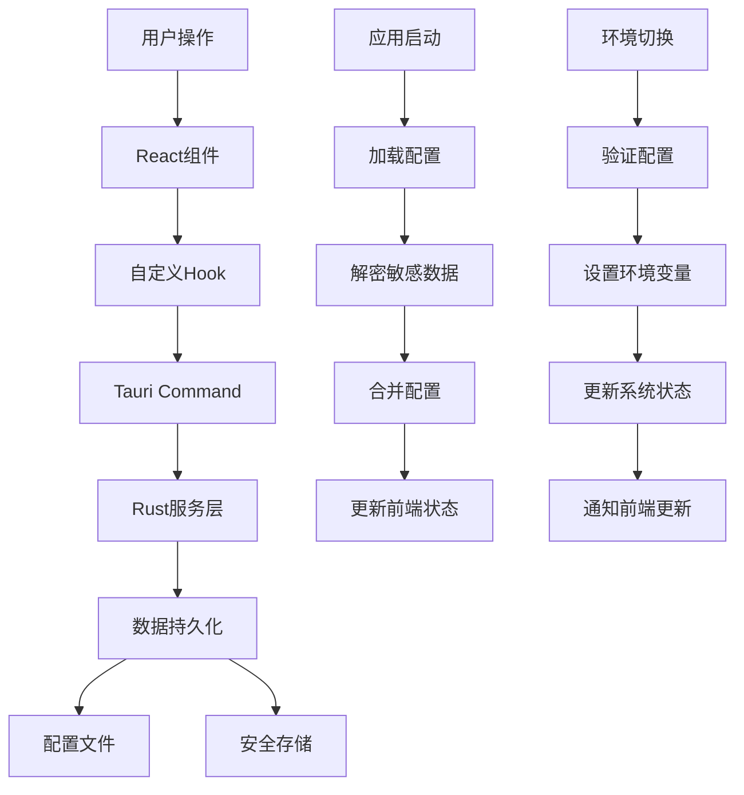

# Claude Code Provider Manager GUI 系统架构设计文档

## 1. 总体架构设计

### 1.1 架构风格和设计原则

**架构风格：**
- **桌面应用架构**: Tauri + React 混合架构
- **分层架构**: 前端 UI 层、业务逻辑层、数据访问层、系统集成层
- **事件驱动架构**: 基于 Tauri 的前后端通信机制
- **插件化架构**: 支持功能模块化扩展

**设计原则：**
- **单一职责**: 每个模块负责单一功能领域
- **开放封闭**: 对扩展开放，对修改封闭
- **依赖倒置**: 高层模块不依赖低层模块，都依赖抽象
- **接口隔离**: 使用小而专的接口，避免接口污染
- **最小权限**: 系统权限和数据访问遵循最小权限原则

### 1.2 系统分层架构图

```
┌─────────────────────────────────────────────────────────────────┐
│                        展示层 (Presentation Layer)               │
├─────────────────────────────────────────────────────────────────┤
│  React 组件层                                                    │
│  ├─ Layout组件 (Header, Sidebar, StatusBar)                     │
│  ├─ 页面组件 (Dashboard, ProviderManagement, Settings)         │
│  ├─ 业务组件 (ProviderCard, ConfigForm, StatusIndicator)       │
│  └─ 基础组件 (Button, Input, Modal, Dialog)                    │
├─────────────────────────────────────────────────────────────────┤
│                      业务逻辑层 (Business Layer)                 │
├─────────────────────────────────────────────────────────────────┤
│  React Hooks & Context                                          │
│  ├─ useProvider (提供商管理)                                     │
│  ├─ useEnvironment (环境切换)                                    │  
│  ├─ useValidator (配置验证)                                      │
│  └─ useSettings (应用设置)                                       │
├─────────────────────────────────────────────────────────────────┤
│                      服务层 (Service Layer)                      │
├─────────────────────────────────────────────────────────────────┤
│  前端服务 (TypeScript)           │  后端服务 (Rust)                │
│  ├─ ProviderService             │  ├─ ConfigManager               │
│  ├─ ValidationService           │  ├─ EnvironmentManager          │
│  ├─ LauncherService             │  ├─ SecurityManager             │
│  └─ StorageService              │  └─ SystemIntegration           │
├─────────────────────────────────────────────────────────────────┤
│                     数据访问层 (Data Access Layer)               │
├─────────────────────────────────────────────────────────────────┤
│  Tauri Commands                                                  │
│  ├─ 配置文件操作 (JSON/TOML)                                     │
│  ├─ 环境变量管理 (系统API)                                       │
│  ├─ 加密存储 (系统Keychain/Registry)                            │
│  └─ 进程管理 (系统进程API)                                       │
├─────────────────────────────────────────────────────────────────┤
│                    系统集成层 (System Integration)               │
├─────────────────────────────────────────────────────────────────┤
│  操作系统API                                                     │
│  ├─ 文件系统 (配置存储)                                          │
│  ├─ 安全API (Windows DPAPI, macOS Keychain, Linux SecretAPI)   │
│  ├─ 进程管理 (Claude Code启动)                                   │
│  └─ 系统通知 (托盘、通知中心)                                    │
└─────────────────────────────────────────────────────────────────┘
```

### 1.3 技术栈选型理由

**前端技术栈：**
- **React 18**: 组件化开发，生态成熟，开发效率高
- **TypeScript**: 类型安全，代码质量保障，IDE支持好
- **Tailwind CSS**: 原子化CSS，快速样式开发
- **React Router**: 单页面应用路由管理
- **Lucide React**: 轻量级图标库，风格统一

**后端技术栈：**
- **Tauri**: Rust后端，性能优异，安全性强，跨平台支持
- **Rust**: 内存安全，零成本抽象，适合系统级开发
- **serde**: 序列化/反序列化，JSON配置处理
- **tokio**: 异步运行时，处理IO密集型操作

**构建工具链：**
- **Vite**: 快速的前端构建工具，HMR支持
- **TypeScript Compiler**: 类型检查和编译
- **ESLint**: 代码质量检查
- **Cargo**: Rust包管理和构建

## 2. 前端架构设计

### 2.1 React 组件架构

**组件层次结构：**
```
App
├── Providers
│   ├── ThemeProvider (主题管理)
│   ├── ConfigProvider (配置上下文)
│   └── NotificationProvider (通知管理)
├── Layout
│   ├── AppHeader
│   │   ├── TitleBar
│   │   └── MenuBar
│   ├── AppSidebar  
│   │   ├── NavItem
│   │   └── StatusPanel
│   ├── MainContent
│   │   └── PageContainer
│   └── StatusBar
│       ├── ConnectionStatus
│       ├── ActiveProvider
│       └── VersionInfo
├── Pages
│   ├── Dashboard
│   │   ├── OverviewPanel
│   │   ├── QuickActions
│   │   └── RecentActivity
│   ├── ProviderManagement
│   │   ├── ProviderList
│   │   ├── ProviderCard
│   │   └── ProviderForm
│   ├── EnvironmentSettings
│   │   ├── ActiveConfig
│   │   ├── EnvironmentSwitch
│   │   └── EnvVariableView
│   └── SystemSettings
│       ├── GeneralSettings
│       ├── SecuritySettings
│       └── AdvancedSettings
├── Components
│   ├── UI Components
│   │   ├── Button
│   │   ├── Input
│   │   ├── Select
│   │   ├── Modal
│   │   └── Toast
│   ├── Business Components
│   │   ├── ProviderCard
│   │   ├── ConfigForm
│   │   ├── ValidationStatus
│   │   └── LaunchButton
│   └── Layout Components
│       ├── Card
│       ├── Panel
│       └── Section
└── Modals
    ├── AddProviderModal
    ├── EditProviderModal
    ├── ConfirmDialog
    └── SettingsModal
```

### 2.2 状态管理方案

**Context + Hooks 模式：**

```typescript
// 配置管理上下文
interface ConfigContextType {
  providers: Provider[];
  activeProvider: Provider | null;
  settings: AppSettings;
  isLoading: boolean;
  error: string | null;
  
  // Actions
  addProvider: (provider: Omit<Provider, 'id'>) => Promise<void>;
  updateProvider: (id: string, updates: Partial<Provider>) => Promise<void>;
  deleteProvider: (id: string) => Promise<void>;
  switchProvider: (id: string) => Promise<void>;
  validateProvider: (id: string) => Promise<ValidationResult>;
  updateSettings: (settings: Partial<AppSettings>) => Promise<void>;
}

// 主要的 Context Providers
const ConfigProvider: React.FC<{ children: ReactNode }>;
const ThemeProvider: React.FC<{ children: ReactNode }>;
const NotificationProvider: React.FC<{ children: ReactNode }>;

// 自定义 Hooks
const useConfig = () => useContext(ConfigContext);
const useTheme = () => useContext(ThemeContext);
const useNotification = () => useContext(NotificationContext);
```

**状态管理层级：**
1. **全局状态**: 应用配置、主题、通知
2. **页面状态**: 表单数据、页面特定状态
3. **组件状态**: UI状态、临时数据

### 2.3 路由设计

```typescript
// 路由配置
const routes = [
  {
    path: '/',
    element: <Layout />,
    children: [
      { index: true, element: <Dashboard /> },
      { path: 'providers', element: <ProviderManagement /> },
      { path: 'environment', element: <EnvironmentSettings /> },
      { path: 'settings', element: <SystemSettings /> },
    ],
  },
];

// 路由权限控制
const ProtectedRoute: React.FC<{ children: ReactNode }> = ({ children }) => {
  const { isConfigured } = useConfig();
  
  if (!isConfigured) {
    return <Navigate to="/setup" replace />;
  }
  
  return <>{children}</>;
};
```

### 2.4 UI 组件设计模式

**原子化设计原则：**
- **原子**: Button, Input, Icon, Badge
- **分子**: SearchBox, FormField, StatusIndicator
- **有机体**: ProviderCard, ConfigForm, NavigationMenu
- **模板**: PageLayout, ModalLayout
- **页面**: Dashboard, ProviderManagement

**组件规范：**
```typescript
// 组件接口规范
interface BaseComponentProps {
  className?: string;
  testId?: string;
  children?: ReactNode;
}

interface ButtonProps extends BaseComponentProps {
  variant?: 'primary' | 'secondary' | 'danger';
  size?: 'sm' | 'md' | 'lg';
  disabled?: boolean;
  loading?: boolean;
  onClick?: () => void;
}

// 样式系统 (Tailwind + CSS Modules)
const buttonVariants = {
  primary: 'bg-blue-600 hover:bg-blue-700 text-white',
  secondary: 'bg-gray-200 hover:bg-gray-300 text-gray-900',
  danger: 'bg-red-600 hover:bg-red-700 text-white',
};
```

## 3. 后端架构设计（Tauri）

### 3.1 Rust 后端模块设计

**模块结构：**
```
src-tauri/src/
├── main.rs                 // 应用程序入口
├── lib.rs                  // 库根模块
├── commands/               // Tauri Commands
│   ├── mod.rs
│   ├── config.rs          // 配置管理命令
│   ├── provider.rs        // 提供商管理命令
│   ├── environment.rs     // 环境管理命令
│   ├── validation.rs      // 验证命令
│   └── launcher.rs        // 启动器命令
├── services/              // 核心业务服务
│   ├── mod.rs
│   ├── config_service.rs  // 配置服务
│   ├── security_service.rs// 安全服务  
│   ├── env_service.rs     // 环境服务
│   └── system_service.rs  // 系统集成服务
├── models/                // 数据模型
│   ├── mod.rs
│   ├── provider.rs        // 提供商模型
│   ├── config.rs          // 配置模型
│   └── settings.rs        // 设置模型
├── utils/                 // 工具函数
│   ├── mod.rs
│   ├── crypto.rs          // 加密工具
│   ├── filesystem.rs      // 文件系统工具
│   └── validation.rs      // 验证工具
└── errors/                // 错误定义
    ├── mod.rs
    └── app_error.rs       // 应用错误类型
```

### 3.2 API 接口设计

**Tauri Commands 接口：**

```rust
// 配置管理命令
#[tauri::command]
async fn load_config() -> Result<Configuration, AppError>;

#[tauri::command]  
async fn save_config(config: Configuration) -> Result<(), AppError>;

// 提供商管理命令
#[tauri::command]
async fn add_provider(provider: CreateProviderRequest) -> Result<Provider, AppError>;

#[tauri::command]
async fn update_provider(id: String, updates: UpdateProviderRequest) -> Result<Provider, AppError>;

#[tauri::command]
async fn delete_provider(id: String) -> Result<(), AppError>;

#[tauri::command]
async fn get_providers() -> Result<Vec<Provider>, AppError>;

// 环境管理命令
#[tauri::command]
async fn switch_environment(provider_id: String) -> Result<(), AppError>;

#[tauri::command]
async fn get_current_environment() -> Result<EnvironmentInfo, AppError>;

// 验证命令
#[tauri::command]
async fn validate_provider(provider: Provider) -> Result<ValidationResult, AppError>;

#[tauri::command]
async fn test_connection(base_url: String, auth_token: String) -> Result<ConnectionTest, AppError>;

// 启动器命令
#[tauri::command]
async fn launch_claude_code(config: LaunchConfig) -> Result<ProcessInfo, AppError>;

#[tauri::command]
async fn get_process_status(pid: u32) -> Result<ProcessStatus, AppError>;
```

### 3.3 数据持久化方案

**配置存储策略：**
```rust
// 配置文件结构
pub struct ConfigManager {
    config_dir: PathBuf,
    config_file: PathBuf,
    secure_storage: SecureStorage,
}

impl ConfigManager {
    pub fn new() -> Result<Self, AppError> {
        let config_dir = Self::get_config_dir()?;
        let config_file = config_dir.join("config.json");
        let secure_storage = SecureStorage::new()?;
        
        Ok(Self {
            config_dir,
            config_file,
            secure_storage,
        })
    }
    
    pub async fn load_config(&self) -> Result<Configuration, AppError> {
        // 从配置文件加载基本配置
        let mut config: Configuration = if self.config_file.exists() {
            let content = fs::read_to_string(&self.config_file).await?;
            serde_json::from_str(&content)?
        } else {
            Configuration::default()
        };
        
        // 从安全存储加载敏感数据
        for provider in &mut config.providers {
            provider.auth_token = self.secure_storage
                .get_token(&provider.id)
                .await?
                .unwrap_or_default();
        }
        
        Ok(config)
    }
}
```

**安全存储实现：**
```rust
// 跨平台安全存储
pub struct SecureStorage {
    #[cfg(windows)]
    windows_storage: WindowsSecureStorage,
    #[cfg(target_os = "macos")]
    macos_storage: MacOSSecureStorage,
    #[cfg(target_os = "linux")]
    linux_storage: LinuxSecureStorage,
}

impl SecureStorage {
    pub async fn store_token(&self, provider_id: &str, token: &str) -> Result<(), AppError> {
        #[cfg(windows)]
        return self.windows_storage.store_token(provider_id, token).await;
        
        #[cfg(target_os = "macos")]
        return self.macos_storage.store_token(provider_id, token).await;
        
        #[cfg(target_os = "linux")]
        return self.linux_storage.store_token(provider_id, token).await;
    }
    
    pub async fn get_token(&self, provider_id: &str) -> Result<Option<String>, AppError> {
        // 平台特定实现...
    }
}
```

### 3.4 系统集成接口

**环境变量管理：**
```rust
pub struct EnvironmentManager;

impl EnvironmentManager {
    pub fn set_claude_environment(provider: &Provider) -> Result<(), AppError> {
        std::env::set_var("ANTHROPIC_BASE_URL", &provider.base_url);
        std::env::set_var("ANTHROPIC_AUTH_TOKEN", &provider.auth_token);
        std::env::set_var("ANTHROPIC_MODEL", &provider.model);
        std::env::set_var("ANTHROPIC_SMALL_FAST_MODEL", &provider.small_fast_model);
        Ok(())
    }
    
    pub fn get_current_environment() -> EnvironmentInfo {
        EnvironmentInfo {
            base_url: std::env::var("ANTHROPIC_BASE_URL").ok(),
            model: std::env::var("ANTHROPIC_MODEL").ok(),
            small_fast_model: std::env::var("ANTHROPIC_SMALL_FAST_MODEL").ok(),
            // auth_token 不返回，安全考虑
        }
    }
}
```

**进程管理：**
```rust
pub struct ProcessManager {
    active_processes: Arc<Mutex<HashMap<String, Child>>>,
}

impl ProcessManager {
    pub async fn launch_claude_code(&self, config: &LaunchConfig) -> Result<ProcessInfo, AppError> {
        let mut cmd = Command::new("claude-code");
        
        // 设置工作目录
        if let Some(work_dir) = &config.working_directory {
            cmd.current_dir(work_dir);
        }
        
        // 添加启动参数
        for arg in &config.args {
            cmd.arg(arg);
        }
        
        // 启动进程
        let child = cmd.spawn()?;
        let pid = child.id();
        
        // 存储进程引用
        self.active_processes.lock().unwrap()
            .insert(config.session_id.clone(), child);
        
        Ok(ProcessInfo {
            pid,
            session_id: config.session_id.clone(),
            started_at: chrono::Utc::now(),
        })
    }
}
```

## 4. 数据架构设计

### 4.1 数据模型定义

**核心数据模型：**

```typescript
// TypeScript 前端模型
interface Provider {
  id: string;
  name: string;
  baseUrl: string;
  authToken: string;  // 在前端内存中临时存储，不持久化
  model: string;
  smallFastModel: string;
  createdAt: Date;
  updatedAt: Date;
  isActive: boolean;
  isValid?: boolean;
  lastValidated?: Date;
  tags?: string[];
  description?: string;
}

interface Configuration {
  version: string;
  activeProviderId: string | null;
  providers: Provider[];
  settings: AppSettings;
  metadata: ConfigMetadata;
}

interface AppSettings {
  theme: 'light' | 'dark' | 'system';
  language: string;
  autoValidate: boolean;
  autoStart: boolean;
  startMinimized: boolean;
  closeToTray: boolean;
  claudeCodePath?: string;
  defaultWorkingDirectory?: string;
  startupArgs: string[];
  updateCheck: boolean;
  telemetry: boolean;
}

interface ValidationResult {
  isValid: boolean;
  connectionStatus: 'success' | 'timeout' | 'error';
  authStatus: 'success' | 'invalid' | 'expired';
  modelStatus: 'available' | 'unavailable' | 'unknown';
  errors: ValidationError[];
  warnings: ValidationWarning[];
  latency?: number;
}
```

**Rust 后端模型：**
```rust
// Rust 后端对应模型
#[derive(Debug, Clone, Serialize, Deserialize)]
pub struct Provider {
    pub id: String,
    pub name: String,
    pub base_url: String,
    // auth_token 不在配置文件中存储
    pub model: String,
    pub small_fast_model: String,
    pub created_at: chrono::DateTime<chrono::Utc>,
    pub updated_at: chrono::DateTime<chrono::Utc>,
    pub is_active: bool,
    pub tags: Option<Vec<String>>,
    pub description: Option<String>,
}

#[derive(Debug, Serialize, Deserialize)]
pub struct Configuration {
    pub version: String,
    pub active_provider_id: Option<String>,
    pub providers: Vec<Provider>,
    pub settings: AppSettings,
    pub metadata: ConfigMetadata,
}

#[derive(Debug, Serialize, Deserialize)]
pub struct SecureProviderData {
    pub provider_id: String,
    pub auth_token: String,
    pub encrypted_at: chrono::DateTime<chrono::Utc>,
}
```

### 4.2 配置文件结构

**主配置文件 (config.json)：**
```json
{
  "version": "1.0.0",
  "activeProviderId": "provider-001",
  "providers": [
    {
      "id": "provider-001",
      "name": "Claude Official",
      "baseUrl": "https://api.anthropic.com",
      "model": "claude-3-sonnet-20240229",
      "smallFastModel": "claude-3-haiku-20240307",
      "createdAt": "2024-01-15T10:30:00Z",
      "updatedAt": "2024-01-15T10:30:00Z",
      "isActive": true,
      "tags": ["official", "production"],
      "description": "官方 Claude API"
    }
  ],
  "settings": {
    "theme": "system",
    "language": "zh-CN",
    "autoValidate": true,
    "autoStart": false,
    "startMinimized": false,
    "closeToTray": true,
    "startupArgs": [],
    "updateCheck": true,
    "telemetry": false
  },
  "metadata": {
    "configVersion": "1.0.0",
    "lastModified": "2024-01-15T10:30:00Z",
    "backupEnabled": true,
    "encryptionEnabled": true
  }
}
```

**备份和版本管理：**
```
config/
├── config.json              // 当前配置
├── config.backup.json       // 自动备份
├── config.v1.json          // 版本备份
├── secure/                 // 安全存储目录
│   └── tokens.encrypted    // 加密的敏感数据
└── logs/                   // 日志文件
    ├── app.log
    └── security.log
```

### 4.3 加密存储方案

**平台特定加密实现：**

```rust
// Windows DPAPI 实现
#[cfg(windows)]
impl WindowsSecureStorage {
    pub async fn store_token(&self, provider_id: &str, token: &str) -> Result<(), AppError> {
        let data = format!("{}:{}", provider_id, token);
        let encrypted = dpapi::encrypt_data(data.as_bytes(), None, None)?;
        
        let key_path = format!("SOFTWARE\\ClaudeCodeProviderManager\\Tokens\\{}", provider_id);
        self.write_registry(&key_path, &encrypted)?;
        
        Ok(())
    }
}

// macOS Keychain 实现
#[cfg(target_os = "macos")]
impl MacOSSecureStorage {
    pub async fn store_token(&self, provider_id: &str, token: &str) -> Result<(), AppError> {
        let service = "claude-code-provider-manager";
        let account = provider_id;
        
        keychain::set_generic_password(service, account, token.as_bytes())?;
        
        Ok(())
    }
}

// Linux Secret Service 实现  
#[cfg(target_os = "linux")]
impl LinuxSecureStorage {
    pub async fn store_token(&self, provider_id: &str, token: &str) -> Result<(), AppError> {
        let connection = secret_service::SecretService::connect(
            secret_service::EncryptionType::Dh
        ).await?;
        
        let collection = connection.get_default_collection().await?;
        
        let attributes = vec![
            ("service", "claude-code-provider-manager"),
            ("provider_id", provider_id),
        ];
        
        collection.create_item(
            &format!("Claude Provider: {}", provider_id),
            attributes,
            token.as_bytes(),
            true, // replace existing
            "text/plain",
        ).await?;
        
        Ok(())
    }
}
```

### 4.4 数据流设计

**配置数据流：**


## 5. 安全架构设计

### 5.1 敏感数据保护

**数据分类和保护策略：**

```rust
// 安全级别定义
#[derive(Debug, Clone)]
pub enum SecurityLevel {
    Public,      // 公开数据，可以明文存储
    Internal,    // 内部数据，本地加密存储
    Confidential,// 机密数据，系统安全存储
    Secret,      // 秘密数据，最高级别保护
}

// 数据保护实现
pub struct DataProtection {
    local_cipher: ChaCha20Poly1305,
    system_storage: SecureStorage,
}

impl DataProtection {
    pub fn protect_data(&self, data: &[u8], level: SecurityLevel) -> Result<Vec<u8>, AppError> {
        match level {
            SecurityLevel::Public => Ok(data.to_vec()),
            SecurityLevel::Internal => self.encrypt_local(data),
            SecurityLevel::Confidential | SecurityLevel::Secret => {
                self.store_system_secure(data)
            }
        }
    }
    
    fn encrypt_local(&self, data: &[u8]) -> Result<Vec<u8>, AppError> {
        let nonce = ChaCha20Poly1305::generate_nonce(&mut OsRng);
        let ciphertext = self.local_cipher.encrypt(&nonce, data)?;
        
        let mut result = Vec::new();
        result.extend_from_slice(&nonce);
        result.extend_from_slice(&ciphertext);
        
        Ok(result)
    }
}
```

### 5.2 加密存储实现

**多层加密策略：**

```rust
pub struct EncryptionManager {
    // 应用级加密（用于配置文件）
    app_key: [u8; 32],
    // 系统级加密（用于敏感令牌）
    system_storage: SecureStorage,
}

impl EncryptionManager {
    pub fn new() -> Result<Self, AppError> {
        let app_key = Self::derive_app_key()?;
        let system_storage = SecureStorage::new()?;
        
        Ok(Self {
            app_key,
            system_storage,
        })
    }
    
    fn derive_app_key() -> Result<[u8; 32], AppError> {
        // 使用设备唯一标识符和应用信息生成密钥
        let device_id = Self::get_device_id()?;
        let app_info = "claude-code-provider-manager-v1";
        
        let mut hasher = Sha256::new();
        hasher.update(device_id.as_bytes());
        hasher.update(app_info.as_bytes());
        
        let hash = hasher.finalize();
        let mut key = [0u8; 32];
        key.copy_from_slice(&hash);
        
        Ok(key)
    }
    
    pub fn encrypt_config(&self, data: &str) -> Result<String, AppError> {
        let cipher = ChaCha20Poly1305::new(&self.app_key.into());
        let nonce = ChaCha20Poly1305::generate_nonce(&mut OsRng);
        
        let ciphertext = cipher.encrypt(&nonce, data.as_bytes())?;
        
        // Base64编码存储
        let mut result = Vec::new();
        result.extend_from_slice(&nonce);
        result.extend_from_slice(&ciphertext);
        
        Ok(base64::encode(result))
    }
    
    pub fn decrypt_config(&self, encrypted: &str) -> Result<String, AppError> {
        let data = base64::decode(encrypted)?;
        
        if data.len() < 12 {
            return Err(AppError::DecryptionError("Invalid data length".to_string()));
        }
        
        let (nonce_bytes, ciphertext) = data.split_at(12);
        let nonce = GenericArray::from_slice(nonce_bytes);
        
        let cipher = ChaCha20Poly1305::new(&self.app_key.into());
        let plaintext = cipher.decrypt(nonce, ciphertext)?;
        
        Ok(String::from_utf8(plaintext)?)
    }
}
```

### 5.3 权限管理

**最小权限原则实现：**

```rust
pub struct PermissionManager {
    required_permissions: Vec<Permission>,
    granted_permissions: Vec<Permission>,
}

#[derive(Debug, Clone, PartialEq)]
pub enum Permission {
    ReadConfig,
    WriteConfig,
    AccessSecureStorage,
    ManageEnvironment,
    LaunchProcess,
    NetworkAccess,
    FileSystemAccess(PathBuf),
}

impl PermissionManager {
    pub fn check_permission(&self, permission: &Permission) -> Result<(), AppError> {
        if !self.granted_permissions.contains(permission) {
            return Err(AppError::PermissionDenied(format!("{:?}", permission)));
        }
        Ok(())
    }
    
    pub async fn request_permissions(&mut self) -> Result<(), AppError> {
        // 请求必要的系统权限
        for permission in &self.required_permissions {
            match permission {
                Permission::AccessSecureStorage => {
                    self.request_secure_storage_access().await?;
                }
                Permission::LaunchProcess => {
                    self.request_process_launch_access().await?;
                }
                Permission::FileSystemAccess(path) => {
                    self.request_filesystem_access(path).await?;
                }
                _ => {} // 其他权限默认授予
            }
        }
        Ok(())
    }
}
```

### 5.4 安全通信

**API通信安全：**

```rust
pub struct SecureApiClient {
    client: reqwest::Client,
    timeout: Duration,
}

impl SecureApiClient {
    pub fn new() -> Self {
        let client = reqwest::Client::builder()
            .timeout(Duration::from_secs(30))
            .danger_accept_invalid_certs(false) // 强制证书验证
            .https_only(true) // 仅允许HTTPS
            .build()
            .expect("Failed to create HTTP client");
            
        Self {
            client,
            timeout: Duration::from_secs(30),
        }
    }
    
    pub async fn validate_connection(
        &self, 
        base_url: &str, 
        auth_token: &str
    ) -> Result<ValidationResult, AppError> {
        // 构建安全请求头
        let mut headers = reqwest::header::HeaderMap::new();
        headers.insert(
            "Authorization",
            format!("Bearer {}", auth_token).parse()?
        );
        headers.insert(
            "User-Agent",
            "Claude-Code-Provider-Manager/1.0".parse()?
        );
        
        // 发送测试请求
        let response = self
            .client
            .get(&format!("{}/v1/models", base_url))
            .headers(headers)
            .timeout(self.timeout)
            .send()
            .await?;
            
        let status = response.status();
        let latency = response.extensions()
            .get::<reqwest::ResponseTime>()
            .map(|rt| rt.elapsed())
            .unwrap_or_default();
            
        Ok(ValidationResult {
            is_valid: status.is_success(),
            connection_status: if status.is_success() { 
                "success" 
            } else { 
                "error" 
            }.to_string(),
            latency: Some(latency.as_millis() as u32),
            // ... 其他字段
        })
    }
}
```

## 6. 跨平台适配架构

### 6.1 平台差异处理

**平台特定代码组织：**

```rust
// 平台抽象层
pub trait PlatformAdapter {
    fn get_config_dir(&self) -> Result<PathBuf, AppError>;
    fn get_secure_storage(&self) -> Result<Box<dyn SecureStorageBackend>, AppError>;
    fn setup_system_integration(&self) -> Result<(), AppError>;
    fn get_system_theme(&self) -> Result<SystemTheme, AppError>;
}

// Windows 实现
#[cfg(windows)]
pub struct WindowsPlatform;

#[cfg(windows)]
impl PlatformAdapter for WindowsPlatform {
    fn get_config_dir(&self) -> Result<PathBuf, AppError> {
        let appdata = std::env::var("APPDATA")?;
        Ok(PathBuf::from(appdata).join("ClaudeCodeProviderManager"))
    }
    
    fn setup_system_integration(&self) -> Result<(), AppError> {
        // Windows 系统托盘设置
        self.setup_system_tray()?;
        // Windows 注册表集成
        self.setup_registry_integration()?;
        // Windows 开始菜单快捷方式
        self.create_start_menu_shortcut()?;
        Ok(())
    }
}

// macOS 实现  
#[cfg(target_os = "macos")]
pub struct MacOSPlatform;

#[cfg(target_os = "macos")]
impl PlatformAdapter for MacOSPlatform {
    fn get_config_dir(&self) -> Result<PathBuf, AppError> {
        let home = std::env::var("HOME")?;
        Ok(PathBuf::from(home)
            .join("Library")
            .join("Application Support")
            .join("ClaudeCodeProviderManager"))
    }
    
    fn setup_system_integration(&self) -> Result<(), AppError> {
        // macOS 菜单栏应用设置
        self.setup_menu_bar_app()?;
        // macOS Dock 集成
        self.setup_dock_integration()?;
        // macOS 通知中心
        self.setup_notification_center()?;
        Ok(())
    }
}

// Linux 实现
#[cfg(target_os = "linux")]  
pub struct LinuxPlatform;

#[cfg(target_os = "linux")]
impl PlatformAdapter for LinuxPlatform {
    fn get_config_dir(&self) -> Result<PathBuf, AppError> {
        if let Ok(xdg_config) = std::env::var("XDG_CONFIG_HOME") {
            Ok(PathBuf::from(xdg_config).join("claude-code-provider-manager"))
        } else {
            let home = std::env::var("HOME")?;
            Ok(PathBuf::from(home).join(".config").join("claude-code-provider-manager"))
        }
    }
    
    fn setup_system_integration(&self) -> Result<(), AppError> {
        // Linux 系统托盘 (支持多种桌面环境)
        self.setup_system_tray_linux()?;
        // Linux .desktop 文件
        self.create_desktop_entry()?;
        // Linux 自启动设置
        self.setup_autostart()?;
        Ok(())
    }
}
```

### 6.2 系统集成方案

**系统托盘集成：**

```rust
pub struct SystemTrayManager {
    platform: Box<dyn PlatformAdapter>,
    tray_icon: Option<TrayIcon>,
}

impl SystemTrayManager {
    pub fn new() -> Result<Self, AppError> {
        let platform = Self::get_platform_adapter()?;
        
        Ok(Self {
            platform,
            tray_icon: None,
        })
    }
    
    pub fn setup_tray(&mut self) -> Result<(), AppError> {
        let menu = self.create_tray_menu()?;
        
        let tray_icon = TrayIcon::builder()
            .with_icon(self.get_tray_icon()?)
            .with_tooltip("Claude Code Provider Manager")
            .with_menu(menu)
            .build()?;
            
        // 注册事件处理器
        tray_icon.on_click(|_| {
            // 显示/隐藏主窗口
            WindowManager::toggle_main_window();
        });
        
        self.tray_icon = Some(tray_icon);
        Ok(())
    }
    
    fn create_tray_menu(&self) -> Result<Menu, AppError> {
        let menu = Menu::new()
            .add_item("显示界面", "show_window")
            .add_separator()
            .add_submenu("快速切换", self.create_provider_submenu()?)
            .add_item("启动 Claude Code", "launch_claude")
            .add_separator()
            .add_item("设置", "settings")
            .add_item("退出", "quit");
            
        Ok(menu)
    }
}
```

**文件关联和协议处理：**

```rust
pub struct ProtocolHandler;

impl ProtocolHandler {
    // 注册自定义协议 claude-code-provider://
    pub fn register_protocol() -> Result<(), AppError> {
        #[cfg(windows)]
        self.register_windows_protocol()?;
        
        #[cfg(target_os = "macos")]
        self.register_macos_protocol()?;
        
        #[cfg(target_os = "linux")]
        self.register_linux_protocol()?;
        
        Ok(())
    }
    
    pub fn handle_protocol_url(&self, url: &str) -> Result<(), AppError> {
        // 解析协议URL: claude-code-provider://switch/provider-id
        let parsed = url::Url::parse(url)?;
        
        match parsed.path() {
            "/switch" => {
                if let Some(provider_id) = parsed.query_pairs().find(|(k, _)| k == "id") {
                    self.switch_to_provider(&provider_id.1)?;
                }
            }
            "/launch" => {
                self.launch_claude_code()?;
            }
            _ => {
                return Err(AppError::InvalidProtocolUrl(url.to_string()));
            }
        }
        
        Ok(())
    }
}
```

### 6.3 打包分发策略

**构建配置：**

```toml
# Cargo.toml 中的平台特定配置
[package.metadata.bundle]
name = "Claude Code Provider Manager"
identifier = "com.claude.provider-manager"
version = "1.0.0"
resources = ["assets/*"]
copyright = "Copyright © 2024"
short_description = "Claude API Provider Management Tool"
long_description = """
A cross-platform desktop application for managing Claude API providers 
and configurations with secure credential storage.
"""

[package.metadata.bundle.windows]
wix = true
sign_tool = "signtool"
sign_params = "/fd SHA256 /tr http://timestamp.digicert.com /td SHA256"

[package.metadata.bundle.osx]
signing_identity = "Developer ID Application"
provider_short_name = "ClaudeManager"
entitlements = "entitlements.plist"

[package.metadata.bundle.linux]
appimage = true
desktop_file = "assets/claude-code-provider-manager.desktop"
```

**CI/CD 构建流程：**

```yaml
# .github/workflows/build.yml
name: Build and Release

on:
  push:
    tags: ['v*']

jobs:
  build-windows:
    runs-on: windows-latest
    steps:
      - uses: actions/checkout@v3
      - name: Setup Node.js
        uses: actions/setup-node@v3
        with:
          node-version: 18
      - name: Setup Rust
        uses: actions-rs/toolchain@v1
        with:
          toolchain: stable
      - name: Install dependencies
        run: npm ci
      - name: Build application
        run: npm run tauri:build
      - name: Sign Windows binary
        run: |
          signtool sign /fd SHA256 /tr http://timestamp.digicert.com /td SHA256 \
                  /f ${{ secrets.WINDOWS_CERTIFICATE }} \
                  /p ${{ secrets.CERTIFICATE_PASSWORD }} \
                  "src-tauri/target/release/bundle/msi/*.msi"

  build-macos:
    runs-on: macos-latest
    steps:
      - uses: actions/checkout@v3
      - name: Setup Node.js and Rust
        # ... 类似配置
      - name: Build and sign
        run: |
          npm run tauri:build
          codesign --force --deep --sign "${{ secrets.MACOS_CERTIFICATE }}" \
                   "src-tauri/target/release/bundle/dmg/*.app"

  build-linux:
    runs-on: ubuntu-latest
    steps:
      - uses: actions/checkout@v3
      - name: Install system dependencies
        run: |
          sudo apt-get update
          sudo apt-get install -y libgtk-3-dev libwebkit2gtk-4.0-dev \
                                  libappindicator3-dev librsvg2-dev
      - name: Build application
        run: npm run tauri:build
```

## 7. 部署架构设计

### 7.1 构建流程设计

**本地开发构建流程：**

```bash
# 开发环境启动
npm run dev           # 启动前端开发服务器
npm run tauri:dev     # 启动 Tauri 开发模式（热重载）

# 构建流程
npm run build         # 构建前端资源
npm run tauri:build   # 构建完整应用程序

# 质量检查
npm run lint          # 代码质量检查
npm run lint:fix      # 自动修复代码问题
cargo test            # Rust 后端测试
npm run test          # 前端测试（如果有）
```

**生产构建优化：**

```javascript
// vite.config.ts - 生产构建优化
import { defineConfig } from 'vite';
import react from '@vitejs/plugin-react';

export default defineConfig({
  plugins: [react()],
  
  // 构建优化
  build: {
    minify: 'terser',
    terserOptions: {
      compress: {
        drop_console: true,
        drop_debugger: true,
      },
    },
    rollupOptions: {
      output: {
        manualChunks: {
          vendor: ['react', 'react-dom', 'react-router-dom'],
          tauri: ['@tauri-apps/api'],
          icons: ['lucide-react'],
        },
      },
    },
    sourcemap: false, // 生产环境不生成 sourcemap
  },
  
  // 开发服务器配置
  server: {
    port: 3000,
    strictPort: true,
  },
  
  // 环境变量处理
  define: {
    __APP_VERSION__: JSON.stringify(process.env.npm_package_version),
    __BUILD_TIME__: JSON.stringify(new Date().toISOString()),
  },
});
```

### 7.2 自动化部署

**GitHub Actions 完整流程：**

```yaml
name: Release

on:
  push:
    tags: ['v*']

env:
  CARGO_TERM_COLOR: always

jobs:
  test:
    name: Test Suite
    runs-on: ubuntu-latest
    steps:
      - name: Checkout
        uses: actions/checkout@v4
      
      - name: Setup Node.js
        uses: actions/setup-node@v4
        with:
          node-version: '18'
          cache: 'npm'
      
      - name: Setup Rust
        uses: dtolnay/rust-toolchain@stable
      
      - name: Install dependencies
        run: npm ci
      
      - name: Lint frontend
        run: npm run lint
      
      - name: Test Rust backend
        run: cargo test --manifest-path=src-tauri/Cargo.toml
  
  build:
    name: Build ${{ matrix.platform }}
    runs-on: ${{ matrix.os }}
    needs: test
    
    strategy:
      fail-fast: false
      matrix:
        include:
          - platform: windows-x64
            os: windows-latest
            target: x86_64-pc-windows-msvc
            
          - platform: macos-x64
            os: macos-latest
            target: x86_64-apple-darwin
            
          - platform: macos-arm64
            os: macos-latest
            target: aarch64-apple-darwin
            
          - platform: linux-x64
            os: ubuntu-latest
            target: x86_64-unknown-linux-gnu
    
    steps:
      - name: Checkout
        uses: actions/checkout@v4
      
      - name: Setup Node.js
        uses: actions/setup-node@v4
        with:
          node-version: '18'
          cache: 'npm'
      
      - name: Setup Rust
        uses: dtolnay/rust-toolchain@stable
        with:
          targets: ${{ matrix.target }}
      
      - name: Install Linux dependencies
        if: matrix.platform == 'linux-x64'
        run: |
          sudo apt-get update
          sudo apt-get install -y \
            libgtk-3-dev libwebkit2gtk-4.0-dev \
            libappindicator3-dev librsvg2-dev \
            libasound2-dev
      
      - name: Install frontend dependencies
        run: npm ci
      
      - name: Build frontend
        run: npm run build
      
      - name: Build Tauri application
        uses: tauri-apps/tauri-action@v0
        env:
          GITHUB_TOKEN: ${{ secrets.GITHUB_TOKEN }}
        with:
          tagName: ${{ github.ref_name }}
          releaseName: 'Claude Code Provider Manager ${{ github.ref_name }}'
          releaseBody: |
            # Claude Code Provider Manager ${{ github.ref_name }}
            
            ## 🚀 新功能
            - 详细更新日志请查看 CHANGELOG.md
            
            ## 📦 下载
            请根据您的操作系统下载对应的安装包：
            - Windows: `.msi` 安装程序
            - macOS: `.dmg` 磁盘映像
            - Linux: `.AppImage` 或 `.deb` 包
            
            ## 🔐 安全验证
            所有发布的二进制文件都经过数字签名，请确保验证签名后再安装。
          releaseDraft: false
          prerelease: false

  notify:
    name: Notify Release
    runs-on: ubuntu-latest
    needs: build
    if: success()
    
    steps:
      - name: Send notification
        run: |
          echo "Release ${{ github.ref_name }} completed successfully"
          # 可以添加其他通知方式，如发送邮件、Slack消息等
```

### 7.3 版本管理策略

**语义化版本控制：**

```json
{
  "version": "1.2.3",
  "versionCode": "10203",
  "releaseChannel": "stable"
}
```

版本号规则：
- **Major (1.x.x)**: 重大架构变更、不兼容的API变更
- **Minor (x.2.x)**: 新功能添加、向后兼容的改进
- **Patch (x.x.3)**: Bug修复、安全更新

**自动更新实现：**

```rust
pub struct UpdateManager {
    current_version: Version,
    update_url: String,
    auto_check: bool,
}

impl UpdateManager {
    pub async fn check_for_updates(&self) -> Result<Option<UpdateInfo>, AppError> {
        if !self.auto_check {
            return Ok(None);
        }
        
        let response = reqwest::get(&format!("{}/latest", self.update_url)).await?;
        let update_info: UpdateInfo = response.json().await?;
        
        if update_info.version > self.current_version {
            Ok(Some(update_info))
        } else {
            Ok(None)
        }
    }
    
    pub async fn download_and_install_update(&self, update_info: &UpdateInfo) -> Result<(), AppError> {
        // 下载更新包
        let update_package = self.download_update(update_info).await?;
        
        // 验证签名
        self.verify_update_signature(&update_package)?;
        
        // 执行更新
        #[cfg(windows)]
        self.install_windows_update(&update_package).await?;
        
        #[cfg(target_os = "macos")]
        self.install_macos_update(&update_package).await?;
        
        #[cfg(target_os = "linux")]
        self.install_linux_update(&update_package).await?;
        
        Ok(())
    }
}

#[derive(Debug, Deserialize)]
pub struct UpdateInfo {
    pub version: Version,
    pub release_notes: String,
    pub download_url: String,
    pub signature: String,
    pub file_size: u64,
    pub required: bool,
}
```

**配置迁移机制：**

```rust
pub struct ConfigMigration {
    migrations: Vec<Box<dyn Migration>>,
}

trait Migration: Send + Sync {
    fn version(&self) -> Version;
    fn migrate(&self, config: &mut Configuration) -> Result<(), AppError>;
}

// 示例：v1.0 到 v1.1 的配置迁移
pub struct MigrationV1_0ToV1_1;

impl Migration for MigrationV1_0ToV1_1 {
    fn version(&self) -> Version {
        Version::new(1, 1, 0)
    }
    
    fn migrate(&self, config: &mut Configuration) -> Result<(), AppError> {
        // 添加新的设置字段
        if config.settings.telemetry.is_none() {
            config.settings.telemetry = Some(false);
        }
        
        // 迁移提供商配置格式
        for provider in &mut config.providers {
            if provider.tags.is_none() {
                provider.tags = Some(Vec::new());
            }
        }
        
        // 更新配置版本
        config.version = "1.1.0".to_string();
        
        Ok(())
    }
}
```

## 8. 性能优化和监控

### 8.1 前端性能优化

**React 性能优化策略：**

```typescript
// 使用 React.memo 优化组件重渲染
const ProviderCard = React.memo<ProviderCardProps>(({ provider, onEdit, onDelete }) => {
  const handleEdit = useCallback(() => {
    onEdit(provider.id);
  }, [provider.id, onEdit]);
  
  const handleDelete = useCallback(() => {
    onDelete(provider.id);
  }, [provider.id, onDelete]);
  
  return (
    <Card className="provider-card">
      <CardHeader>
        <h3>{provider.name}</h3>
        <StatusIndicator status={provider.isValid ? 'success' : 'error'} />
      </CardHeader>
      <CardContent>
        <p>{provider.baseUrl}</p>
        <p>{provider.model}</p>
      </CardContent>
      <CardActions>
        <Button onClick={handleEdit}>编辑</Button>
        <Button variant="danger" onClick={handleDelete}>删除</Button>
      </CardActions>
    </Card>
  );
});

// 虚拟化长列表
const ProviderList = () => {
  const { providers } = useConfig();
  
  const rowRenderer = useCallback(({ index, key, style }) => (
    <div key={key} style={style}>
      <ProviderCard provider={providers[index]} />
    </div>
  ), [providers]);
  
  return (
    <AutoSizer>
      {({ height, width }) => (
        <List
          width={width}
          height={height}
          rowCount={providers.length}
          rowHeight={120}
          rowRenderer={rowRenderer}
        />
      )}
    </AutoSizer>
  );
};

// 状态管理优化
const ConfigProvider: React.FC<{ children: ReactNode }> = ({ children }) => {
  const [state, dispatch] = useReducer(configReducer, initialState);
  
  // 使用 useMemo 优化复杂计算
  const contextValue = useMemo(() => ({
    ...state,
    addProvider: (provider: Omit<Provider, 'id'>) => {
      dispatch({ type: 'ADD_PROVIDER_START' });
      return addProviderAsync(provider).then(
        (newProvider) => dispatch({ type: 'ADD_PROVIDER_SUCCESS', payload: newProvider }),
        (error) => dispatch({ type: 'ADD_PROVIDER_ERROR', payload: error.message })
      );
    },
    // 其他 actions...
  }), [state]);
  
  return (
    <ConfigContext.Provider value={contextValue}>
      {children}
    </ConfigContext.Provider>
  );
};
```

### 8.2 后端性能优化

**Rust 异步优化：**

```rust
// 并发配置验证
pub struct ValidationService {
    client: Arc<reqwest::Client>,
    semaphore: Arc<Semaphore>,
}

impl ValidationService {
    pub async fn validate_providers_batch(
        &self, 
        providers: &[Provider]
    ) -> Result<Vec<ValidationResult>, AppError> {
        let tasks: Vec<_> = providers
            .iter()
            .map(|provider| {
                let client = Arc::clone(&self.client);
                let semaphore = Arc::clone(&self.semaphore);
                let provider = provider.clone();
                
                async move {
                    // 限制并发数量
                    let _permit = semaphore.acquire().await?;
                    
                    let start = std::time::Instant::now();
                    let result = self.validate_single_provider(&provider).await?;
                    let duration = start.elapsed();
                    
                    Ok::<ValidationResult, AppError>(ValidationResult {
                        provider_id: provider.id,
                        is_valid: result.is_valid,
                        latency: Some(duration.as_millis() as u32),
                        ..result
                    })
                }
            })
            .collect();
            
        let results = futures::future::try_join_all(tasks).await?;
        Ok(results)
    }
}

// 缓存机制
pub struct CacheManager<T> {
    cache: Arc<RwLock<HashMap<String, CachedItem<T>>>>,
    ttl: Duration,
}

#[derive(Debug, Clone)]
struct CachedItem<T> {
    data: T,
    created_at: Instant,
}

impl<T: Clone + Send + Sync + 'static> CacheManager<T> {
    pub fn new(ttl: Duration) -> Self {
        Self {
            cache: Arc::new(RwLock::new(HashMap::new())),
            ttl,
        }
    }
    
    pub async fn get_or_compute<F, Fut>(
        &self,
        key: &str,
        compute: F,
    ) -> Result<T, AppError>
    where
        F: FnOnce() -> Fut,
        Fut: Future<Output = Result<T, AppError>>,
    {
        // 尝试从缓存读取
        {
            let cache = self.cache.read().await;
            if let Some(cached) = cache.get(key) {
                if cached.created_at.elapsed() < self.ttl {
                    return Ok(cached.data.clone());
                }
            }
        }
        
        // 缓存不存在或已过期，重新计算
        let computed_value = compute().await?;
        
        // 更新缓存
        {
            let mut cache = self.cache.write().await;
            cache.insert(key.to_string(), CachedItem {
                data: computed_value.clone(),
                created_at: Instant::now(),
            });
        }
        
        Ok(computed_value)
    }
}
```

### 8.3 应用监控和诊断

**性能监控：**

```rust
pub struct PerformanceMonitor {
    metrics: Arc<RwLock<ApplicationMetrics>>,
    start_time: Instant,
}

#[derive(Debug, Default)]
pub struct ApplicationMetrics {
    pub startup_time: Duration,
    pub memory_usage: u64,
    pub cpu_usage: f64,
    pub api_call_count: u64,
    pub api_call_latency: Vec<Duration>,
    pub cache_hit_rate: f64,
    pub error_count: u64,
}

impl PerformanceMonitor {
    pub async fn collect_metrics(&self) -> ApplicationMetrics {
        let mut metrics = self.metrics.write().await;
        
        // 收集系统指标
        metrics.memory_usage = self.get_memory_usage();
        metrics.cpu_usage = self.get_cpu_usage();
        
        // 计算缓存命中率
        metrics.cache_hit_rate = self.calculate_cache_hit_rate();
        
        // 计算平均延迟
        if !metrics.api_call_latency.is_empty() {
            let total: Duration = metrics.api_call_latency.iter().sum();
            metrics.average_latency = total / metrics.api_call_latency.len() as u32;
        }
        
        metrics.clone()
    }
    
    pub async fn log_api_call(&self, duration: Duration, success: bool) {
        let mut metrics = self.metrics.write().await;
        metrics.api_call_count += 1;
        metrics.api_call_latency.push(duration);
        
        if !success {
            metrics.error_count += 1;
        }
        
        // 保持最近1000次调用的记录
        if metrics.api_call_latency.len() > 1000 {
            metrics.api_call_latency.remove(0);
        }
    }
}

// 错误追踪
pub struct ErrorTracker {
    errors: Arc<RwLock<VecDeque<ErrorEntry>>>,
    max_entries: usize,
}

#[derive(Debug, Clone)]
pub struct ErrorEntry {
    pub timestamp: chrono::DateTime<chrono::Utc>,
    pub error: String,
    pub context: HashMap<String, String>,
    pub stack_trace: Option<String>,
}

impl ErrorTracker {
    pub async fn track_error(&self, error: &AppError, context: HashMap<String, String>) {
        let entry = ErrorEntry {
            timestamp: chrono::Utc::now(),
            error: error.to_string(),
            context,
            stack_trace: error.backtrace().map(|bt| bt.to_string()),
        };
        
        let mut errors = self.errors.write().await;
        errors.push_back(entry);
        
        // 保持错误日志大小
        while errors.len() > self.max_entries {
            errors.pop_front();
        }
    }
    
    pub async fn get_recent_errors(&self, limit: usize) -> Vec<ErrorEntry> {
        let errors = self.errors.read().await;
        errors.iter()
            .rev()
            .take(limit)
            .cloned()
            .collect()
    }
}
```

## 9. 测试策略

### 9.1 前端测试

**单元测试和集成测试：**

```typescript
// 组件测试
import { render, screen, fireEvent, waitFor } from '@testing-library/react';
import { ProviderCard } from '../ProviderCard';

describe('ProviderCard', () => {
  const mockProvider: Provider = {
    id: 'test-1',
    name: 'Test Provider',
    baseUrl: 'https://api.test.com',
    model: 'claude-3-sonnet',
    smallFastModel: 'claude-3-haiku',
    isActive: false,
    isValid: true,
    // ... 其他必需字段
  };

  it('renders provider information correctly', () => {
    render(
      <ProviderCard 
        provider={mockProvider}
        onEdit={jest.fn()}
        onDelete={jest.fn()}
      />
    );
    
    expect(screen.getByText('Test Provider')).toBeInTheDocument();
    expect(screen.getByText('https://api.test.com')).toBeInTheDocument();
    expect(screen.getByText('claude-3-sonnet')).toBeInTheDocument();
  });

  it('calls onEdit when edit button is clicked', async () => {
    const mockOnEdit = jest.fn();
    
    render(
      <ProviderCard 
        provider={mockProvider}
        onEdit={mockOnEdit}
        onDelete={jest.fn()}
      />
    );
    
    fireEvent.click(screen.getByText('编辑'));
    
    await waitFor(() => {
      expect(mockOnEdit).toHaveBeenCalledWith('test-1');
    });
  });
});

// Hook 测试
import { renderHook, act } from '@testing-library/react';
import { useConfig } from '../hooks/useConfig';

describe('useConfig', () => {
  it('should add provider correctly', async () => {
    const { result } = renderHook(() => useConfig());
    
    const newProvider = {
      name: 'New Provider',
      baseUrl: 'https://api.new.com',
      authToken: 'token-123',
      model: 'claude-3-sonnet',
      smallFastModel: 'claude-3-haiku',
    };
    
    await act(async () => {
      await result.current.addProvider(newProvider);
    });
    
    expect(result.current.providers).toHaveLength(1);
    expect(result.current.providers[0].name).toBe('New Provider');
  });
});
```

### 9.2 后端测试

**Rust 单元测试和集成测试：**

```rust
#[cfg(test)]
mod tests {
    use super::*;
    use tokio_test;
    use tempfile::TempDir;

    #[tokio::test]
    async fn test_config_manager_load_save() {
        let temp_dir = TempDir::new().unwrap();
        let config_path = temp_dir.path().join("test_config.json");
        
        let mut config_manager = ConfigManager::new(config_path.clone()).unwrap();
        
        // 创建测试配置
        let test_config = Configuration {
            version: "1.0.0".to_string(),
            active_provider_id: None,
            providers: vec![
                Provider {
                    id: "test-1".to_string(),
                    name: "Test Provider".to_string(),
                    base_url: "https://api.test.com".to_string(),
                    model: "claude-3-sonnet".to_string(),
                    small_fast_model: "claude-3-haiku".to_string(),
                    created_at: chrono::Utc::now(),
                    updated_at: chrono::Utc::now(),
                    is_active: false,
                    tags: None,
                    description: None,
                }
            ],
            settings: AppSettings::default(),
            metadata: ConfigMetadata::default(),
        };
        
        // 保存配置
        config_manager.save_config(&test_config).await.unwrap();
        
        // 加载配置
        let loaded_config = config_manager.load_config().await.unwrap();
        
        assert_eq!(loaded_config.version, "1.0.0");
        assert_eq!(loaded_config.providers.len(), 1);
        assert_eq!(loaded_config.providers[0].name, "Test Provider");
    }

    #[tokio::test]
    async fn test_validation_service() {
        let validation_service = ValidationService::new().unwrap();
        
        let provider = Provider {
            id: "test-1".to_string(),
            name: "Test Provider".to_string(),
            base_url: "https://httpbin.org".to_string(), // 使用测试服务
            model: "claude-3-sonnet".to_string(),
            small_fast_model: "claude-3-haiku".to_string(),
            created_at: chrono::Utc::now(),
            updated_at: chrono::Utc::now(),
            is_active: false,
            tags: None,
            description: None,
        };
        
        let result = validation_service
            .validate_connection(&provider.base_url, "fake-token")
            .await;
            
        // 验证返回结果的结构
        match result {
            Ok(validation_result) => {
                assert!(validation_result.latency.is_some());
                // 更多断言...
            }
            Err(_) => {
                // 网络错误是可以接受的，主要是测试代码结构
            }
        }
    }

    #[test]
    fn test_encryption_manager() {
        let encryption_manager = EncryptionManager::new().unwrap();
        
        let original_data = "sensitive-auth-token-12345";
        
        // 加密
        let encrypted = encryption_manager.encrypt_config(original_data).unwrap();
        assert_ne!(encrypted, original_data);
        
        // 解密
        let decrypted = encryption_manager.decrypt_config(&encrypted).unwrap();
        assert_eq!(decrypted, original_data);
    }
}

// 集成测试
#[cfg(test)]
mod integration_tests {
    use super::*;
    use std::sync::Arc;
    use tempfile::TempDir;

    #[tokio::test]
    async fn test_full_provider_lifecycle() {
        let temp_dir = TempDir::new().unwrap();
        let app_state = AppState::new_for_testing(temp_dir.path()).await.unwrap();
        
        // 添加提供商
        let create_request = CreateProviderRequest {
            name: "Test Provider".to_string(),
            base_url: "https://api.test.com".to_string(),
            auth_token: "token-123".to_string(),
            model: "claude-3-sonnet".to_string(),
            small_fast_model: "claude-3-haiku".to_string(),
        };
        
        let provider = commands::add_provider(app_state.clone(), create_request)
            .await
            .unwrap();
            
        // 验证提供商已添加
        let providers = commands::get_providers(app_state.clone()).await.unwrap();
        assert_eq!(providers.len(), 1);
        assert_eq!(providers[0].id, provider.id);
        
        // 更新提供商
        let update_request = UpdateProviderRequest {
            name: Some("Updated Provider".to_string()),
            base_url: None,
            auth_token: None,
            model: None,
            small_fast_model: None,
        };
        
        let updated_provider = commands::update_provider(
            app_state.clone(),
            provider.id.clone(),
            update_request
        ).await.unwrap();
        
        assert_eq!(updated_provider.name, "Updated Provider");
        
        // 删除提供商
        commands::delete_provider(app_state.clone(), provider.id.clone())
            .await
            .unwrap();
            
        let providers_after_delete = commands::get_providers(app_state.clone())
            .await
            .unwrap();
        assert_eq!(providers_after_delete.len(), 0);
    }
}
```

### 9.3 端到端测试

**使用 Playwright 进行 E2E 测试：**

```typescript
// e2e/provider-management.spec.ts
import { test, expect } from '@playwright/test';

test.describe('Provider Management', () => {
  test.beforeEach(async ({ page }) => {
    await page.goto('/');
    // 等待应用加载完成
    await page.waitForSelector('[data-testid="app-loaded"]');
  });

  test('should add new provider', async ({ page }) => {
    // 点击添加提供商按钮
    await page.click('[data-testid="add-provider-button"]');
    
    // 填写提供商信息
    await page.fill('[data-testid="provider-name"]', 'Test Provider');
    await page.fill('[data-testid="provider-url"]', 'https://api.test.com');
    await page.fill('[data-testid="provider-token"]', 'test-token-123');
    await page.selectOption('[data-testid="provider-model"]', 'claude-3-sonnet');
    await page.selectOption('[data-testid="provider-small-model"]', 'claude-3-haiku');
    
    // 保存提供商
    await page.click('[data-testid="save-provider-button"]');
    
    // 验证提供商已添加到列表
    await expect(page.locator('[data-testid="provider-list"]')).toContainText('Test Provider');
    await expect(page.locator('[data-testid="provider-list"]')).toContainText('https://api.test.com');
  });

  test('should switch active provider', async ({ page }) => {
    // 假设已有两个提供商
    await addTestProvider(page, 'Provider 1');
    await addTestProvider(page, 'Provider 2');
    
    // 点击切换提供商
    await page.click('[data-testid="provider-1-activate-button"]');
    
    // 确认切换对话框
    await page.click('[data-testid="confirm-switch-button"]');
    
    // 验证状态栏显示当前激活的提供商
    await expect(page.locator('[data-testid="active-provider-indicator"]'))
      .toContainText('Provider 1');
  });

  test('should validate provider connection', async ({ page }) => {
    await page.click('[data-testid="add-provider-button"]');
    
    // 填写提供商信息
    await page.fill('[data-testid="provider-name"]', 'Invalid Provider');
    await page.fill('[data-testid="provider-url"]', 'https://invalid-url.com');
    await page.fill('[data-testid="provider-token"]', 'invalid-token');
    
    // 点击验证按钮
    await page.click('[data-testid="validate-provider-button"]');
    
    // 等待验证结果
    await page.waitForSelector('[data-testid="validation-result"]');
    
    // 验证显示错误状态
    await expect(page.locator('[data-testid="validation-result"]'))
      .toHaveClass(/error/);
  });

  async function addTestProvider(page: Page, name: string) {
    await page.click('[data-testid="add-provider-button"]');
    await page.fill('[data-testid="provider-name"]', name);
    await page.fill('[data-testid="provider-url"]', 'https://api.test.com');
    await page.fill('[data-testid="provider-token"]', 'test-token');
    await page.selectOption('[data-testid="provider-model"]', 'claude-3-sonnet');
    await page.selectOption('[data-testid="provider-small-model"]', 'claude-3-haiku');
    await page.click('[data-testid="save-provider-button"]');
  }
});
```

## 10. 文档和维护

### 10.1 技术文档结构

**文档组织架构：**
```
docs/
├── README.md                    // 项目概述和快速开始
├── ARCHITECTURE.md             // 本架构设计文档
├── API_REFERENCE.md            // Tauri Commands API 参考
├── DEPLOYMENT.md               // 部署和发布指南
├── SECURITY.md                 // 安全设计和最佳实践
├── CONTRIBUTING.md             // 贡献指南
├── CHANGELOG.md               // 版本更新日志
├── development/               // 开发文档
│   ├── setup.md              // 开发环境搭建
│   ├── coding-standards.md   // 代码规范
│   ├── testing.md            // 测试指南
│   └── debugging.md          // 调试指南
├── user-guide/               // 用户文档
│   ├── installation.md       // 安装指南
│   ├── getting-started.md    // 入门教程
│   ├── features.md           // 功能说明
│   └── troubleshooting.md    // 故障排除
└── assets/                   // 文档资源
    ├── images/              // 截图和图表
    └── diagrams/            // 架构图和流程图
```

### 10.2 代码质量保障

**代码规范和工具配置：**

```json
// .eslintrc.json - 前端代码规范
{
  "extends": [
    "@typescript-eslint/recommended",
    "plugin:react/recommended",
    "plugin:react-hooks/recommended"
  ],
  "rules": {
    "@typescript-eslint/explicit-function-return-type": "error",
    "@typescript-eslint/no-unused-vars": "error",
    "react/prop-types": "off",
    "react/react-in-jsx-scope": "off"
  },
  "settings": {
    "react": {
      "version": "detect"
    }
  }
}
```

```toml
# Cargo.toml - Rust 代码规范配置
[lints.rust]
unsafe_code = "forbid"
unused_imports = "warn"
unused_variables = "warn"

[lints.clippy]
all = "warn"
pedantic = "warn"
nursery = "warn"
cargo = "warn"
```

### 10.3 持续集成和质量检查

**代码质量检查流程：**

```yaml
# .github/workflows/quality.yml
name: Code Quality

on: [push, pull_request]

jobs:
  frontend-quality:
    runs-on: ubuntu-latest
    steps:
      - uses: actions/checkout@v4
      
      - name: Setup Node.js
        uses: actions/setup-node@v4
        with:
          node-version: '18'
          cache: 'npm'
      
      - name: Install dependencies
        run: npm ci
      
      - name: Lint TypeScript
        run: npm run lint
      
      - name: Type check
        run: npx tsc --noEmit
      
      - name: Run tests
        run: npm test -- --coverage
      
      - name: Upload coverage
        uses: codecov/codecov-action@v3
        with:
          file: ./coverage/lcov.info

  backend-quality:
    runs-on: ubuntu-latest
    steps:
      - uses: actions/checkout@v4
      
      - name: Setup Rust
        uses: dtolnay/rust-toolchain@stable
        with:
          components: rustfmt, clippy
      
      - name: Check formatting
        run: cargo fmt --manifest-path=src-tauri/Cargo.toml --check
      
      - name: Lint with Clippy
        run: cargo clippy --manifest-path=src-tauri/Cargo.toml --all-targets --all-features -- -D warnings
      
      - name: Run tests
        run: cargo test --manifest-path=src-tauri/Cargo.toml
      
      - name: Security audit
        run: cargo audit --file src-tauri/Cargo.lock

  security-scan:
    runs-on: ubuntu-latest
    steps:
      - uses: actions/checkout@v4
      
      - name: Run npm audit
        run: npm audit --audit-level moderate
      
      - name: Run Snyk security scan
        uses: snyk/actions/node@master
        env:
          SNYK_TOKEN: ${{ secrets.SNYK_TOKEN }}
```

## 结语

本系统架构设计文档为 Claude Code Provider Manager GUI 项目提供了全面的技术架构指导，涵盖了从前端UI组件到后端系统集成的各个层面。

### 主要亮点：

1. **现代化技术栈**: 采用 React + Tauri 架构，兼顾开发效率和应用性能
2. **安全优先**: 多层加密存储、平台原生安全API集成、权限最小化原则
3. **跨平台支持**: 统一的代码基础，平台特定的优化和集成
4. **可扩展设计**: 模块化架构、插件化支持、清晰的接口定义
5. **质量保障**: 完善的测试策略、自动化CI/CD、代码质量监控

### 实施建议：

1. **分阶段开发**: 建议按MVP -> 增强版 -> 专业版的路线图逐步实施
2. **安全测试**: 重点关注敏感数据处理和跨平台安全存储的测试验证
3. **性能监控**: 建立应用性能基线，持续监控和优化用户体验
4. **用户反馈**: 建立用户反馈收集机制，迭代优化产品功能

这个架构设计为项目团队提供了清晰的开发路径和技术决策依据，确保最终交付的产品既满足用户需求，又具备良好的可维护性和扩展性。